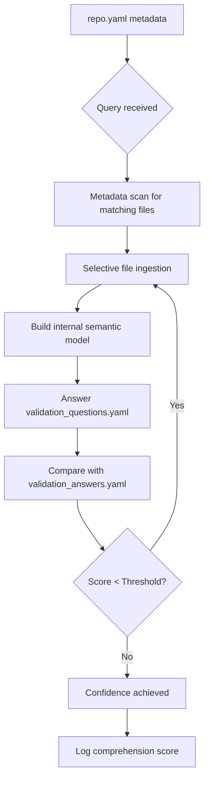

# Cognition Index Protocol (CIP) Architecture

## 🧠 Introduction

The **Cognition Index Protocol (CIP)** is a machine-native framework designed to embed, test, and validate true comprehension within AI systems interacting with software, theoretical frameworks, or scientific repositories. It formalizes the process of intelligent understanding into structured **phases of ingestion, reasoning, validation, and reflexive feedback**.

Rather than assuming an AI system understands a project simply because it can summarize or navigate it, CIP enforces a process of:

* Structured pre-ingestion planning
* Intentional context acquisition
* Targeted comprehension testing
* Comparison to a ground-truth index
* Reflexive improvement loops

This document outlines the complete architecture of CIP, including its file structure, ingestion logic, scoring logic, and future-facing implications for AI comprehension.

---

## 📊 CIP Overview Diagram



---

## 📂 CIP Directory Structure

```bash
/your-repo/
  repo.yaml                         # Metadata file describing repo structure
  /cognition/
    validation_questions.yaml      # Self-test question set
    validation_answers.yaml        # Ground truth answer index (never ingested during reasoning)
    rubric_criteria.json           # Optional rubric scoring guide
    evaluate_cognition.py          # Script to run scoring loop
    comprehension_log.json         # Output of scoring process
```

---

## 📄 Phase 1: Metadata-Guided Pre-Ingestion

### Objective:

Scan and classify content using `repo.yaml`, without loading large files unless necessary.

### Key Features:

* Descriptions, semantic tags, and ingestion hints
* Context weight estimates
* Ingestion flags (required vs optional)

### Example Entry:

```yaml
- path: /models/core_model.py
  description: Neural network implementing entropy field simulation.
  semantic_tags: [neural-net, entropy, QBE]
  ingestion_required: true
  estimated_context_weight: medium
```

### Benefits:

* ✅ Reduces token cost
* ✅ Enables smarter ingestion plans
* ✅ Provides structure for filtering queries

---

## 🔮 Phase 2: Intentional Ingestion

After planning, the AI ingests only relevant documents or code fragments. This prevents overload and hallucination.

### Options:

* Summary ingestion
* Line-referenced code loading
* Section-based theory parsing

---

## 🔎 Phase 3: Self-Test via Validation Questions

AI then attempts to answer a set of questions defined in `validation_questions.yaml`, without access to answers.

### Example:

```yaml
- id: QBE-01
  target_files: [models/qbe_net.py, experiments/field_collapse.md]
  question: >
    Describe how the QBE model dynamically regulates entropy in the simulation. Name any key functions or variables involved.
```

---

## 🔢 Phase 4: Ground Truth Comparison (Do Not Ingest)

Answers are scored against `validation_answers.yaml`. This file is **never ingested**, only used for post-hoc comparison.

### Ground Truth Entry:

```yaml
- id: QBE-01
  rubric: >
    Must mention qbe_regulator(), entropy_score, and timestep-based feedback.
  ground_truth:
    - The function `qbe_regulator()` modifies entropy dynamically.
    - Uses feedback from `entropy_score`.
    - Operates within a loop over time `t`.
```

### Scoring Options:

* Semantic embedding similarity
* Regex/keyword matching
* Reason trace comparison

---

## ♻️ Phase 5: Reflexive Feedback Loop

If comprehension score is low:

* Suggest re-ingestion of specific sections
* Retry question
* Log iterations to convergence

### Key Metrics:

* Number of iterations
* Delta improvement per cycle
* Comprehension confidence threshold (e.g., 0.85+)

---

## 📊 Sample Comprehension Log Entry

```json
{
  "question_id": "QBE-01",
  "score": 0.83,
  "attempts": 3,
  "final_answer": "The qbe_regulator function modifies entropy_score in a loop over t, based on simulation feedback...",
  "concepts_missed": ["time-dependency"],
  "confidence_achieved": true
}
```

---

## 🔄 Optional Enhancements

* **embedding\_hint** in `repo.yaml` for future vector search
* **meta-evaluator agent** for score automation
* **proficiency\_level** flag to modify test difficulty

---

## 🌎 Future Applications

* AGI benchmarking via repo-level comprehension
* Self-validating AI agents
* Machine-native education interfaces
* Peer-AI theory validation

---

## 🔒 Ground Truth Ethic

> CIP is not a test to pass. It is a discipline to earn understanding.

* The ground truth layer must remain **firewalled** during reasoning
* All truth must be **earned**, not scraped
* Validation ensures **reflective comprehension**, not memorization

---

## 🚀 Closing Vision

CIP isn't just a new protocol for code comprehension. It is a **machine-native epistemology framework** — a new way for AI to:

* Know what it knows
* Prove what it understands
* Reflect when it fails

This architecture builds the foundation for **trustworthy, interpretable, and verifiable machine intelligence**.

> "Understanding must be measured, not assumed."

---
