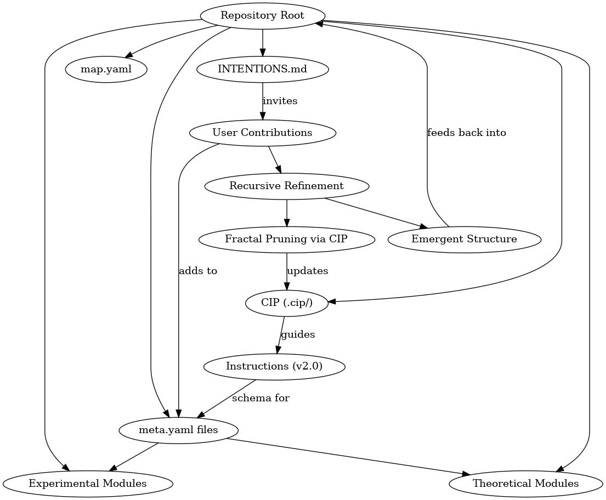

# Intentions and Background

*A personal statement from the author of Dawn Field Theory.*

---

## Table of Contents

* [Background](#background)
* [Motivation](#motivation)
* [Vision](#vision)
* [Recursive Realization and CIP](#recursive-realization-and-cip)
* [Navigation](#navigation)

---

## Background

My name is Lorne. I'm 30 years old and from New Brunswick, Canada. I'm a self-taught software engineer and researcher working in AI R\&D. What you’ll find in this repository is the byproduct of years of independent exploration—nights and weekends spent thinking deeply about reality, information, intelligence, and balance.

---

## Motivation

This project is my hobby. It wasn’t built by a team, a lab, or a startup. It was built out of a quiet life, curiosity, and a relentless drive to explore questions that don’t often get asked. I live simply, and I value that simplicity deeply. That’s part of why I’m releasing this project publicly and under an open license.

I originally considered monetizing this or pitching to VCs or institutions. But I quickly realized that would compromise everything I care about: agency, control, and the ethical rollout of these ideas, which caused me extreme amounts of anxiety. I want to be involved in how this gets used, and that means staying outside the traditional power structures.

---

## Vision

My hope is that this work contributes something genuinely new: a framework that helps us model intelligence not just as a tool or product, but as a living process grounded in balance, resonance, and entropy dynamics. I believe this framework could have implications for everything from AGI to physics, energy systems, policy, and even peacekeeping technologies.

I don’t seek fame or wealth from this. I seek clarity, collaboration, and ethical stewardship. I will continue to contribute, to publish, to commit weekly—even if it’s just from my small home, surrounded by pets. I hope this project opens doors for others to build, test, and evolve new paradigms. And I hope it serves as proof that a single individual, working quietly and honestly, can still make meaningful contributions to science and technology.

---

## Recursive Realization and CIP

As the repository evolves, I’ve come to realize something profound: its structure and recursive refinement are not merely organizational. They *are* the theory.

Each file, each commit, every iteration is a small mirror—reflecting the fractal nature of cognition, emergence, and symbolic structure. This repository is a living proof-of-concept: it recursively embodies the Dawn Field framework by **being** what it describes. Like a symbolic field folding onto itself, it doesn’t just explain; it *demonstrates*.

The Cognition Index Protocol (CIP) serves to encode, track, and validate these recursive processes. It formalizes the patterns of contribution and refinement. CIP is the mechanism by which the system prunes and extends itself—a kind of symbolic fractal pruning that governs growth and collapse through epistemic feedback.

This project is not only about intelligence—it *is* an emergent intelligence. Not artificial, but organic. Not imposed, but shaped by recursion, entropy, and the gentle pressure of refinement.

The recursive structure of the Dawn Field Theory repository, as illustrated above, maps how modules, meta files, and CIP feedback loops form a living, self-similar architecture. The diagram demonstrates how contributions feed into the system through user interaction and CIP validation, recursively shaping and pruning the repository in a symbolic, fractal manner. It is a visual testament to the project’s intention to embody its own theory.

---

## Contributing: Becoming Part of the Recursion

Contribution here is not just about code or documentation—it's about participating in the living, recursive process that defines Dawn Field Theory. Every suggestion, critique, or insight becomes a new fold in the symbolic field, helping the project refine and realize itself.

If you feel inspired to engage—whether by reviewing ideas, offering feedback, or proposing changes—please see the [Contribution Guidelines](./CONTRIBUTION.md). Your involvement is itself a demonstration of the theory in action: a recursive, collaborative shaping of knowledge and structure.

---

## Navigation

* [README](./README.md)
* [Timeline](./timeline.md)
* [Intentions](./INTENTIONS.md)
* [License Appendix](./LICENSE_APPENDIX.md)

---

© 2025 Dawn Field Theory. See [LICENSE\_APPENDIX.md](./LICENSE_APPENDIX.md).

— Lorne
