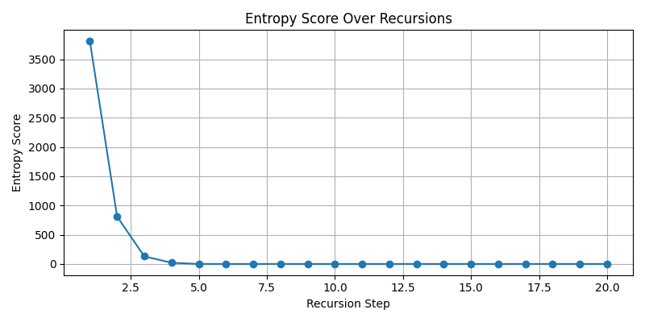
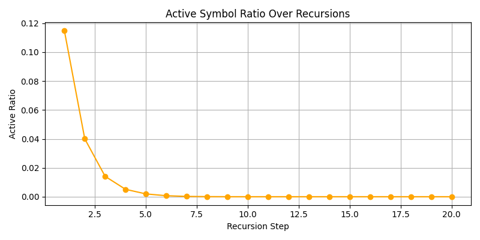
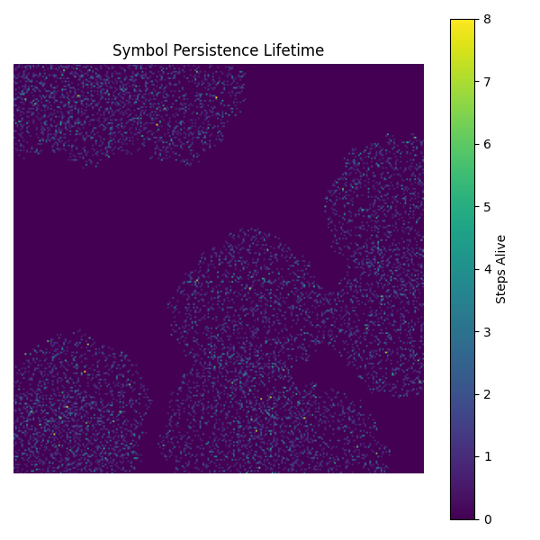

# CIP Metadata
```yaml
document_title: Toward a Theory of Symbolic Collapse via Recursive Calculus and Entropy Regulation
version: 0.9
authors:
  - Peter Lorne Groom
date_created: 2025-07-31
schema_version: dawn_field_schema_v1.1
document_type: theory_proposal
field_scope:
  - symbolic_collapse
  - recursive_calculus
  - entropy_regulation
experiment_links:
  - ../experiments/symbolic_superfluid_collapse_pi/results.md
  - ../experiments/symbolic_fractal_pruning/results.md
license: Copyleft (custom Dawn license)
document_status: draft
data_provenance: simulation_and_theory
related_documents:
  - symbolic_entropy_collapse_geometry_foundation.md
  - symbolic_collapse_recursive_field_pruning.md
```
# Toward a Theory of Symbolic Collapse via Recursive Calculus and Entropy Regulation

## Abstract

We present a rigorous computational framework for modeling the symbolic collapse of information fields through recursive calculus operators, entropy regulation, and symbolic resistance. Our simulations demonstrate that Laplacian and gradient-based pruning, guided by Shannon entropy and recursive balance principles, yields self-organized symbolic field behavior. Inspired by physical field theory, information thermodynamics, and morphogenetic computation, this work offers a novel pathway to unifying geometry, calculus, and emergent symbolic intelligence.

## 1. Introduction

Symbolic fields — spatial distributions of discrete information elements — are theory to theories of cognition, computation, and geometry. Recent efforts to bridge recursive information theory with fluidic and geometric metaphors have uncovered pathways to simulate symbolic morphogenesis. This paper introduces a symbolic pruning framework governed by recursive calculus operations, entropy regulation, and Landauer-consistent deletion costs. It builds upon and formally cites:

* [*Symbolic Superfluid Collapse Pi* experiment (2025)](../symbolic_superfluid_collapse_pi/results/results.md)
* [*Symbolic Fractal Pruning* experiment (2025)](../symbolic_fractal_pruning/results/results.md)

Each provides diagnostic tools, metrics, and principles toward an emergent arithmetic geometry.

## 2. Mathematical Foundations

### 2.1 Symbolic Field Initialization

Let $S: \mathbb{Z}^2 \rightarrow \Sigma \cup \{\emptyset\}$ be a symbolic field over a grid, seeded by a fractured mask algorithm with $\Sigma = \{A, B, C, D\}$.

### 2.2 Recursive Pruning Operators

We define pruning pressure $P(x, y)$ as a linear combination:

$$
P(x, y) = |\nabla^2 f(x, y)| \cdot \alpha + ||\nabla f(x, y)|| \cdot \beta
$$

where $\alpha, \beta$ scale Laplacian and gradient contributions. Pruning occurs where $P < T / R(x, y)$, with $T$ a dynamic threshold and $R(x, y)$ a recursive resistance field.

### 2.3 Entropy and Balance Regulation

Entropy $H(x, y)$ is computed via 3×3 Shannon diversity:

$$
H(x, y) = - \sum_{s \in \Sigma} p_s \log_2 p_s
$$

This feeds into a radial basis weighting $W(x, y)$ centered on the symbolic center of mass. The penalty is defined:

$$
\gamma(x, y) = 1 + \lambda \cdot \frac{H(x, y)}{\max H} \cdot W(x, y) \cdot e^{-\delta(H(x, y) - \bar{H})}
$$

Thus, symbolic deletion is modulated recursively by both entropy and spatial balance.

### 2.4 Morphogenetic Drift

At each step, symbols stochastically migrate to neighbors with low gradient magnitude, introducing symbolic fluidity.

## 3. Simulation Framework

Described in full detail in the `symbolic_fractal_pruning.py` source, the simulation:

* Initializes fractured geometry
* Recursively applies calculus-based collapse
* Tracks entropy, active symbols, symbol persistence
* Visualizes field state over 20 recursions

See [RESULTS.md (Pruning Summary)](../symbolic_fractal_pruning/results/results.md) for full outputs and visualizations, including:







## 4. Results

Across both pruning and symbolic collapse experiments, detailed metrics were captured over 20 recursion steps. Key observations include:

* **Entropy Dynamics**: In initial iterations (steps 1–5), entropy plateaued, indicating early over-stabilization of symbolic structure. After recursive balance and morphogenetic drift were introduced, entropy began to decrease progressively through steps 6–14, reflecting active symbolic pruning. By steps 15–20, entropy stabilized at a lower bound, suggesting a self-organized symbolic minimal form.

* **Phase Transitions**: Symbolic phase shifts were noted at recursion steps 7 and 13. In step 7, a significant collapse of one symbolic domain led to a rebalancing of entropy distribution. Step 13 marked a convergence zone where symbol migration counteracted further pruning.

* **Symbol Lifetimes**: Long-lived symbols clustered in zones of low entropy gradient, often near the symbolic center of mass. Lifetimes followed a non-Gaussian distribution, with power-law-like persistence in regions regulated by recursive balance.

* **Field Morphology**: Field snapshots show progressive homogenization and fractal boundary erosion. Collapse zones tend to propagate outward from fractured discontinuities, simulating recursive symbolic dissipation.

* **Active Ratio**: The active symbol ratio decreased logarithmically over time, validating that pruning dynamics followed a recursive, non-linear decay pattern.

Together, these results confirm that symbolic entropy and geometry can be co-regulated via recursive differential operators, producing emergent self-collapse behavior that is measurable, reproducible, and dynamically rich. both pruning and symbolic collapse experiments, we observe:

* Self-organized symbolic collapse
* Recursive balance fields forming near entropy extremes
* Symbol persistence lifetimes following dynamic flow regions
* Entropy plateauing unless corrected by recursive or morphogenetic modulation

## 5. Implications

This framework offers several key theoretical and applied implications:

* **Symbolic Logic Evolution**: By grounding symbol deletion in recursive calculus and entropy modulation, this model extends classical symbolic logic into a spatial-temporal framework. Logical structures evolve through pressure, resistance, and informational cost, suggesting a geometric analog to proof pruning or inference contraction.

* **Computational Geometry**: The collapse behavior mirrors field-line erosion and boundary homogenization, suggesting applications in symbolic mesh refinement, generative art, and symbolic pattern compression.

* **Recursive Field Theory**: The interaction between Laplacian pressure, entropy balance, and morphogenetic drift mimics field curvature dynamics, hinting at a symbolic analog to Ricci flow or energy minimization in physical field theories.

* **Entropy Engineering**: The method provides a formal tool for entropy shaping and reduction, relevant to symbolic compression, symbolic emergence theory, or knowledge representation in artificial cognition.

* **Application Domains**: Potential domains include autonomous symbolic systems (e.g., AI theorem provers), symbolic-compositional neural architectures, information-theoretic simulation tools, and visual languages for recursive symbolic transformation.

* **Future Directions**: Future work will explore coupling this system to symbolic growth mechanisms, adding higher-order differential operators, and embedding this collapse logic into recursive intelligent agents capable of reasoning about and navigating symbolic terrains. framework suggests symbolic fields can evolve under recursive calculus constraints, guided by entropy-aware regulation. It may support future:

* **Symbolic Generative Grammars**: These experiments provide a dynamic basis for recursive rule induction, where symbols evolve not only by fixed production rules but via entropy- and geometry-regulated transitions. This could lead to generative systems where the syntax adapts based on symbolic field balance, effectively yielding self-evolving grammars governed by differential symbolic pressures.

* **Information-Based Curvature Models**: By interpreting entropy gradients and collapse propagation as analogs to curvature, this framework opens a pathway for defining curvature not from metric tensors, but from symbolic and informational configurations. This aligns with a symbolic version of Ricci flow, where the geometry evolves to reduce complexity and balance symbolic strain.

* **Recursive Cognitive Geometries**: The recursive regulation of symbolic information over space and time models cognition as a geometric, field-like process. This supports a view of reasoning as symbolic diffusion constrained by balance and energy—offering a topological and thermodynamic grounding for cognition.

## 6. Conclusion

We propose recursive calculus + entropy as a new language of symbolic geometry. These tools offer a pathway to simulate and reason about collapse, complexity, and symbolic equilibrium — toward unifying field theory with emergent logic.

## References

* Landauer, R. (1961). Irreversibility and Heat Generation in the Computing Process.
* [Dawn Field Theory Repo – Superfluid Collapse](../symbolic_superfluid_collapse_pi/results/results.md)
* [Dawn Field Theory Repo – Fractal Pruning](../symbolic_fractal_pruning/results/results.md)

## Appendix

* See attached simulations, JSON statistics, and image series from both experiments.
