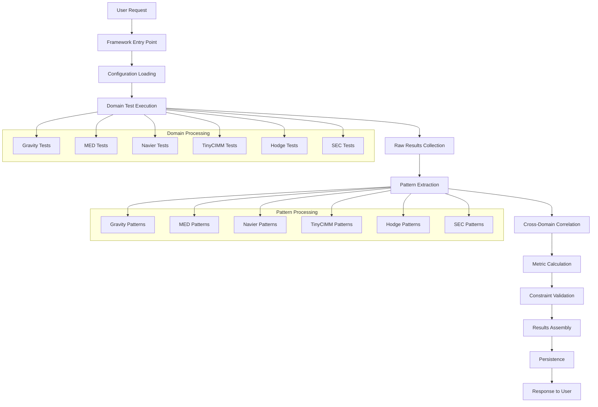

# Data Flow and Processing Architecture

## Overview

The Unified Emergence Framework processes data through a well-defined pipeline that transforms domain-specific simulation results into unified emergence validation metrics. This document describes the complete data flow, processing stages, and data structures.

## Data Flow Pipeline



## Data Structures

### 1. Configuration Data

```python
@dataclass
class ValidationConfig:
    """Configuration for emergence validation runs."""
    session_id: str
    timestamp: str
    
    # Test execution parameters
    domains: List[str]
    field_sizes: List[int]
    runs_per_domain: int
    param_sweep: bool
    
    # Validation thresholds
    sec_classification_threshold: float = 0.9
    pattern_assembly_threshold: float = 0.8
    emergence_consistency_threshold: float = 0.85
    correlation_threshold: float = 0.7
    
    # Performance parameters
    parallel_execution: bool = True
    max_workers: int = 4
    timeout_seconds: int = 300
    
    # Output configuration
    save_intermediate_results: bool = True
    export_visualizations: bool = False
    output_directory: str = "results"
```

### 2. Raw Domain Results

Each domain produces results in its native format, which gets standardized through adapters:

```python
# Gravity Domain Raw Results
GravityResults = {
    'test_type': 'gravity',
    'runs': [
        {
            'field_size_32': {
                'orbital_stability': 0.926,
                'energy_conservation': 0.848,
                'angular_momentum_conservation': 0.999,
                'mean_orbital_radius_au': 1.084,
                'orbital_eccentricity': 0.08,
                'orbital_period_days': 365.25,
                'trajectory_points': 1096,
                'field_data_keys': ['gravitational_potential', 'force_field_x', 'force_field_y']
            }
        }
    ],
    'summary': {
        'total_runs': 1,
        'average_stability': 0.926,
        'stability_std': 0.0
    }
}

# MED Domain Raw Results
MEDResults = {
    'test_type': 'med',
    'complexity_bound_satisfaction': 1.0,
    'best_score': 0.691,
    'best_parameters': 'a0.005857_x1.0571_n0.025_s32',
    'parameter_analysis': {
        'a0.005857_x1.0571_n0.025_s32': {'score': 0.691},
        'a0.005857_x1.0571_n0.025_s64': {'score': 0.689}
    },
    'runs': [
        {
            'parameters': {'alpha': 0.005857, 'xi': 1.0571, 'nu': 0.025},
            'field_size': 32,
            'score': 0.691,
            'convergence_iterations': 150
        }
    ]
}
```

### 3. Emergence Signatures (Standardized)

```python
@dataclass
class EmergenceSignature:
    """Standardized emergence pattern representation."""
    domain: str                    # 'gravity', 'med', 'navier', etc.
    pattern_type: str             # 'orbital_dynamics', 'complexity_emergence', etc.
    features: List[float]         # Normalized feature vector [0, 1]
    confidence: float             # Pattern extraction confidence [0, 1]
    emergence_strength: float     # Strength of emergence signal [0, 1]
    metadata: Dict[str, Any]      # Domain-specific additional data
    
    # Computed fields
    feature_hash: str = field(init=False)  # For deduplication
    extraction_timestamp: str = field(init=False)
    
    def __post_init__(self):
        self.feature_hash = hashlib.md5(str(self.features).encode()).hexdigest()[:8]
        self.extraction_timestamp = datetime.now().isoformat()
```

### 4. Correlation Matrix

```python
@dataclass
class CorrelationMatrix:
    """Cross-domain pattern correlation analysis."""
    domains: List[str]                           # Domain names in order
    correlation_values: List[List[float]]        # NxN correlation matrix
    correlation_method: str                      # 'pearson', 'spearman', 'cosine'
    significance_levels: List[List[float]]       # P-values for correlations
    
    # Derived metrics
    mean_correlation: float = field(init=False)
    max_correlation: float = field(init=False)
    correlation_consistency: float = field(init=False)
    
    def __post_init__(self):
        # Calculate derived metrics
        flat_correlations = [c for row in self.correlation_values for c in row if c != 1.0]
        self.mean_correlation = np.mean(flat_correlations) if flat_correlations else 0.0
        self.max_correlation = max(flat_correlations) if flat_correlations else 0.0
        self.correlation_consistency = 1.0 - np.std(flat_correlations) if flat_correlations else 0.0
```

### 5. Validation Metrics

```python
@dataclass
class ValidationMetrics:
    """Unified validation metrics across all domains."""
    
    # Core Phase 1 metrics
    sec_classification_accuracy: float      # [0, 1] - SEC field classification accuracy
    pattern_assembly_success_rate: float    # [0, 1] - Cross-domain pattern assembly
    emergence_consistency_score: float      # [0, 1] - Consistency across domains
    phase1_readiness_score: float          # [0, 1] - Overall Phase 1 completion
    
    # Constraint validation
    constraint_violations: int              # Number of physical constraint violations
    violation_details: List[str]           # Descriptive violation messages
    
    # Pattern analysis metrics
    total_patterns_extracted: int          # Total emergence signatures found
    patterns_per_domain: Dict[str, int]    # Pattern count by domain
    cross_domain_correlations: float       # Average correlation between domains
    pattern_coherence_score: float         # Internal consistency of patterns
    
    # Performance metrics
    processing_time_seconds: float         # Total processing time
    domain_processing_times: Dict[str, float]  # Processing time per domain
    
    # Quality metrics
    data_quality_score: float             # Overall data quality assessment
    confidence_distribution: List[float]   # Distribution of pattern confidences
    
    def is_phase1_complete(self, thresholds: ValidationConfig) -> bool:
        """Check if Phase 1 validation criteria are met."""
        return (
            self.sec_classification_accuracy >= thresholds.sec_classification_threshold and
            self.pattern_assembly_success_rate >= thresholds.pattern_assembly_threshold and
            self.emergence_consistency_score >= thresholds.emergence_consistency_threshold and
            self.constraint_violations == 0
        )
```

### 6. Complete Results Container

```python
@dataclass
class EmergenceResults:
    """Complete results container for emergence validation."""
    
    # Identification
    session_id: str
    timestamp: str
    configuration: ValidationConfig
    
    # Core results
    signatures: List[EmergenceSignature]
    metrics: ValidationMetrics
    correlation_matrix: CorrelationMatrix
    
    # Raw data (for debugging/analysis)
    raw_domain_results: Dict[str, Any]
    processing_log: List[str]
    
    # Status
    success: bool
    error_messages: List[str]
    warnings: List[str]
    
    def to_summary_dict(self) -> Dict[str, Any]:
        """Create summary dictionary for quick analysis."""
        return {
            'session_id': self.session_id,
            'timestamp': self.timestamp,
            'success': self.success,
            'phase1_complete': self.metrics.is_phase1_complete(self.configuration),
            'metrics': {
                'sec_classification': self.metrics.sec_classification_accuracy,
                'pattern_assembly': self.metrics.pattern_assembly_success_rate,
                'emergence_consistency': self.metrics.emergence_consistency_score,
                'phase1_readiness': self.metrics.phase1_readiness_score,
                'constraint_violations': self.metrics.constraint_violations
            },
            'patterns': {
                'total_extracted': self.metrics.total_patterns_extracted,
                'by_domain': self.metrics.patterns_per_domain,
                'mean_confidence': np.mean([s.confidence for s in self.signatures]) if self.signatures else 0.0
            },
            'correlations': {
                'mean_correlation': self.correlation_matrix.mean_correlation,
                'max_correlation': self.correlation_matrix.max_correlation,
                'consistency': self.correlation_matrix.correlation_consistency
            }
        }
```

## Processing Stages

### Stage 1: Configuration and Initialization

```python
def initialize_validation(user_config: Dict[str, Any]) -> ValidationConfig:
    """Initialize validation configuration with defaults and validation."""
    
    # Apply defaults
    config = ValidationConfig(
        session_id=user_config.get('session_id', generate_session_id()),
        timestamp=datetime.now().isoformat(),
        domains=user_config.get('domains', ['gravity', 'med', 'navier', 'tinycimm', 'hodge']),
        field_sizes=user_config.get('field_sizes', [32, 64]),
        runs_per_domain=user_config.get('runs', 1),
        **user_config
    )
    
    # Validate configuration
    _validate_configuration(config)
    
    return config
```

### Stage 2: Domain Test Execution

```python
async def execute_domain_tests(config: ValidationConfig, 
                               domain_adapters: Dict[str, DomainAdapter]) -> Dict[str, Any]:
    """Execute tests across all configured domains."""
    
    raw_results = {}
    
    if config.parallel_execution:
        # Parallel execution
        tasks = [
            run_domain_async(domain, adapter, config) 
            for domain, adapter in domain_adapters.items() 
            if domain in config.domains
        ]
        
        results = await asyncio.gather(*tasks, return_exceptions=True)
        
        for i, result in enumerate(results):
            domain = list(domain_adapters.keys())[i]
            if isinstance(result, Exception):
                logger.error(f"Domain {domain} failed: {result}")
                raw_results[domain] = {'error': str(result)}
            else:
                raw_results[domain] = result
    else:
        # Sequential execution
        for domain, adapter in domain_adapters.items():
            if domain in config.domains:
                try:
                    raw_results[domain] = await run_domain_async(domain, adapter, config)
                except Exception as e:
                    logger.error(f"Domain {domain} failed: {e}")
                    raw_results[domain] = {'error': str(e)}
    
    return raw_results
```

### Stage 3: Pattern Extraction

```python
def extract_all_patterns(raw_results: Dict[str, Any], 
                        domain_adapters: Dict[str, DomainAdapter]) -> List[EmergenceSignature]:
    """Extract emergence patterns from all domain results."""
    
    all_signatures = []
    
    for domain, results in raw_results.items():
        if 'error' in results:
            logger.warning(f"Skipping pattern extraction for {domain} due to error")
            continue
        
        adapter = domain_adapters.get(domain)
        if not adapter:
            logger.warning(f"No adapter found for domain: {domain}")
            continue
        
        try:
            signatures = adapter.extract_patterns(results)
            all_signatures.extend(signatures)
            logger.info(f"Extracted {len(signatures)} patterns from {domain}")
        except Exception as e:
            logger.error(f"Pattern extraction failed for {domain}: {e}")
    
    return all_signatures
```

### Stage 4: Cross-Domain Correlation Analysis

```python
def calculate_cross_domain_correlations(signatures: List[EmergenceSignature]) -> CorrelationMatrix:
    """Calculate correlation matrix between domains."""
    
    # Group signatures by domain
    domain_groups = defaultdict(list)
    for sig in signatures:
        domain_groups[sig.domain].append(sig)
    
    domains = sorted(domain_groups.keys())
    n_domains = len(domains)
    
    if n_domains < 2:
        return CorrelationMatrix(
            domains=domains,
            correlation_values=[[1.0]] if n_domains == 1 else [],
            correlation_method='none',
            significance_levels=[[0.0]] if n_domains == 1 else []
        )
    
    # Calculate domain-level feature vectors
    domain_features = {}
    for domain in domains:
        domain_sigs = domain_groups[domain]
        # Aggregate features across signatures for this domain
        domain_features[domain] = _aggregate_domain_features(domain_sigs)
    
    # Calculate correlation matrix
    correlation_matrix = np.zeros((n_domains, n_domains))
    significance_matrix = np.zeros((n_domains, n_domains))
    
    for i, domain_i in enumerate(domains):
        for j, domain_j in enumerate(domains):
            if i == j:
                correlation_matrix[i, j] = 1.0
                significance_matrix[i, j] = 0.0
            else:
                features_i = domain_features[domain_i]
                features_j = domain_features[domain_j]
                
                # Calculate Pearson correlation
                corr, p_value = pearsonr(features_i, features_j)
                correlation_matrix[i, j] = corr if not np.isnan(corr) else 0.0
                significance_matrix[i, j] = p_value if not np.isnan(p_value) else 1.0
    
    return CorrelationMatrix(
        domains=domains,
        correlation_values=correlation_matrix.tolist(),
        correlation_method='pearson',
        significance_levels=significance_matrix.tolist()
    )
```

### Stage 5: Metric Calculation

```python
def calculate_validation_metrics(signatures: List[EmergenceSignature],
                               correlation_matrix: CorrelationMatrix,
                               raw_results: Dict[str, Any],
                               processing_times: Dict[str, float]) -> ValidationMetrics:
    """Calculate comprehensive validation metrics."""
    
    # SEC Classification Accuracy
    sec_accuracy = _calculate_sec_classification_accuracy(signatures)
    
    # Pattern Assembly Success Rate
    assembly_rate = _calculate_pattern_assembly_rate(signatures, correlation_matrix)
    
    # Emergence Consistency Score
    consistency_score = _calculate_emergence_consistency(signatures, correlation_matrix)
    
    # Phase 1 Readiness Score
    phase1_score = _calculate_phase1_readiness(sec_accuracy, assembly_rate, consistency_score)
    
    # Pattern statistics
    patterns_per_domain = defaultdict(int)
    confidences = []
    for sig in signatures:
        patterns_per_domain[sig.domain] += 1
        confidences.append(sig.confidence)
    
    return ValidationMetrics(
        sec_classification_accuracy=sec_accuracy,
        pattern_assembly_success_rate=assembly_rate,
        emergence_consistency_score=consistency_score,
        phase1_readiness_score=phase1_score,
        constraint_violations=0,  # Will be set by constraint validation
        violation_details=[],
        total_patterns_extracted=len(signatures),
        patterns_per_domain=dict(patterns_per_domain),
        cross_domain_correlations=correlation_matrix.mean_correlation,
        pattern_coherence_score=np.mean(confidences) if confidences else 0.0,
        processing_time_seconds=sum(processing_times.values()),
        domain_processing_times=processing_times,
        data_quality_score=_assess_data_quality(raw_results),
        confidence_distribution=confidences
    )
```

### Stage 6: Constraint Validation

```python
def validate_all_constraints(raw_results: Dict[str, Any],
                           domain_adapters: Dict[str, DomainAdapter]) -> List[str]:
    """Validate physical and mathematical constraints across all domains."""
    
    all_violations = []
    
    for domain, results in raw_results.items():
        if 'error' in results:
            continue
        
        adapter = domain_adapters.get(domain)
        if not adapter:
            continue
        
        try:
            violations = adapter.validate_constraints(results)
            all_violations.extend([f"{domain}: {v}" for v in violations])
        except Exception as e:
            all_violations.append(f"{domain}: Constraint validation error: {e}")
    
    return all_violations
```

This data flow architecture ensures that information is processed consistently and efficiently through the entire pipeline, with comprehensive error handling and quality assurance at each stage.
