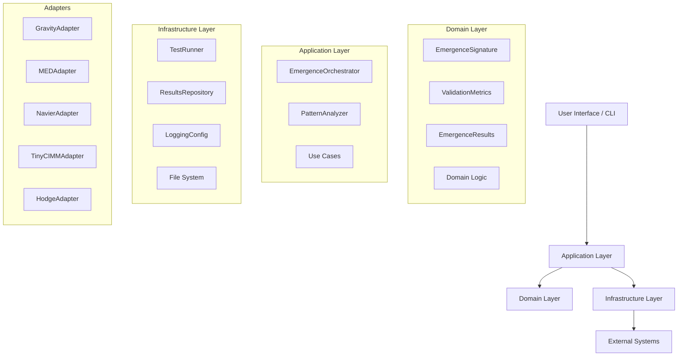
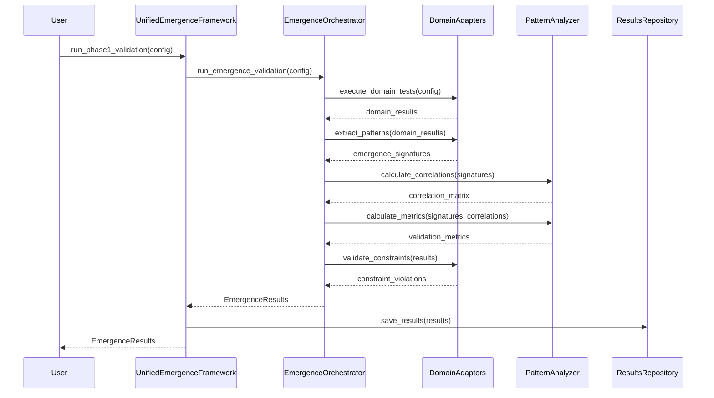

# Architecture Overview

## Design Principles

The Unified Emergence Framework v2 follows **Clean Architecture** principles to create a maintainable, testable, and extensible system for cross-domain emergence validation.

### Core Principles

1. **Separation of Concerns**: Clear boundaries between domain logic, application logic, and infrastructure
2. **Dependency Inversion**: High-level modules don't depend on low-level modules
3. **Interface Segregation**: Small, focused interfaces rather than large, monolithic ones
4. **Single Responsibility**: Each class/module has one reason to change
5. **Open/Closed**: Open for extension, closed for modification

## Layer Architecture



### Layer Responsibilities

#### Domain Layer (Core Business Logic)
- **EmergenceSignature**: Standardized representation of emergence patterns
- **ValidationMetrics**: Unified metrics across all domains  
- **EmergenceResults**: Container for complete validation results
- **Business Rules**: Domain-specific validation logic

#### Application Layer (Use Cases)
- **EmergenceOrchestrator**: Main coordinator for validation workflow
- **PatternAnalyzer**: Core pattern analysis and correlation engine
- **Use Cases**: Specific business workflows (Phase 1 validation, etc.)

#### Infrastructure Layer (Technical Concerns)
- **TestRunner**: Execution of domain-specific tests
- **ResultsRepository**: Persistence and retrieval of results
- **LoggingConfig**: Centralized logging configuration
- **External Integrations**: File system, databases, etc.

## Key Design Patterns

### 1. Adapter Pattern
Each physics domain implements the `DomainAdapter` protocol:

```python
class DomainAdapter(Protocol):
    def extract_patterns(self, domain_results: Dict[str, Any]) -> List[EmergenceSignature]:
        """Extract emergence patterns from domain-specific results."""
        ...
    
    def validate_constraints(self, results: Dict[str, Any]) -> List[str]:
        """Validate domain-specific constraints."""
        ...
    
    @property
    def domain_name(self) -> str:
        """Return the domain identifier."""
        ...
```

### 2. Repository Pattern
Abstracts data persistence concerns:

```python
class ResultsRepository:
    def save_results(self, results: EmergenceResults) -> str:
        """Save results to persistent storage."""
        pass
    
    def load_results(self, session_id: str) -> Optional[EmergenceResults]:
        """Load results from persistent storage."""
        pass
```

### 3. Dependency Injection
Components receive their dependencies explicitly:

```python
class EmergenceOrchestrator:
    def __init__(self, 
                 pattern_analyzer: PatternAnalyzer,
                 domain_adapters: List[DomainAdapter],
                 logger: logging.Logger):
        self.pattern_analyzer = pattern_analyzer
        self.domain_adapters = {adapter.domain_name: adapter for adapter in domain_adapters}
        self.logger = logger
```

### 4. Factory Pattern
Creates configured components:

```python
class UnifiedEmergenceFramework:
    def __init__(self):
        self.logger = LoggingConfig.setup_logger(__name__)
        self.results_repository = ResultsRepository()
        
        # Factory creates configured adapters
        self.domain_adapters = [
            GravityDomainAdapter(self._create_test_runner('gravity')),
            MEDDomainAdapter(self._create_test_runner('med')),
            # ... other domains
        ]
```

## Data Flow



## Advantages Over v1 Spike

### ✅ Solved Problems

1. **Inconsistent Logging**
   - v1: Different logging patterns per module
   - v2: Centralized `LoggingConfig` with standardized format

2. **Mixed Output Formats**
   - v1: JSON, dict, custom objects scattered
   - v2: Single `EmergenceResults` container with standardized structure

3. **Duplicate Logic**
   - v1: `phase1_simple_validator.py` and `phase1_integration_framework.py`
   - v2: Single `EmergenceOrchestrator` with clear use cases

4. **No Clear Separation**
   - v1: Domain logic mixed with orchestration
   - v2: Clean layer separation with dependency inversion

5. **Hardcoded Dependencies**
   - v1: Direct imports scattered throughout
   - v2: Protocol-based interfaces with dependency injection

### 🚀 New Capabilities

1. **Extensibility**: Easy to add new physics domains
2. **Testability**: All components are mockable and testable
3. **Performance**: Parallel processing and efficient algorithms
4. **Configuration**: Flexible configuration without code changes
5. **Error Handling**: Comprehensive error handling and recovery

## Implementation Guidelines

### Adding New Domains

1. Implement `DomainAdapter` protocol
2. Create test runner for domain-specific tests
3. Register adapter with framework
4. Add comprehensive tests

### Testing Strategy

1. **Unit Tests**: Test individual components in isolation
2. **Integration Tests**: Test component interactions
3. **Contract Tests**: Verify adapter protocol compliance
4. **End-to-End Tests**: Full workflow validation

### Performance Considerations

1. **Lazy Loading**: Load adapters only when needed
2. **Parallel Processing**: Use async/await for I/O bound operations
3. **Memory Management**: Stream large datasets, avoid loading everything in memory
4. **Caching**: Cache computed patterns and correlations

### Error Handling

1. **Graceful Degradation**: Framework continues even if one domain fails
2. **Comprehensive Logging**: Log all errors with context
3. **Retry Logic**: Retry transient failures with exponential backoff
4. **Validation**: Validate inputs and outputs at boundaries

This architecture provides a solid foundation for the production version of the Unified Emergence Framework, addressing all the pain points identified in the v1 spike while maintaining the proven functionality.
