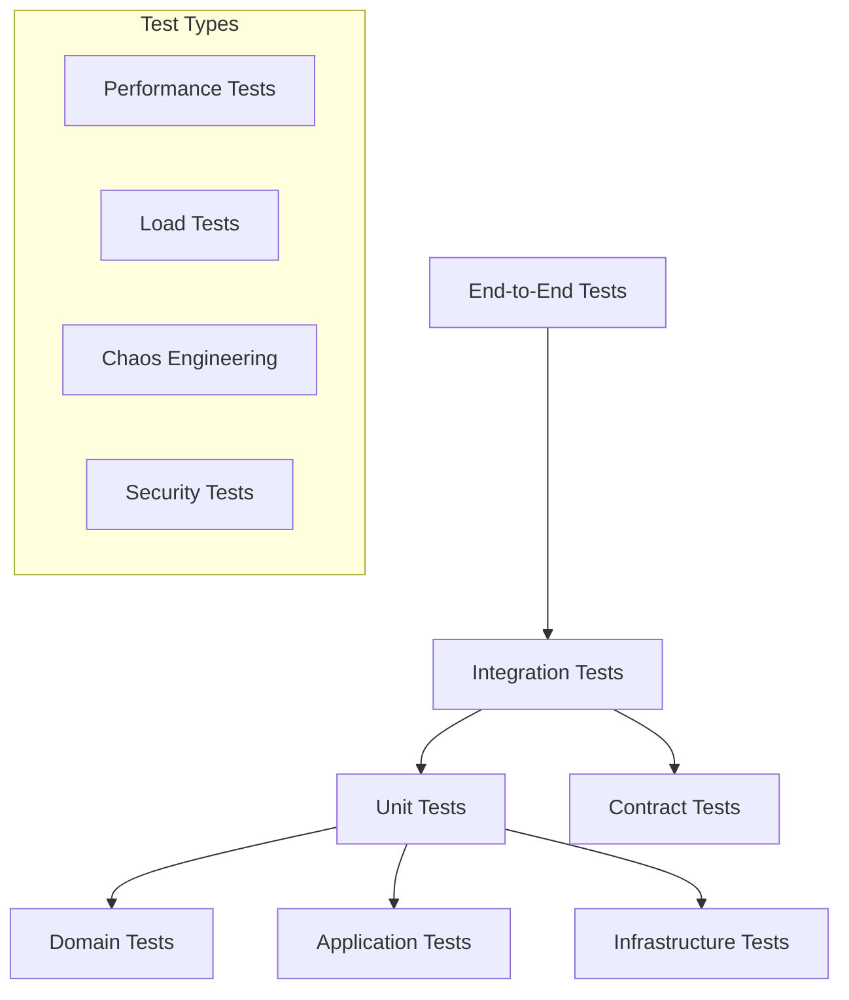

# Testing Strategy and Implementation

## Overview

The Unified Emergence Framework v2 employs a comprehensive testing strategy that ensures reliability, correctness, and performance across all layers of the architecture. This document outlines the testing philosophy, strategies, and implementation details.

## Testing Philosophy

### Core Principles

1. **Test Pyramid**: Unit tests form the foundation, integration tests verify component interactions, and end-to-end tests validate complete workflows
2. **Test-Driven Development**: Write tests before implementation to drive clean design
3. **Comprehensive Coverage**: Aim for >90% code coverage with meaningful tests
4. **Performance Testing**: Validate performance characteristics under various loads
5. **Failure Testing**: Test error conditions and recovery mechanisms
6. **Contract Testing**: Verify protocol compliance for all adapters

## Testing Layers



## Unit Testing

### Domain Layer Tests

```python
# tests/unit/domain/test_emergence_signature.py
import pytest
from unittest.mock import Mock
from unified_emergence_v2.domain import EmergenceSignature

class TestEmergenceSignature:
    
    def test_creation_with_valid_data(self):
        """Test EmergenceSignature creation with valid data."""
        signature = EmergenceSignature(
            domain='gravity',
            pattern_type='orbital_dynamics',
            features=[0.926, 0.848, 0.999, 0.92],
            confidence=0.926,
            emergence_strength=0.9,
            metadata={'field_size': 32}
        )
        
        assert signature.domain == 'gravity'
        assert signature.pattern_type == 'orbital_dynamics'
        assert len(signature.features) == 4
        assert signature.confidence == 0.926
        assert signature.emergence_strength == 0.9
        assert signature.metadata['field_size'] == 32
        assert signature.feature_hash is not None
        assert signature.extraction_timestamp is not None
    
    @pytest.mark.parametrize("confidence", [-0.1, 1.1, float('inf'), float('nan')])
    def test_invalid_confidence_values(self, confidence):
        """Test that invalid confidence values are handled appropriately."""
        with pytest.raises(ValueError):
            EmergenceSignature(
                domain='test',
                pattern_type='test',
                features=[0.5],
                confidence=confidence,
                emergence_strength=0.5,
                metadata={}
            )
    
    def test_feature_hash_consistency(self):
        """Test that feature hash is consistent for same features."""
        features = [0.1, 0.2, 0.3]
        
        sig1 = EmergenceSignature(
            domain='test', pattern_type='test', features=features,
            confidence=0.5, emergence_strength=0.5, metadata={}
        )
        
        sig2 = EmergenceSignature(
            domain='test', pattern_type='test', features=features,
            confidence=0.5, emergence_strength=0.5, metadata={}
        )
        
        assert sig1.feature_hash == sig2.feature_hash
    
    def test_feature_hash_uniqueness(self):
        """Test that different features produce different hashes."""
        sig1 = EmergenceSignature(
            domain='test', pattern_type='test', features=[0.1, 0.2],
            confidence=0.5, emergence_strength=0.5, metadata={}
        )
        
        sig2 = EmergenceSignature(
            domain='test', pattern_type='test', features=[0.1, 0.3],
            confidence=0.5, emergence_strength=0.5, metadata={}
        )
        
        assert sig1.feature_hash != sig2.feature_hash
```

### Application Layer Tests

```python
# tests/unit/application/test_pattern_analyzer.py
import pytest
import numpy as np
from unittest.mock import Mock, patch
from unified_emergence_v2.application import PatternAnalyzer
from unified_emergence_v2.domain import EmergenceSignature

class TestPatternAnalyzer:
    
    @pytest.fixture
    def pattern_analyzer(self):
        return PatternAnalyzer()
    
    @pytest.fixture
    def sample_signatures(self):
        return [
            EmergenceSignature(
                domain='gravity', pattern_type='orbital', features=[0.9, 0.8],
                confidence=0.9, emergence_strength=0.8, metadata={}
            ),
            EmergenceSignature(
                domain='med', pattern_type='complexity', features=[0.7, 0.9],
                confidence=0.8, emergence_strength=0.7, metadata={}
            ),
            EmergenceSignature(
                domain='navier', pattern_type='turbulence', features=[0.6, 0.7],
                confidence=0.7, emergence_strength=0.6, metadata={}
            )
        ]
    
    def test_calculate_correlations_valid_input(self, pattern_analyzer, sample_signatures):
        """Test correlation calculation with valid signatures."""
        correlation_matrix = pattern_analyzer.calculate_correlations(sample_signatures)
        
        assert len(correlation_matrix.domains) == 3
        assert 'gravity' in correlation_matrix.domains
        assert 'med' in correlation_matrix.domains
        assert 'navier' in correlation_matrix.domains
        
        # Check matrix properties
        values = correlation_matrix.correlation_values
        assert len(values) == 3
        assert len(values[0]) == 3
        
        # Diagonal should be 1.0
        for i in range(3):
            assert values[i][i] == 1.0
        
        # Matrix should be symmetric
        for i in range(3):
            for j in range(3):
                assert abs(values[i][j] - values[j][i]) < 1e-10
    
    def test_calculate_correlations_empty_input(self, pattern_analyzer):
        """Test correlation calculation with empty signature list."""
        correlation_matrix = pattern_analyzer.calculate_correlations([])
        
        assert len(correlation_matrix.domains) == 0
        assert len(correlation_matrix.correlation_values) == 0
        assert correlation_matrix.mean_correlation == 0.0
    
    def test_calculate_correlations_single_domain(self, pattern_analyzer):
        """Test correlation calculation with single domain."""
        signatures = [
            EmergenceSignature(
                domain='gravity', pattern_type='orbital', features=[0.9, 0.8],
                confidence=0.9, emergence_strength=0.8, metadata={}
            )
        ]
        
        correlation_matrix = pattern_analyzer.calculate_correlations(signatures)
        
        assert len(correlation_matrix.domains) == 1
        assert correlation_matrix.domains[0] == 'gravity'
        assert correlation_matrix.correlation_values == [[1.0]]
    
    def test_calculate_metrics_comprehensive(self, pattern_analyzer, sample_signatures):
        """Test comprehensive metric calculation."""
        # Mock correlation matrix
        mock_correlation_matrix = Mock()
        mock_correlation_matrix.mean_correlation = 0.75
        mock_correlation_matrix.correlation_consistency = 0.8
        
        metrics = pattern_analyzer.calculate_metrics(sample_signatures, mock_correlation_matrix)
        
        assert 0.0 <= metrics.sec_classification_accuracy <= 1.0
        assert 0.0 <= metrics.pattern_assembly_success_rate <= 1.0
        assert 0.0 <= metrics.emergence_consistency_score <= 1.0
        assert 0.0 <= metrics.phase1_readiness_score <= 1.0
        assert metrics.total_patterns_extracted == 3
        assert len(metrics.patterns_per_domain) == 3
        assert metrics.cross_domain_correlations == 0.75
```

### Infrastructure Layer Tests

```python
# tests/unit/infrastructure/test_results_repository.py
import pytest
import tempfile
import os
from unittest.mock import Mock, patch
from unified_emergence_v2.infrastructure import ResultsRepository
from unified_emergence_v2.domain import EmergenceResults, ValidationConfig

class TestResultsRepository:
    
    @pytest.fixture
    def temp_directory(self):
        with tempfile.TemporaryDirectory() as temp_dir:
            yield temp_dir
    
    @pytest.fixture
    def repository(self, temp_directory):
        return ResultsRepository(base_path=temp_directory)
    
    @pytest.fixture
    def sample_results(self):
        config = ValidationConfig(session_id="test_session")
        return EmergenceResults(
            session_id="test_session",
            timestamp="2025-08-29T10:00:00",
            configuration=config,
            signatures=[],
            metrics=Mock(),
            correlation_matrix=Mock(),
            raw_domain_results={},
            processing_log=[],
            success=True,
            error_messages=[],
            warnings=[]
        )
    
    def test_save_and_load_results(self, repository, sample_results):
        """Test saving and loading results."""
        # Save results
        saved_path = repository.save_results(sample_results)
        assert os.path.exists(saved_path)
        
        # Load results
        loaded_results = repository.load_results("test_session")
        assert loaded_results is not None
        assert loaded_results.session_id == "test_session"
        assert loaded_results.timestamp == "2025-08-29T10:00:00"
        assert loaded_results.success == True
    
    def test_load_nonexistent_results(self, repository):
        """Test loading results that don't exist."""
        result = repository.load_results("nonexistent_session")
        assert result is None
    
    def test_list_sessions(self, repository, sample_results):
        """Test listing available sessions."""
        # Initially empty
        sessions = repository.list_sessions()
        assert len(sessions) == 0
        
        # Save some results
        repository.save_results(sample_results)
        
        sample_results.session_id = "test_session_2"
        repository.save_results(sample_results)
        
        # Check listing
        sessions = repository.list_sessions()
        assert len(sessions) == 2
        assert "test_session" in sessions
        assert "test_session_2" in sessions
    
    def test_delete_results(self, repository, sample_results):
        """Test deleting saved results."""
        # Save results
        repository.save_results(sample_results)
        assert repository.load_results("test_session") is not None
        
        # Delete results
        success = repository.delete_results("test_session")
        assert success == True
        assert repository.load_results("test_session") is None
    
    @patch('unified_emergence_v2.infrastructure.results_repository.json')
    def test_save_failure_handling(self, mock_json, repository, sample_results):
        """Test handling of save failures."""
        # Mock JSON to raise an exception
        mock_json.dump.side_effect = Exception("Disk full")
        
        with pytest.raises(Exception):
            repository.save_results(sample_results)
```

## Integration Testing

### Domain Adapter Integration Tests

```python
# tests/integration/test_domain_adapters.py
import pytest
from unittest.mock import Mock
from unified_emergence_v2.adapters import GravityDomainAdapter, MEDDomainAdapter
from unified_emergence_v2.infrastructure import TestRunner

class TestDomainAdapterIntegration:
    
    @pytest.fixture
    def mock_test_runner(self):
        runner = Mock(spec=TestRunner)
        return runner
    
    @pytest.fixture
    def gravity_adapter(self, mock_test_runner):
        return GravityDomainAdapter(mock_test_runner)
    
    @pytest.fixture
    def med_adapter(self, mock_test_runner):
        return MEDDomainAdapter(mock_test_runner)
    
    @pytest.fixture
    def sample_gravity_results(self):
        return {
            'test_type': 'gravity',
            'runs': [{
                'field_size_32': {
                    'orbital_stability': 0.926,
                    'energy_conservation': 0.848,
                    'angular_momentum_conservation': 0.999,
                    'orbital_eccentricity': 0.08,
                    'mean_orbital_radius_au': 1.084,
                    'trajectory_points': 1096
                }
            }]
        }
    
    def test_gravity_adapter_full_workflow(self, gravity_adapter, sample_gravity_results):
        """Test complete gravity adapter workflow."""
        # Extract patterns
        signatures = gravity_adapter.extract_patterns(sample_gravity_results)
        
        assert len(signatures) == 1
        signature = signatures[0]
        assert signature.domain == 'gravity'
        assert signature.pattern_type == 'orbital_dynamics'
        assert len(signature.features) == 4
        assert signature.confidence == 0.926
        assert 'field_size' in signature.metadata
        
        # Validate constraints
        violations = gravity_adapter.validate_constraints(sample_gravity_results['runs'][0]['field_size_32'])
        
        # Should have violations due to low energy conservation
        assert len(violations) > 0
        assert any('Energy conservation' in v for v in violations)
    
    def test_adapter_error_handling(self, gravity_adapter):
        """Test adapter error handling with malformed data."""
        # Test with completely invalid data
        signatures = gravity_adapter.extract_patterns({'invalid': 'data'})
        assert len(signatures) == 0
        
        # Test with partially invalid data
        signatures = gravity_adapter.extract_patterns({
            'runs': [{'field_size_32': {'orbital_stability': 'invalid'}}]
        })
        assert len(signatures) == 0
    
    def test_multiple_adapters_consistency(self, gravity_adapter, med_adapter):
        """Test that multiple adapters work consistently together."""
        gravity_results = {
            'runs': [{
                'field_size_32': {
                    'orbital_stability': 0.9,
                    'energy_conservation': 0.95,
                    'angular_momentum_conservation': 0.999,
                    'orbital_eccentricity': 0.05
                }
            }]
        }
        
        med_results = {
            'complexity_bound_satisfaction': 1.0,
            'best_score': 0.8,
            'runs': [{
                'score': 0.8,
                'field_size': 32,
                'parameters': {'alpha': 0.01}
            }]
        }
        
        gravity_signatures = gravity_adapter.extract_patterns(gravity_results)
        med_signatures = med_adapter.extract_patterns(med_results)
        
        # Both should produce valid signatures
        assert len(gravity_signatures) == 1
        assert len(med_signatures) == 1
        
        # Signatures should have consistent structure
        for sig in gravity_signatures + med_signatures:
            assert hasattr(sig, 'domain')
            assert hasattr(sig, 'pattern_type')
            assert hasattr(sig, 'features')
            assert hasattr(sig, 'confidence')
            assert hasattr(sig, 'emergence_strength')
            assert 0.0 <= sig.confidence <= 1.0
            assert 0.0 <= sig.emergence_strength <= 1.0
```

### End-to-End Integration Tests

```python
# tests/integration/test_full_workflow.py
import pytest
import tempfile
from unified_emergence_v2 import UnifiedEmergenceFramework

class TestFullWorkflow:
    
    @pytest.fixture
    def temp_output_dir(self):
        with tempfile.TemporaryDirectory() as temp_dir:
            yield temp_dir
    
    def test_complete_phase1_validation(self, temp_output_dir):
        """Test complete Phase 1 validation workflow."""
        framework = UnifiedEmergenceFramework()
        
        config = {
            'domains': ['gravity', 'med'],  # Use subset for faster testing
            'field_sizes': [32],
            'runs_per_domain': 1,
            'output_directory': temp_output_dir,
            'save_intermediate_results': True
        }
        
        results = framework.run_phase1_validation(config)
        
        # Verify results structure
        assert results is not None
        assert results.session_id is not None
        assert results.success == True
        assert len(results.error_messages) == 0
        
        # Verify signatures were extracted
        assert len(results.signatures) > 0
        
        # Verify domains are represented
        domains_found = set(sig.domain for sig in results.signatures)
        assert 'gravity' in domains_found
        assert 'med' in domains_found
        
        # Verify correlation matrix
        assert results.correlation_matrix is not None
        assert len(results.correlation_matrix.domains) >= 2
        
        # Verify metrics
        metrics = results.metrics
        assert 0.0 <= metrics.sec_classification_accuracy <= 1.0
        assert 0.0 <= metrics.pattern_assembly_success_rate <= 1.0
        assert 0.0 <= metrics.emergence_consistency_score <= 1.0
        assert metrics.total_patterns_extracted == len(results.signatures)
    
    def test_phase1_validation_with_all_domains(self, temp_output_dir):
        """Test Phase 1 validation with all supported domains."""
        framework = UnifiedEmergenceFramework()
        
        config = {
            'domains': ['gravity', 'med', 'navier', 'tinycimm', 'hodge'],
            'field_sizes': [32],
            'runs_per_domain': 1,
            'output_directory': temp_output_dir,
            'timeout_seconds': 600  # Allow more time for all domains
        }
        
        results = framework.run_phase1_validation(config)
        
        assert results.success == True
        
        # Should have patterns from all domains (or at least most)
        domains_found = set(sig.domain for sig in results.signatures)
        expected_domains = set(config['domains'])
        
        # Allow for some domains to fail in test environment
        assert len(domains_found.intersection(expected_domains)) >= 3
    
    def test_configuration_validation(self):
        """Test configuration validation."""
        framework = UnifiedEmergenceFramework()
        
        # Valid configuration
        valid_config = {
            'domains': ['gravity', 'med'],
            'field_sizes': [32, 64],
            'runs_per_domain': 2
        }
        
        errors = framework.validate_config(valid_config)
        assert len(errors) == 0
        
        # Invalid configuration
        invalid_config = {
            'domains': ['invalid_domain'],
            'field_sizes': [7],  # Not power of 2
            'sec_classification_threshold': 1.5  # > 1.0
        }
        
        errors = framework.validate_config(invalid_config)
        assert len(errors) > 0
    
    def test_error_recovery(self, temp_output_dir):
        """Test framework behavior when individual domains fail."""
        framework = UnifiedEmergenceFramework()
        
        # Configure to include a non-existent domain
        config = {
            'domains': ['gravity', 'nonexistent_domain', 'med'],
            'field_sizes': [32],
            'runs_per_domain': 1,
            'output_directory': temp_output_dir
        }
        
        results = framework.run_phase1_validation(config)
        
        # Framework should continue despite domain failure
        assert results is not None
        
        # Should have some warnings about failed domain
        assert len(results.warnings) > 0 or len(results.error_messages) > 0
        
        # Should still have patterns from working domains
        domains_found = set(sig.domain for sig in results.signatures)
        assert 'gravity' in domains_found or 'med' in domains_found
```

## Performance Testing

### Performance Benchmarks

```python
# tests/performance/test_benchmarks.py
import pytest
import time
from unified_emergence_v2 import UnifiedEmergenceFramework

class TestPerformanceBenchmarks:
    
    @pytest.mark.performance
    def test_single_domain_performance(self):
        """Benchmark single domain execution time."""
        framework = UnifiedEmergenceFramework()
        
        config = {
            'domains': ['gravity'],
            'field_sizes': [32],
            'runs_per_domain': 1
        }
        
        start_time = time.time()
        results = framework.run_phase1_validation(config)
        execution_time = time.time() - start_time
        
        assert results.success == True
        assert execution_time < 30.0  # Should complete within 30 seconds
        
        print(f"Single domain execution time: {execution_time:.2f}s")
    
    @pytest.mark.performance
    def test_parallel_vs_sequential_performance(self):
        """Compare parallel vs sequential execution performance."""
        framework = UnifiedEmergenceFramework()
        
        base_config = {
            'domains': ['gravity', 'med', 'navier'],
            'field_sizes': [32],
            'runs_per_domain': 1
        }
        
        # Sequential execution
        sequential_config = {**base_config, 'parallel_execution': False}
        start_time = time.time()
        sequential_results = framework.run_phase1_validation(sequential_config)
        sequential_time = time.time() - start_time
        
        # Parallel execution
        parallel_config = {**base_config, 'parallel_execution': True}
        start_time = time.time()
        parallel_results = framework.run_phase1_validation(parallel_config)
        parallel_time = time.time() - start_time
        
        assert sequential_results.success == True
        assert parallel_results.success == True
        
        # Parallel should be faster (or at least not significantly slower)
        speedup = sequential_time / parallel_time
        print(f"Parallel speedup: {speedup:.2f}x")
        
        # Allow for some overhead in test environment
        assert speedup >= 0.8
    
    @pytest.mark.performance
    def test_memory_usage(self):
        """Test memory usage during validation."""
        import psutil
        import os
        
        framework = UnifiedEmergenceFramework()
        
        config = {
            'domains': ['gravity', 'med'],
            'field_sizes': [32, 64],
            'runs_per_domain': 2
        }
        
        process = psutil.Process(os.getpid())
        initial_memory = process.memory_info().rss / 1024 / 1024  # MB
        
        results = framework.run_phase1_validation(config)
        
        final_memory = process.memory_info().rss / 1024 / 1024  # MB
        memory_increase = final_memory - initial_memory
        
        assert results.success == True
        
        # Memory increase should be reasonable (< 500MB for test configuration)
        assert memory_increase < 500
        
        print(f"Memory increase: {memory_increase:.1f} MB")
    
    @pytest.mark.performance
    def test_scaling_performance(self):
        """Test performance scaling with different configurations."""
        framework = UnifiedEmergenceFramework()
        
        configurations = [
            {'domains': ['gravity'], 'field_sizes': [32], 'runs_per_domain': 1},
            {'domains': ['gravity', 'med'], 'field_sizes': [32], 'runs_per_domain': 1},
            {'domains': ['gravity', 'med'], 'field_sizes': [32, 64], 'runs_per_domain': 1},
            {'domains': ['gravity', 'med'], 'field_sizes': [32, 64], 'runs_per_domain': 2},
        ]
        
        execution_times = []
        
        for config in configurations:
            start_time = time.time()
            results = framework.run_phase1_validation(config)
            execution_time = time.time() - start_time
            
            assert results.success == True
            execution_times.append(execution_time)
            
            complexity = len(config['domains']) * len(config['field_sizes']) * config['runs_per_domain']
            print(f"Complexity {complexity}: {execution_time:.2f}s")
        
        # Execution time should scale reasonably (not exponentially)
        for i in range(1, len(execution_times)):
            ratio = execution_times[i] / execution_times[i-1]
            assert ratio < 5.0  # Should not increase by more than 5x between steps
```

## Contract Testing

### Domain Adapter Contract Tests

```python
# tests/contract/test_domain_adapter_contracts.py
import pytest
from typing import List
from unified_emergence_v2.domain import DomainAdapter, EmergenceSignature
from unified_emergence_v2.adapters import (
    GravityDomainAdapter, MEDDomainAdapter, NavierDomainAdapter,
    TinyCIMMDomainAdapter, HodgeDomainAdapter
)

class TestDomainAdapterContracts:
    """Test that all domain adapters conform to the DomainAdapter protocol."""
    
    @pytest.fixture(params=[
        GravityDomainAdapter,
        MEDDomainAdapter,
        NavierDomainAdapter,
        TinyCIMMDomainAdapter,
        HodgeDomainAdapter
    ])
    def adapter_class(self, request):
        return request.param
    
    def test_adapter_implements_protocol(self, adapter_class):
        """Test that adapter class implements DomainAdapter protocol."""
        # Create instance
        adapter = adapter_class(Mock())
        
        # Check required methods exist
        assert hasattr(adapter, 'extract_patterns')
        assert callable(adapter.extract_patterns)
        
        assert hasattr(adapter, 'validate_constraints')
        assert callable(adapter.validate_constraints)
        
        assert hasattr(adapter, 'domain_name')
    
    def test_extract_patterns_signature(self, adapter_class):
        """Test extract_patterns method signature and return type."""
        adapter = adapter_class(Mock())
        
        # Should accept dict and return list of EmergenceSignature
        result = adapter.extract_patterns({})
        assert isinstance(result, list)
        
        # All elements should be EmergenceSignature instances
        for item in result:
            assert isinstance(item, EmergenceSignature)
    
    def test_validate_constraints_signature(self, adapter_class):
        """Test validate_constraints method signature and return type."""
        adapter = adapter_class(Mock())
        
        # Should accept dict and return list of strings
        result = adapter.validate_constraints({})
        assert isinstance(result, list)
        
        # All elements should be strings
        for item in result:
            assert isinstance(item, str)
    
    def test_domain_name_property(self, adapter_class):
        """Test domain_name property."""
        adapter = adapter_class(Mock())
        
        domain_name = adapter.domain_name
        assert isinstance(domain_name, str)
        assert len(domain_name) > 0
        assert ' ' not in domain_name  # Should not contain spaces
        assert domain_name.islower()  # Should be lowercase
    
    def test_error_handling_contract(self, adapter_class):
        """Test that adapters handle errors gracefully."""
        adapter = adapter_class(Mock())
        
        # Should not raise exceptions with invalid input
        try:
            result = adapter.extract_patterns(None)
            assert isinstance(result, list)
        except Exception:
            pytest.fail("extract_patterns should handle None input gracefully")
        
        try:
            result = adapter.validate_constraints(None)
            assert isinstance(result, list)
        except Exception:
            pytest.fail("validate_constraints should handle None input gracefully")
    
    def test_signature_quality_contract(self, adapter_class):
        """Test that extracted signatures meet quality requirements."""
        adapter = adapter_class(Mock())
        
        # Create realistic test data for each adapter
        test_data = self._create_test_data(adapter.domain_name)
        
        signatures = adapter.extract_patterns(test_data)
        
        for sig in signatures:
            # All signatures should have valid confidence values
            assert 0.0 <= sig.confidence <= 1.0
            
            # All signatures should have valid emergence strength
            assert 0.0 <= sig.emergence_strength <= 1.0
            
            # Features should be normalized
            assert all(0.0 <= f <= 1.0 for f in sig.features if isinstance(f, (int, float)))
            
            # Domain should match adapter
            assert sig.domain == adapter.domain_name
            
            # Pattern type should be meaningful
            assert len(sig.pattern_type) > 0
            
            # Metadata should be a dict
            assert isinstance(sig.metadata, dict)
    
    def _create_test_data(self, domain_name: str) -> dict:
        """Create realistic test data for each domain."""
        test_data_map = {
            'gravity': {
                'runs': [{
                    'field_size_32': {
                        'orbital_stability': 0.9,
                        'energy_conservation': 0.95,
                        'angular_momentum_conservation': 0.999,
                        'orbital_eccentricity': 0.05
                    }
                }]
            },
            'med': {
                'complexity_bound_satisfaction': 1.0,
                'best_score': 0.8,
                'runs': [{'score': 0.8, 'field_size': 32}]
            },
            'navier': {
                'runs': [{
                    'reynolds_number': 1000,
                    'turbulence_detection_accuracy': 0.9,
                    'grid_size': 32
                }]
            },
            'tinycimm': {
                'runs': [{
                    'architecture': 'planck',
                    'score': 0.7,
                    'field_size': 32
                }]
            },
            'hodge': {
                'total_cycles_detected': 5,
                'cycle_detection_rate': 0.8,
                'runs': [{
                    'field_size': 32,
                    'prime': 7,
                    'cycles_detected': 2
                }]
            }
        }
        
        return test_data_map.get(domain_name, {})
```

## Continuous Integration

### CI/CD Pipeline Configuration

```yaml
# .github/workflows/test.yml
name: Test Suite

on:
  push:
    branches: [ main, develop ]
  pull_request:
    branches: [ main ]

jobs:
  unit-tests:
    runs-on: ubuntu-latest
    strategy:
      matrix:
        python-version: [3.9, 3.10, 3.11]
    
    steps:
    - uses: actions/checkout@v3
    
    - name: Set up Python ${{ matrix.python-version }}
      uses: actions/setup-python@v3
      with:
        python-version: ${{ matrix.python-version }}
    
    - name: Install dependencies
      run: |
        python -m pip install --upgrade pip
        pip install -r requirements.txt
        pip install -r requirements-test.txt
    
    - name: Run unit tests
      run: |
        pytest tests/unit/ --cov=src --cov-report=xml --cov-report=html
    
    - name: Upload coverage to Codecov
      uses: codecov/codecov-action@v3
      with:
        file: ./coverage.xml

  integration-tests:
    runs-on: ubuntu-latest
    needs: unit-tests
    
    steps:
    - uses: actions/checkout@v3
    
    - name: Set up Python 3.10
      uses: actions/setup-python@v3
      with:
        python-version: '3.10'
    
    - name: Install dependencies
      run: |
        python -m pip install --upgrade pip
        pip install -r requirements.txt
        pip install -r requirements-test.txt
    
    - name: Run integration tests
      run: |
        pytest tests/integration/ -v --timeout=300
    
    - name: Run contract tests
      run: |
        pytest tests/contract/ -v

  performance-tests:
    runs-on: ubuntu-latest
    needs: integration-tests
    
    steps:
    - uses: actions/checkout@v3
    
    - name: Set up Python 3.10
      uses: actions/setup-python@v3
      with:
        python-version: '3.10'
    
    - name: Install dependencies
      run: |
        python -m pip install --upgrade pip
        pip install -r requirements.txt
        pip install -r requirements-test.txt
    
    - name: Run performance tests
      run: |
        pytest tests/performance/ -v -m performance --timeout=600
    
    - name: Archive performance results
      uses: actions/upload-artifact@v3
      with:
        name: performance-results
        path: performance-results/
```

This comprehensive testing strategy ensures that the Unified Emergence Framework v2 maintains high quality, reliability, and performance across all its components and use cases.
