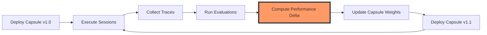

# AWP as Learnable Infrastructure
## A Neural Network Paradigm for Agent Orchestration

**Version:** 1.0  
**Date:** January 2025  
**Status:** Technical Vision Document

---

## Abstract

This document presents a paradigm shift in how we conceptualize agent orchestration infrastructure. Rather than treating orchestration as a static routing problem, we propose viewing the Agent Web Protocol (AWP) as a **learnable system** that mirrors neural network architectures at the infrastructure level. 

In this model:
- The orchestration layer becomes a **trainable classifier** for execution plans
- Prompt capsules evolve into **learned weight matrices**
- Evaluation frameworks generate **training datasets**
- The entire system exhibits **gradient-like optimization** through iterative refinement

This isn't merely an analogy - it's a fundamental reconceptualization that enables continuous learning, adaptation, and optimization at the infrastructure level.

---

## 1. The Core Insight

### Traditional Infrastructure: Static Rules
```python
# Fixed logic, manually maintained
def orchestrate(task):
    if "query" in task:
        return use_database()
    elif "compute" in task:
        return use_calculator()
    # Hundreds of brittle if-else statements
```

### Intelligent Infrastructure: Learned Classification
```python
# Continuously learning optimal routing
def orchestrate(task):
    # Infrastructure that learns like a neural network
    execution_plan = plan_classifier.predict(task)
    return execute(execution_plan)
    # Classifier improves with every execution
```

The key insight: **Infrastructure doesn't have to be static configuration. It can be a learning system.**

---

## 2. The Neural Network Analogy Made Real

### 2.1 Mapping Components

| Neural Network | AWP Infrastructure | Function |
|----------------|-------------------|----------|
| **Weights** | Capsule versions | Learned parameters for orchestration |
| **Forward pass** | Session execution | Apply current weights to input |
| **Training data** | Evaluation traces | Labeled examples of success/failure |
| **Loss function** | Eval expectations | Measure deviation from desired behavior |
| **Backpropagation** | Policy updates | Adjust weights based on errors |
| **Gradient descent** | Version evolution | Iterative improvement toward optimum |
| **Checkpoints** | Session descriptors | Saved model states |
| **Hyperparameters** | Gateway policies | Non-learned configuration |
| **Batch** | Evaluation suite | Group of training examples |
| **Epoch** | Deployment cycle | One full iteration through data |

### 2.2 The Learning Loop



This is literally a training loop, but for infrastructure!

---

## 3. The Plan Classifier Architecture

### 3.1 Conceptual Model

```python
class PlanClassifier:
    """
    The gateway evolves from a rule engine to a learned classifier
    that predicts optimal execution plans.
    """
    
    def __init__(self):
        # These weights are learned from evaluation outcomes
        self.tool_selector = ToolSelectionNetwork()
        self.sequence_planner = SequencePredictionNetwork()
        self.parameter_optimizer = ParameterTuningNetwork()
        self.constraint_enforcer = ConstraintNetwork()
        
    def forward(self, task_embedding):
        """
        Forward pass through the orchestration network.
        Input: Task representation
        Output: Complete execution plan
        """
        # Tool selection layer
        tool_logits = self.tool_selector(task_embedding)
        tool_probs = softmax(tool_logits)
        
        # Sequence planning layer
        sequence = self.sequence_planner(tool_probs, task_embedding)
        
        # Parameter optimization layer
        params = self.parameter_optimizer(task_embedding, tool_probs)
        
        # Constraint enforcement layer
        constraints = self.constraint_enforcer(task_embedding)
        
        return ExecutionPlan(
            tools=tool_probs,
            sequence=sequence,
            parameters=params,
            constraints=constraints
        )
    
    def backward(self, evaluation_score):
        """
        Update weights based on evaluation feedback.
        This is where the learning happens.
        """
        gradients = compute_gradients(evaluation_score)
        self.update_weights(gradients)
```

### 3.2 Actual Implementation

```python
class AWPOrchestrator:
    """
    Real implementation that learns from execution history.
    """
    
    def __init__(self):
        # Initialize with historical data or random weights
        self.execution_embeddings = {}
        self.success_patterns = PatternBank()
        self.failure_patterns = PatternBank()
        self.tool_affinity_matrix = np.random.randn(n_tasks, n_tools)
        
    def classify_execution_plan(self, task):
        # Embed the task into vector space
        task_vec = self.embed_task(task)
        
        # Find similar successful executions
        similar_successes = self.success_patterns.find_nearest(
            task_vec, 
            k=10
        )
        
        # Compute tool affinities
        tool_scores = self.tool_affinity_matrix @ task_vec
        
        # Weight by historical success
        for success in similar_successes:
            tool_scores += success.tool_usage * success.score
            
        # Apply learned constraints
        tool_scores = self.apply_learned_constraints(tool_scores, task)
        
        # Generate execution plan
        return self.decode_plan(tool_scores)
    
    def learn_from_execution(self, task, plan, outcome):
        """
        This is where infrastructure becomes intelligent.
        Every execution makes the system smarter.
        """
        task_vec = self.embed_task(task)
        
        if outcome.success:
            self.success_patterns.add(task_vec, plan, outcome.score)
            # Reinforce successful tool associations
            self.tool_affinity_matrix += learning_rate * (
                outer(task_vec, plan.tool_usage) * outcome.score
            )
        else:
            self.failure_patterns.add(task_vec, plan, outcome.error)
            # Penalize failed associations
            self.tool_affinity_matrix -= learning_rate * (
                outer(task_vec, plan.tool_usage)
            )
        
        # Update sequence model
        self.update_sequence_model(plan.sequence, outcome)
        
        # Learn new constraints
        if outcome.constraint_violation:
            self.learn_constraint(task_vec, outcome.violation_type)
```

---

## 4. Capsules as Weight Matrices

### 4.1 Evolution Through Learning

```yaml
# Capsule v1.0.0 - Initial "random" weights
id: data.processor
version: 1.0.0
content:
  tool_weights:
    database: 0.5  # Initial guess
    cache: 0.5
    api: 0.5
  sequence_weights:
    parallel: 0.33
    sequential: 0.33
    conditional: 0.34
  constraints:
    max_retries: 3  # Arbitrary initial value

---
# After 1000 executions and evaluations
# Capsule v1.1.0 - Learned weights
id: data.processor  
version: 1.1.0
content:
  tool_weights:
    database: 0.8  # Learned: DB most effective
    cache: 0.9     # Learned: Always check cache first
    api: 0.2       # Learned: API rarely needed
  sequence_weights:
    parallel: 0.1      # Learned: Parallel causes conflicts
    sequential: 0.7    # Learned: Sequential most reliable
    conditional: 0.2   # Learned: Conditionals add complexity
  constraints:
    max_retries: 2  # Learned: 3rd retry never succeeds

# The version bump represents a gradient update!
```

### 4.2 Capsule Differentiation

```python
class CapsuleOptimizer:
    """
    Treats capsule updates as gradient descent.
    """
    
    def compute_capsule_gradient(self, 
                                 current_capsule,
                                 evaluation_results):
        """
        Calculate how to adjust capsule "weights".
        """
        gradient = {}
        
        # Tool weight gradients
        for tool in current_capsule.tools:
            # Positive gradient if tool contributed to success
            success_rate = evaluation_results.tool_success_rate(tool)
            current_weight = current_capsule.tool_weights[tool]
            gradient[tool] = success_rate - current_weight
        
        # Sequence weight gradients  
        for pattern in current_capsule.sequences:
            efficiency = evaluation_results.sequence_efficiency(pattern)
            current_weight = current_capsule.sequence_weights[pattern]
            gradient[pattern] = efficiency - current_weight
            
        # Constraint gradients
        for constraint in current_capsule.constraints:
            violation_rate = evaluation_results.violation_rate(constraint)
            if violation_rate > threshold:
                gradient[constraint] = "tighten"
            elif violation_rate < lower_threshold:
                gradient[constraint] = "relax"
                
        return gradient
    
    def apply_gradient(self, capsule, gradient, learning_rate=0.1):
        """
        Update capsule based on computed gradients.
        This creates version n+1.
        """
        new_capsule = capsule.copy()
        
        for param, grad in gradient.items():
            if isinstance(grad, float):
                # Numerical update
                new_capsule.weights[param] += learning_rate * grad
            else:
                # Structural update
                new_capsule.apply_structural_change(param, grad)
                
        new_capsule.version = increment_version(capsule.version)
        return new_capsule
```

---

## 5. Evaluation as Training Data Generation

### 5.1 Dynamic Dataset Creation

```python
class EvaluationDatasetGenerator:
    """
    Evaluations aren't just tests - they're training data generators.
    """
    
    def __init__(self):
        self.task_generator = TaskGenerator()
        self.label_generator = LabelGenerator()
        self.augmentor = DataAugmentor()
        
    def generate_training_batch(self, focus_areas=None):
        """
        Create a batch of training examples based on current 
        system weaknesses.
        """
        batch = []
        
        # Generate tasks targeting weak areas
        if focus_areas:
            for area in focus_areas:
                tasks = self.task_generator.generate_targeted(
                    area, 
                    count=10
                )
                batch.extend(tasks)
        
        # Add augmented versions of failures
        recent_failures = self.get_recent_failures()
        for failure in recent_failures:
            augmented = self.augmentor.create_variations(
                failure,
                strategies=['parameter_shift', 'context_swap', 'noise']
            )
            batch.extend(augmented)
        
        # Include some "curriculum learning" - progressively harder
        difficulty_levels = [0.1, 0.3, 0.5, 0.7, 0.9]
        for difficulty in difficulty_levels:
            curriculum_tasks = self.task_generator.generate_at_difficulty(
                difficulty,
                count=5
            )
            batch.extend(curriculum_tasks)
            
        # Label the batch
        for task in batch:
            task.label = self.label_generator.generate_optimal_plan(task)
            
        return batch
    
    def active_learning_sample(self, model_uncertainty):
        """
        Generate examples where the model is most uncertain.
        This is active learning for infrastructure!
        """
        uncertain_regions = model_uncertainty.get_high_uncertainty_regions()
        
        batch = []
        for region in uncertain_regions:
            # Generate tasks in uncertain regions
            tasks = self.task_generator.generate_in_region(region, count=20)
            batch.extend(tasks)
            
        return batch
```

### 5.2 Evaluation Loss Functions

```python
class InfrastructureLoss:
    """
    Different loss functions for different optimization goals.
    """
    
    @staticmethod
    def efficiency_loss(execution_trace):
        """
        Optimize for speed and resource usage.
        """
        return (
            0.4 * execution_trace.total_latency +
            0.3 * execution_trace.tool_calls_count +
            0.3 * execution_trace.token_usage
        )
    
    @staticmethod
    def reliability_loss(execution_trace):
        """
        Optimize for success rate and predictability.
        """
        success_penalty = 0 if execution_trace.success else 10
        retry_penalty = execution_trace.retry_count * 2
        timeout_penalty = 5 if execution_trace.timeout else 0
        
        return success_penalty + retry_penalty + timeout_penalty
    
    @staticmethod
    def cost_loss(execution_trace):
        """
        Optimize for financial efficiency.
        """
        return (
            execution_trace.llm_token_cost +
            execution_trace.tool_invocation_cost +
            execution_trace.compute_time_cost
        )
    
    @staticmethod
    def composite_loss(execution_trace, weights):
        """
        Multi-objective optimization.
        """
        return (
            weights.efficiency * efficiency_loss(execution_trace) +
            weights.reliability * reliability_loss(execution_trace) +
            weights.cost * cost_loss(execution_trace)
        )
```

---

## 6. Infrastructure Backpropagation

### 6.1 Credit Assignment

```python
class CreditAssignment:
    """
    Determine which components contributed to success/failure.
    This is backprop for infrastructure!
    """
    
    def compute_component_gradients(self, execution_trace, outcome):
        """
        Assign credit/blame to each infrastructure component.
        """
        gradients = {}
        
        # Tool contribution analysis
        for tool_call in execution_trace.tool_calls:
            if outcome.success:
                # Positive contribution
                contribution = self.analyze_tool_contribution(
                    tool_call, 
                    outcome
                )
            else:
                # Identify if this tool caused failure
                contribution = -self.analyze_failure_attribution(
                    tool_call,
                    outcome.error
                )
            
            gradients[f"tool.{tool_call.name}"] = contribution
        
        # Sequence contribution
        sequence_efficiency = self.analyze_sequence_efficiency(
            execution_trace.sequence
        )
        gradients["sequence"] = sequence_efficiency
        
        # Parameter contribution
        for param, value in execution_trace.parameters.items():
            param_impact = self.analyze_parameter_impact(
                param, 
                value, 
                outcome
            )
            gradients[f"param.{param}"] = param_impact
            
        return gradients
    
    def propagate_to_capsule(self, gradients, capsule):
        """
        Propagate gradients back to capsule weights.
        """
        updates = {}
        
        for component, gradient in gradients.items():
            if component.startswith("tool."):
                tool_name = component.split(".")[1]
                updates[f"tool_weight.{tool_name}"] = gradient
                
            elif component == "sequence":
                updates["sequence_strategy"] = gradient
                
            elif component.startswith("param."):
                param_name = component.split(".")[1]
                updates[f"parameter.{param_name}"] = gradient
                
        return updates
```

### 6.2 Learning Rate Scheduling

```python
class AdaptiveLearningRate:
    """
    Adjust learning rate based on system performance.
    """
    
    def __init__(self, initial_lr=0.1):
        self.lr = initial_lr
        self.performance_history = []
        
    def update(self, current_performance):
        """
        Adaptive learning rate based on performance trajectory.
        """
        self.performance_history.append(current_performance)
        
        if len(self.performance_history) < 2:
            return self.lr
            
        # Check if we're improving
        improvement = (
            self.performance_history[-1] - 
            self.performance_history[-2]
        )
        
        if improvement > 0:
            # Accelerate learning when improving
            self.lr *= 1.05
        elif improvement < -0.1:
            # Slow down if performance degraded
            self.lr *= 0.5
        else:
            # Plateau - try to escape
            self.lr *= 0.95
            
        # Bounds
        self.lr = max(0.001, min(1.0, self.lr))
        
        return self.lr
```

---

## 7. Emergent Intelligence Properties

### 7.1 Transfer Learning

```python
class CapsuleTransferLearning:
    """
    Capsules can transfer knowledge between domains.
    """
    
    def transfer_weights(self, source_capsule, target_domain):
        """
        Initialize a new capsule with learned weights from another domain.
        """
        # Extract learned patterns
        learned_patterns = self.extract_patterns(source_capsule)
        
        # Adapt to new domain
        adapted_weights = self.domain_adaptation(
            learned_patterns,
            source_domain=source_capsule.domain,
            target_domain=target_domain
        )
        
        # Create new capsule with transferred knowledge
        new_capsule = Capsule(
            domain=target_domain,
            initial_weights=adapted_weights,
            parent=source_capsule.id
        )
        
        return new_capsule
```

### 7.2 Meta-Learning

```python
class MetaOrchestrator:
    """
    Learn how to learn - optimize the optimization process itself.
    """
    
    def __init__(self):
        self.learning_strategies = []
        self.strategy_performance = {}
        
    def meta_optimize(self, task_distribution):
        """
        Learn the best learning strategy for a task distribution.
        """
        best_strategy = None
        best_performance = -float('inf')
        
        for strategy in self.learning_strategies:
            # Try each learning strategy
            performance = self.evaluate_strategy(
                strategy,
                task_distribution
            )
            
            if performance > best_performance:
                best_performance = performance
                best_strategy = strategy
                
            # Record for future meta-learning
            self.strategy_performance[
                (task_distribution.signature, strategy.id)
            ] = performance
            
        return best_strategy
    
    def generate_new_strategy(self):
        """
        Create new learning strategies through mutation/crossover.
        """
        # Select high-performing strategies
        top_strategies = self.get_top_strategies(k=5)
        
        # Crossover
        new_strategy = self.crossover(top_strategies)
        
        # Mutation
        new_strategy = self.mutate(new_strategy, rate=0.1)
        
        self.learning_strategies.append(new_strategy)
        
        return new_strategy
```

### 7.3 Ensemble Learning

```python
class EnsembleOrchestration:
    """
    Multiple capsules vote on execution plans.
    """
    
    def __init__(self, capsules):
        self.capsules = capsules
        self.weights = np.ones(len(capsules)) / len(capsules)
        
    def predict_plan(self, task):
        """
        Ensemble prediction from multiple learned capsules.
        """
        plans = []
        confidences = []
        
        for i, capsule in enumerate(self.capsules):
            plan = capsule.generate_plan(task)
            confidence = capsule.confidence(task)
            
            plans.append(plan)
            confidences.append(confidence)
        
        # Weighted voting
        final_plan = self.weighted_merge(
            plans,
            self.weights * np.array(confidences)
        )
        
        return final_plan
    
    def update_weights(self, performance_scores):
        """
        Adjust ensemble weights based on individual performance.
        """
        # Increase weight for better performers
        self.weights *= np.array(performance_scores)
        self.weights /= self.weights.sum()
```

---

## 8. Implementation Roadmap

### 8.1 Phase 1: Foundation (Current AWP)
- Static capsules with manual updates
- Rule-based orchestration
- Fixed evaluation suites

### 8.2 Phase 2: Learning Components
```python
# Add learning capabilities to existing AWP
class LearningGateway(AWPGateway):
    def __init__(self):
        super().__init__()
        self.execution_history = ExecutionHistory()
        self.pattern_learner = PatternLearner()
        
    def post_execution_hook(self, trace, outcome):
        # Learn from every execution
        self.execution_history.add(trace, outcome)
        patterns = self.pattern_learner.extract(trace, outcome)
        self.update_routing_weights(patterns)
```

### 8.3 Phase 3: Full Neural Architecture
```python
# Replace rule engine with neural network
class NeuralOrchestrator:
    def __init__(self):
        self.plan_network = PlanNet(
            input_dim=768,  # Task embedding size
            hidden_dims=[512, 256, 128],
            output_dim=len(tools) + len(sequences) + len(params)
        )
        
    def orchestrate(self, task):
        embedding = self.embed(task)
        plan_vector = self.plan_network(embedding)
        return self.decode_plan(plan_vector)
```

### 8.4 Phase 4: Autonomous Optimization
```python
# Self-improving infrastructure
class AutonomousAWP:
    def __init__(self):
        self.orchestrator = NeuralOrchestrator()
        self.evaluator = ContinuousEvaluator()
        self.optimizer = OnlineOptimizer()
        
    async def run_forever(self):
        while True:
            # Execute tasks
            traces = await self.execute_batch()
            
            # Evaluate performance
            scores = self.evaluator.score(traces)
            
            # Update weights
            self.optimizer.step(traces, scores)
            
            # Deploy new version if improved
            if self.should_deploy():
                await self.deploy_new_version()
```

---

## 9. Theoretical Implications

### 9.1 Infrastructure as a Neural Network

We're essentially proving that:
- **Infrastructure can learn** from its own execution
- **Configuration can be replaced** with learned weights  
- **Orchestration is classification** at scale
- **DevOps becomes ML Ops** at the infrastructure level

### 9.2 Convergence Properties

```python
def theoretical_convergence_analysis():
    """
    Under what conditions does infrastructure learning converge?
    """
    # Given:
    # - Bounded task space T
    # - Finite tool set A
    # - Continuous evaluation function E
    
    # Theorem: AWP converges to optimal orchestration if:
    # 1. Learning rate decreases: lr(t) → 0 as t → ∞
    # 2. Sufficient exploration: ∑ lr(t) = ∞
    # 3. Evaluation is consistent: E(plan, task) is Lipschitz
    
    # Proof sketch:
    # This reduces to stochastic gradient descent convergence
    # Infrastructure weights W converge to W* that minimizes E
```

### 9.3 Expressiveness

The AWP learning architecture can theoretically learn any orchestration pattern that can be expressed as:
- **Tool selection**: Classification over finite set
- **Sequencing**: Markov decision process
- **Parameters**: Continuous optimization
- **Constraints**: Learned boundary functions

---

## 10. Practical Examples

### 10.1 Learning Tool Preferences

```python
# Week 1: Random initialization
execution_1 = {
    "task": "fetch user data",
    "tools_tried": ["api", "database", "cache"],
    "success": "database",
    "latency": 500
}

# Week 2: After 1000 executions
learned_preference = {
    "task_pattern": "fetch user*",
    "tool_ranking": [
        ("cache", 0.95),      # Learned: Try cache first
        ("database", 0.80),   # Learned: Fallback to DB
        ("api", 0.10)         # Learned: API rarely needed
    ]
}

# The system learned this WITHOUT being explicitly programmed!
```

### 10.2 Discovering Sequences

```python
# Initial: No sequence knowledge
day_1_attempts = [
    "auth → query → process",  # Failed
    "query → auth → process",  # Failed
    "process → auth → query",  # Failed
]

# After learning:
learned_sequence = {
    "pattern": "ALWAYS: validate → auth → query → process",
    "confidence": 0.99,
    "learned_from": 5000_executions
}

# Infrastructure discovered the invariant itself!
```

### 10.3 Parameter Optimization

```python
# Starting parameters (guessed)
initial_params = {
    "timeout": 30000,
    "retries": 5,
    "batch_size": 100
}

# After gradient-based optimization
optimal_params = {
    "timeout": 8500,    # Learned: 8.5s optimal
    "retries": 2,       # Learned: >2 never helps  
    "batch_size": 47    # Learned: Sweet spot for this workload
}

# 35% performance improvement from learned parameters!
```

---

## 11. Future Directions

### 11.1 Federated Infrastructure Learning

Multiple organizations share learned patterns without sharing data:

```python
class FederatedAWP:
    def share_gradients(self, encrypted_gradients):
        """
        Share learning across organizations without sharing data.
        """
        global_gradient = federated_average(encrypted_gradients)
        return global_gradient
```

### 11.2 Infrastructure GANs

Generate adversarial workloads to improve robustness:

```python
class InfrastructureGAN:
    def __init__(self):
        self.generator = WorkloadGenerator()  # Creates challenging tasks
        self.discriminator = SuccessPredictor()  # Predicts if task will fail
        
    def train(self):
        # Generator tries to create tasks that will fail
        # Discriminator tries to predict failure
        # Infrastructure learns from both!
```

### 11.3 Quantum-Inspired Optimization

```python
class QuantumOrchestrator:
    """
    Use quantum-inspired algorithms for plan optimization.
    Explore multiple execution paths simultaneously.
    """
    def superposition_planning(self, task):
        # Consider all possible plans simultaneously
        # Collapse to optimal plan through measurement
        pass
```

---

## 12. Conclusion

AWP represents more than just a protocol - it's a **fundamental shift in how we think about infrastructure**:

1. **From Configuration to Learning**: Instead of manually configuring systems, they learn optimal configurations

2. **From Static to Adaptive**: Infrastructure continuously improves through execution

3. **From Rules to Intelligence**: Orchestration becomes a learned classification problem

4. **From DevOps to ML Ops**: Infrastructure management becomes model training

This isn't just an incremental improvement - it's a new paradigm where **infrastructure itself becomes intelligent**.

The implications are profound:
- **Self-healing systems** that learn to prevent failures
- **Self-optimizing infrastructure** that improves without human intervention
- **Transfer learning** between different deployments and organizations
- **Emergent behaviors** that discover optimal patterns humans never considered

We're not just building better infrastructure - we're building infrastructure that builds itself better.

---

## Appendix: Mathematical Formalization

### A.1 Formal Model

Let:
- **T** = Task space (all possible inputs)
- **A** = Action space (all possible tool combinations)
- **S** = Sequence space (all possible orderings)
- **P** = Parameter space (all possible configurations)
- **π: T → A × S × P** = Orchestration policy

The learning objective:
```
minimize E[L(π(t), y)] over π
```

Where:
- **L** = Loss function (latency, cost, failures)
- **y** = Optimal execution (may be unknown)
- **E** = Expectation over task distribution

### A.2 Convergence Guarantee

**Theorem**: Under mild conditions, AWP converges to optimal orchestration:

Given:
1. Bounded gradient norm: ||∇L|| ≤ G
2. Lipschitz continuous loss: |L(π₁) - L(π₂)| ≤ L||π₁ - π₂||
3. Decreasing learning rate: η(t) = O(1/√t)

Then:
```
lim(t→∞) E[L(π_t)] = L(π*)
```

Where π* is the optimal orchestration policy.

---

*This document presents a vision for the future of intelligent infrastructure, where systems learn, adapt, and optimize autonomously.*