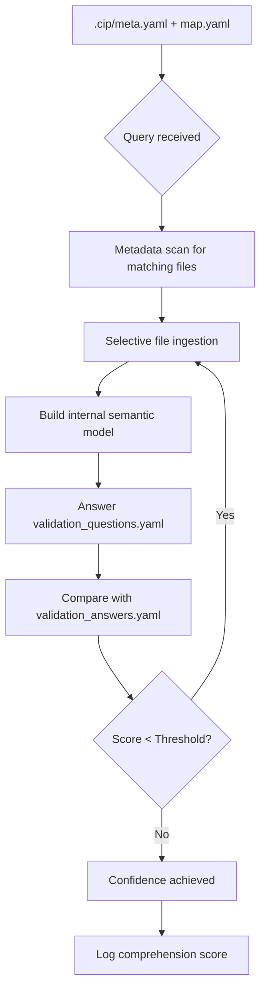

# Cognition Index Protocol (CIP) Architecture

## 🧠 Introduction

The **Cognition Index Protocol (CIP)** is a machine-native framework designed to embed, test, and validate true comprehension within AI systems interacting with software, theoretical frameworks, or scientific repositories. It formalizes the process of intelligent understanding into structured **phases of ingestion, reasoning, validation, and reflexive feedback**.

Rather than assuming an AI system understands a project simply because it can summarize or navigate it, CIP enforces a process of:

* Structured pre-ingestion planning
* Intentional context acquisition
* Targeted comprehension testing
* Comparison to a ground-truth index
* Reflexive improvement loops

This document outlines the complete architecture of CIP, including its file structure, ingestion logic, scoring logic, and future-facing implications for AI comprehension.

---

## 📊 CIP Overview Diagram



---

## 📂 CIP Directory Structure (v3)

```bash
/your-repo/
  .cip/
    meta.yaml                   # CIP metadata and current instructions version
    instructions_v2.0.yaml      # Versioned schema/navigation instructions
    filename_lexicon.yaml       # Tag definitions for filename metadata
  map.yaml                      # Root-level plain directory/file map
  /cognition/
    validation_questions.yaml   # Self-test question set
    validation_answers.yaml     # Ground truth answer index (never ingested during reasoning)
    rubric_criteria.json        # Optional rubric scoring guide
    comprehension_log.json      # Output of scoring process
  /models/
  /experiments/
  /docs/
```

---

## 📄 Phase 1: Metadata-Guided Pre-Ingestion

### Objective:

Scan and classify content using `.cip/meta.yaml` and `map.yaml`, without loading large files unless necessary.

### Key Features:

* Descriptions, semantic tags, and ingestion hints in `meta.yaml`
* Context weight estimates
* Ingestion flags (required vs optional)
* Directory/file structure from `map.yaml`
* Filename tags parsed using `.cip/filename_lexicon.yaml`

### Example Entry (`meta.yaml`):

```yaml
schema_version: 2.0
directory_name: models
description: >
  Core models for entropy field simulation and agent-based experiments.
semantic_scope:
  - neural-net
  - entropy
  - QBE
files:
  - [m][F][v1.0][C4][I5]_core_model.py
  - [m][D][v0.3][C3][I3]_experimental_agent.py
child_directories: []
```

### Benefits:

* ✅ Reduces token cost
* ✅ Enables smarter ingestion plans
* ✅ Provides structure for filtering queries

---

## 🔮 Phase 2: Intentional Ingestion

After planning, the AI ingests only relevant documents or code fragments. This prevents overload and hallucination.

### Options:

* Summary ingestion
* Line-referenced code loading
* Section-based theory parsing

---

## 🔬 Phase 3: Self-Test via Validation Questions

AI then attempts to answer a set of questions defined in `cognition/validation_questions.yaml`, without access to answers.

### Example:

```yaml
- id: QBE-01
  target_files: [[m][F][v1.0][C4][I5]_core_model.py, experiments/field_collapse.md]
  question: >
    Describe how the QBE model dynamically regulates entropy in the simulation. Name any key functions or variables involved.
```

---

## 🔢 Phase 4: Ground Truth Comparison (Do Not Ingest)

Answers are scored against `validation_answers.yaml`. This file is **never ingested**, only used for post-hoc comparison.

### Ground Truth Entry:

```yaml
- id: QBE-01
  rubric: >
    Must mention qbe_regulator(), entropy_score, and timestep-based feedback.
  ground_truth:
    - The function `qbe_regulator()` modifies entropy dynamically.
    - Uses feedback from `entropy_score`.
    - Operates within a loop over time `t`.
```

### Scoring Options:

* Semantic embedding similarity
* Regex/keyword matching
* Reason trace comparison

---

## ♻️ Phase 5: Reflexive Feedback Loop

If comprehension score is low:

* Suggest re-ingestion of specific sections
* Retry question
* Log iterations to convergence

### Key Metrics:

* Number of iterations
* Delta improvement per cycle
* Comprehension confidence threshold (e.g., 0.85+)

---

## 📊 Sample Comprehension Log Entry

```json
{
  "question_id": "QBE-01",
  "score": 0.83,
  "attempts": 3,
  "final_answer": "The qbe_regulator function modifies entropy_score in a loop over t, based on simulation feedback...",
  "concepts_missed": ["time-dependency"],
  "confidence_achieved": true
}
```

---

## 🏷️ Filename Metadata Schema Protocol (v3)

All files should use the bracket-based filename metadata schema:

```
[domain][type][version][complexity][importance][extras]_filename.ext
```

- **domain**: e.g., `[m]` (math), `[a]` (agent), `[id]` (infodynamics), etc.
- **type**: `[D]` (draft), `[S]` (spec), `[F]` (final), `[T]` (test)
- **version**: `[vX.Y]` (semantic version)
- **complexity**: `[C1]` (trivial) to `[C5]` (expert)
- **importance**: `[I1]` (optional) to `[I5]` (critical), `[core]`
- **extras**: `[R]` (recursive), `[Q]` (quantum), `[E]` (entropy-driven), `[A]` (AI-interactive)

See `.cip/filename_lexicon.yaml` for tag definitions.

---

## 🧩 Key Principles (v3)

- **Uniformity:** Every directory, including the root, uses `meta.yaml` for metadata.
- **Extensibility:** New fields and semantic domains can be added as the project evolves.
- **Machine-Readability:** All metadata is YAML, designed for both human and LLM consumption.
- **Maintainability:** Changes to schema or structure are tracked in `schema.yaml` for long-term integrity.
- **Filename Metadata:** All files use bracket-based tags for self-describing, machine-parsable filenames.

---

## 🚀 Getting Started

1. **Add a `meta.yaml` to every directory** (including the root) describing its contents and semantic context.
2. **Add a `map.yaml`** at the root for a plain directory/file map.
3. **Maintain and update `schema.yaml`** as schemas evolve.
4. **Adopt the filename metadata schema** for all new and migrated files.

---

## 🔗 See Also

- `.cip/filename_lexicon.yaml` (for filename tag definitions)
- `schema.yaml` (for schema definitions and versioning)
- Example `meta.yaml` templates in `/docs/metadata_examples/`
- [Modular Metadata Architecture v3](../gpt/metadata_architecturev3.md)

---

## 🔒 Ground Truth Ethic

> CIP is not a test to pass. It is a discipline to earn understanding.

* The ground truth layer must remain **firewalled** during reasoning
* All truth must be **earned**, not scraped
* Validation ensures **reflective comprehension**, not memorization

---

## 🚀 Closing Vision

CIP isn't just a new protocol for code comprehension. It is a **machine-native epistemology framework** — a new way for AI to:

* Know what it knows
* Prove what it understands
* Reflect when it fails

This architecture builds the foundation for **trustworthy, interpretable, and verifiable machine intelligence**.

> "Understanding must be measured, not assumed."
