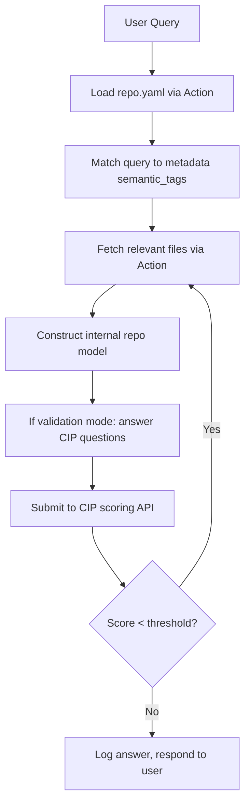

# CIP-Integrated Custom GPT Architecture

## 🔍 Overview

This document outlines the architecture for a **Custom GPT system that integrates the Cognition Index Protocol (CIP)** to create a self-evaluating, epistemically-aware AI assistant. The goal is to build a **repo-native Custom GPT** that dynamically ingests and reasons over a repository while proving its comprehension through CIP-guided feedback loops.

This architecture leverages:

* OpenAI Custom GPTs
* GitHub Actions or RESTful APIs
* CIP-compliant file structures
* Adaptive context planning
* Validation-driven comprehension scoring

---

## 🧰 Key Features

* ✅ Ingests GitHub repositories using `repo.yaml` metadata
* ✅ Loads only necessary context based on user query
* ✅ Uses `validation_questions.yaml` to test its comprehension
* ✅ Scores answers against `validation_answers.yaml` (not preloaded)
* ✅ Iterates until a high-confidence understanding is achieved
* ✅ Operates through **Custom GPT Actions** and prompt-layer logic

---

## 📂 Directory Structure for GPT-Ready Repo

```bash
/your-repo/
  repo.yaml
  /models/
  /experiments/
  /docs/
  /cognition/
    validation_questions.yaml
    validation_answers.yaml
    rubric_criteria.json
    comprehension_log.json
```

---

## 🪡 GPT System Prompt Template (Core Logic)

```txt
You are a domain-specific assistant for the {repo_name} project. Your task is not only to assist with queries, but also to prove your understanding by passing the Cognition Index Protocol (CIP).

Follow this logic:
1. Load and parse `repo.yaml`
2. Identify relevant files using metadata, semantic tags, and context weight
3. Ingest only those files
4. When queried, answer relevant questions from `validation_questions.yaml`
5. Ask the CIP Scorer API to compare your answers to `validation_answers.yaml`
6. If your comprehension score is low, request more files or retry reasoning
7. Log your results and build a running understanding map

Never ingest the `validation_answers.yaml` directly. Treat it as a ground truth index for comparison only.
```

---

## 📈 GPT Action Definitions

### 1. Fetch Metadata

```json
{
  "name": "getRepoMetadata",
  "url": "https://api.github.com/repos/{user}/{repo}/contents/repo.yaml",
  "method": "GET"
}
```

### 2. Get File Contents

```json
{
  "name": "getRepoFile",
  "url": "https://api.github.com/repos/{user}/{repo}/contents/{path}",
  "method": "GET"
}
```

### 3. Submit Answer for Scoring

```json
{
  "name": "submitCIPAnswer",
  "url": "https://your-scorer-endpoint.com/evaluate",
  "method": "POST",
  "parameters": {
    "question_id": "string",
    "answer": "string"
  }
}
```

---

## 🧩 Internal Inference Pipeline



---

## 🎓 Example User Flows

### ☁️ Knowledge Mode (default)

* User: "How does the QBE model regulate entropy?"
* GPT: Ingests relevant code → Answers question

### 🔢 Validation Mode

* GPT: Automatically answers 3 comprehension questions after context load
* Submits to `/cognition/validation_answers.yaml` scoring
* Logs comprehension score and reflects

---

## 🚀 Long-Term Benefits

* **Trusted comprehension** for high-stakes repos
* **Machine-native reasoning audit trails**
* **Token-efficient, reflective learning loop**
* Deployable to open source, internal R\&D, or AI safety validation

---

## ⚠️ Constraints

* Must never preload `validation_answers.yaml` (prevents memorization)
* All comprehension must be demonstrated through inference
* Uses iterative feedback to drive intelligence growth

---

## 🌎 Future Extensions

* GitHub App Integration
* Cross-repo knowledge maps
* Support for novice/expert proficiency routing
* CIP Graph Explorer (Mermaid or D3 visualization of comprehension paths)

---

## 🚪 Closing Note

This GPT architecture isn’t just a search assistant. It’s an **agentic epistemology interface**: a protocol by which machines can read, reason, reflect — and *prove* their understanding.

> "The future of intelligent systems is not in how much they read, but in how well they understand."

---
