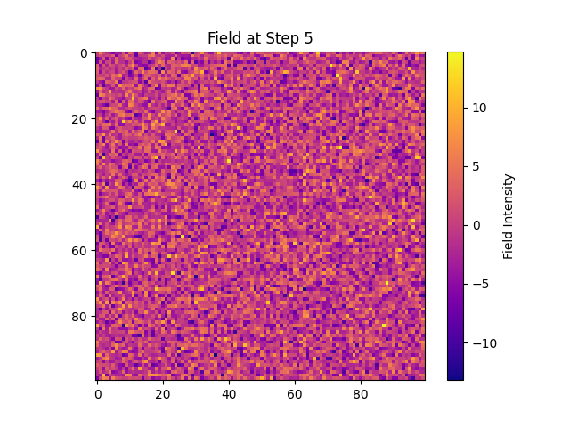
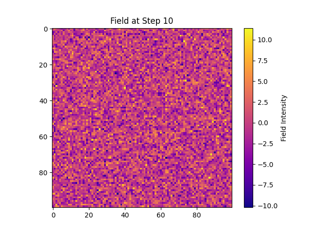
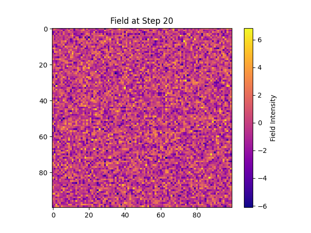

# Landauer Erasure Cost, Superfluidity, and Viscosity in Symbolic Informational Fields

## Abstract

We investigate the energetic cost and emergent phase behaviors of information erasure in symbolic fields, integrating Landauer’s principle with new measures of field viscosity and superfluidity. Using the Landauer Erasure Field Cost Map experiment, we track the energy required to erase distributed memory across a symbolic substrate, quantify viscosity-like resistance to erasure, and analyze the emergence of superfluid-like low-dissipation channels. Our results reveal how symbolic field topology, memory structure, and field history jointly determine the cost and morphology of erasure, with direct implications for information thermodynamics, computational efficiency, and the physics of memory.

## 1. Introduction

Landauer’s principle establishes a fundamental energetic cost to erasing information—a lower bound that has shaped both theory and practice in physics and computation. However, the spatial and field-theoretic dynamics of erasure in complex, memory-laden substrates remain poorly understood. Here, we extend Landauer’s analysis to symbolic fields with nontrivial topology, memory, and emergent phase structure, examining how field geometry, viscosity, and superfluid-like pathways mediate dissipation and energetic cost during erasure. This work situates symbolic field erasure within a unified thermodynamic and informational framework, offering new insights into the links between computation, memory, and physics.

## 2. Theoretical Framework

### 2.1 Landauer Bound and Energy Cost of Erasure

Landauer’s bound sets a minimum energy cost for irreversible erasure: $E \geq k_B T \ln 2$ per bit erased (where $k_B$ is Boltzmann’s constant and $T$ is temperature). In spatially extended, symbolic fields, this bound becomes a distributed, topology-dependent constraint, modified by field memory, redundancy, and spatial coupling.

### 2.2 Symbolic Fields, Topology, and Memory

A symbolic field is modeled as a high-dimensional lattice or network with symbols assigned to nodes. Memory is encoded in spatial correlations, symbolic redundancies, and persistent field substructures. Erasure proceeds by applying local or global transformations to nullify or randomize memory-bearing regions, with cost accumulating according to both local entropy and global field geometry.

### 2.3 Field Viscosity and Superfluidity

* **Viscosity:** Resistance to erasure; quantified by the delay or energetic cost required to erase a region, influenced by symbolic redundancy and structural complexity.
* **Superfluidity:** Existence of low-viscosity channels where information can be erased or reorganized with minimal dissipation; emergent from topological ordering, symmetry, or dynamic feedback.

## 3. Experimental Protocol

### 3.1 Landauer Erasure Field Cost Map

* **Initialization:** A spatial symbolic field (size: 50×50) is seeded with distributed memory (high entropy, structured symbols).
* **Erasure Protocol:** Systematic, stepwise erasure—targeting high-memory regions—proceeds across the field. At each step, local and global energy costs are computed and logged. Field state, entropy, and cost maps are recorded.
* **Metrics:**

  * Total energy cost of full erasure
  * Time series of energy, entropy, and local field state
  * Snapshots of field configuration at critical erasure steps
  * Spatial maps of instantaneous cost, memory, and flow

#### Code Fragment (Protocol)

```python
for step in range(max_steps):
    for (i, j) in field.indices():
        if should_erase(i, j):
            energy_cost = landauer_cost(field[i, j], T)
            total_energy += energy_cost
            field[i, j] = erased_state
    record_metrics(field, total_energy, step)
```

## 4. Results

### 4.1 Energy Cost and Field Evolution

* **Initial field state:** High entropy, memory-rich, spatially structured.
* **Initial energy:** 251,603.52
* **Final energy:** 32,334.11
* **Total energy cost:** ≈ 219,269.41

#### Field Snapshots (Erasure Progression)

| Step | Field State                                                                                                        |
| ---- | ------------------------------------------------------------------------------------------------------------------ |
| 0    |   |
| 1    |   |
| 5    |   |
| 10   |  |
| 15   |  |
| 20   |  |

#### Energy Curve Over Time


*Energy required for erasure decreases as high-memory regions are depleted, revealing non-uniform cost structure.*

### 4.2 Viscosity, Superfluidity, and Dissipation

* **Viscosity Map:** Spatially-resolved energy cost maps identify regions of high and low viscosity (high vs. low resistance to erasure).
* **Superfluid Channels:** Visual analysis shows the emergence of low-cost “channels” where memory is erased with minimal energy, bypassing high-viscosity zones.
* **Dissipation Statistics:**

  * High-viscosity regions exhibit delayed collapse and elevated local cost.
  * Superfluid-like pathways show rapid, low-cost erasure and global field reordering.
* **Phase Diagram:** Viscosity and superfluidity indices plotted vs. field configuration and step number.


### 4.3 Comparative and Theoretical Implications

* **Landauer Bound:** Empirical energy cost approaches Landauer’s lower limit in superfluid regions, but exceeds it in high-viscosity, structurally complex zones.
* **Field Topology:** Structured memory, redundancy, and topological bottlenecks raise dissipation cost and slow erasure.
* **Optimality:** Superfluid-like regions minimize dissipation, providing an emergent mechanism for efficient memory erasure—linking symbolic field theory to practical, thermodynamic efficiency.

## 5. Discussion

This experiment demonstrates the deep interplay between memory structure, field topology, and the physical cost of information erasure. Symbolic field geometry and redundancy generate both high-viscosity (costly) and superfluid (efficient) erasure pathways, mapping directly onto Landauer’s theoretical bound. These results provide a new framework for optimizing memory systems, reversible computation, and designing substrates for low-dissipation information processing.

### Future Directions

* Temperature scaling and thermalization effects
* Random vs. structured field memory comparison
* Integration with symbolic memory reinforcement
* Hybrid protocols for targeted erasure and minimal dissipation

## References

* Landauer, R. (1961). Irreversibility and Heat Generation in the Computing Process. IBM J. Res. Dev.
* Dawn Field experiments: landauer\_erasure\_field\_cost\_map
