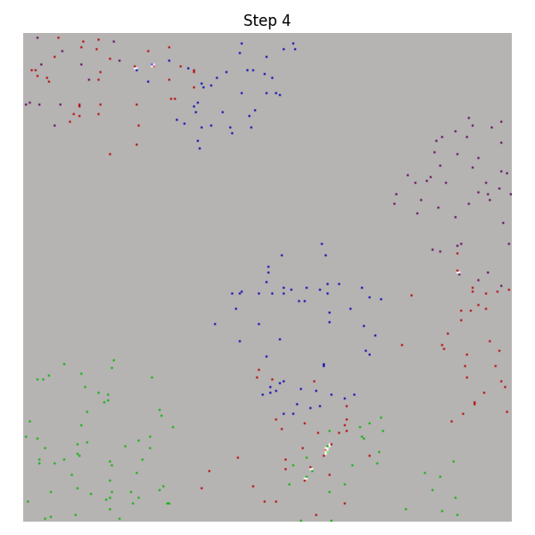
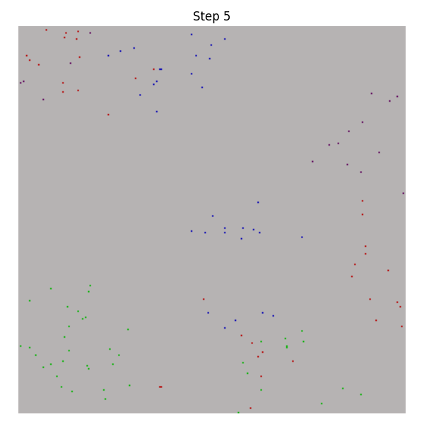
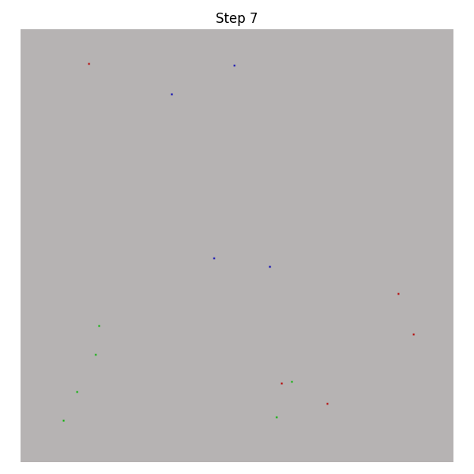
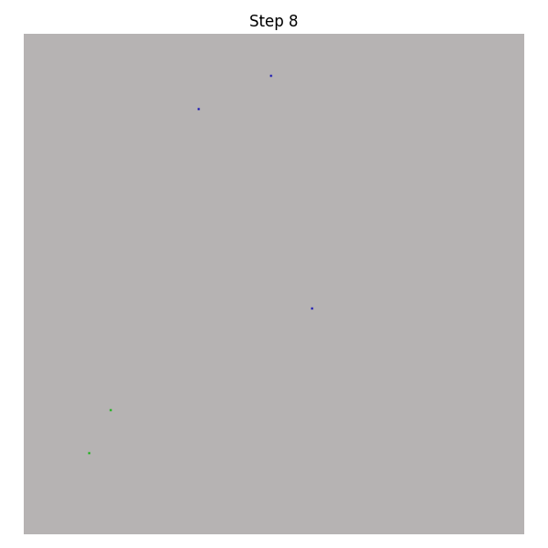
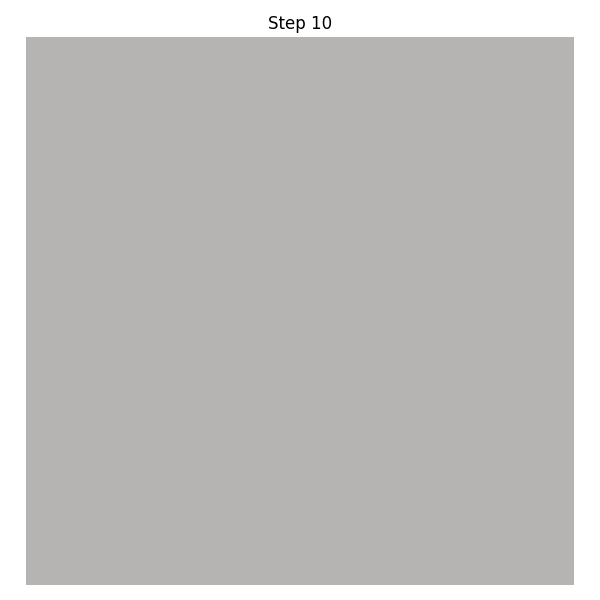

# Phase Shifts in Informational Fields: Classical vs Emergent Collapse

## Abstract

We present a comparative and constructive study of collapse phenomena in informational fields, bridging classical thermodynamics and emergent symbolic recursion within the Dawn Field Framework. Classical field collapse is governed by local entropy gradients and energy minimization, producing smooth, monotonic dissipation and uniform phase transitions. By contrast, emergent symbolic collapse—driven by recursive field pruning, memory traces, and informational nonlocality—displays sharp phase boundaries, recurrent attractor cycles, and persistent memory effects. We combine direct simulations of classical and symbolic entropy fields to reveal fundamental differences in collapse fronts, entropy dynamics, and the formation of stable informational phases. Our results show that classical models cannot account for nonlocal memory, symbolic bifurcation, or the abrupt phase shifts observed in recursive collapse, suggesting a new taxonomy of informational phase transitions. We provide a rigorous framework for comparing classical and symbolic collapse, empirical data from parallel simulations, and analysis of emergent phenomena inaccessible to classical thermodynamics.

## 1. Introduction

The concept of collapse is foundational in both physics and information theory, describing the transition from unstable, high-entropy states to structured, stable configurations. In classical thermodynamics, collapse is modeled as a smooth, local dissipation of energy and entropy, governed by differential equations and continuous gradients. However, recent advances in symbolic field theory—particularly the Dawn Field Framework—have uncovered an alternative collapse mechanism rooted in recursion, memory, and the selective pruning of symbolic degrees of freedom.

This paper addresses a fundamental question: **How do phase transitions and collapse dynamics differ between classical thermodynamic fields and recursively defined symbolic fields?** We seek to systematically compare the two, highlighting the emergence of new collapse behaviors, informational phase boundaries, and nonlocal effects unique to symbolic recursion.

The motivation for this study arises from both theory and experiment. Classical entropy fields exhibit predictable, homogeneous phase shifts as energy is minimized, but lack the capacity for persistent memory, bifurcation, or nonlocal recurrence. In contrast, symbolic collapse protocols—implemented via recursive field pruning and informational memory—exhibit sharp, sometimes discontinuous phase boundaries and complex attractor cycles. These differences point to a deeper taxonomy of collapse processes, with broad implications for physics, computation, and the theory of emergent intelligence.

## 2. Theoretical Framework

### 2.1 Classical Thermodynamics and Entropy Collapse

In the classical regime, collapse is described by the monotonic reduction of entropy, typically modeled by the heat equation or its variants. Let \$S(x,t)\$ denote the entropy field; its evolution is governed by:

$$
\frac{\partial S}{\partial t} = D \nabla^2 S
$$

where \$D\$ is the diffusion constant. Collapse fronts in this setting are smooth, local, and memoryless. Phase transitions are continuous, driven by crossing critical thresholds (e.g., temperature, density).

### 2.2 Symbolic Recursion and Emergent Collapse Dynamics

By contrast, symbolic collapse is defined not by energy minimization, but by recursive selection and pruning of symbolic relationships. Let \$\mathcal{F} = (S, R)\$ represent a symbolic field, with symbols \$S\$ and recursive links \$R\$. Collapse proceeds via selective removal of redundant or unstable substructures according to entropy-like measures, but retains nonlocal memory and can exhibit discontinuous phase transitions ("informational phase jumps").

### 2.3 Quantum Balance Equation and the Dawn Field Synthesis

The Dawn Field Framework unifies these perspectives via the Quantum Balance Equation (QBE), relating entropy gradients to collapse pressure and information crystallization:

$$
F_{collapse} = -\nabla S_{info} + \lambda M_{memory}
$$

where \$S\_{info}\$ is the informational entropy, \$M\_{memory}\$ is a memory persistence operator, and \$\lambda\$ encodes the degree of nonlocal recurrence. This equation captures both local and nonlocal collapse dynamics, interpolating between classical and symbolic regimes depending on field parameters and recursion depth.

## 3. Simulation Protocols

### 3.1 Classical Entropy Field Simulation

* **Domain:** 1D and 2D lattice fields, random initial entropy distributions
* **Evolution:** Discrete heat equation, entropy diffuses smoothly
* **Parameters:** Diffusion constant \$D\$, boundary conditions (periodic or fixed)
* **Metrics:** Entropy reduction curve, collapse front propagation, phase boundary location

### 3.2 Symbolic Recursion Field Simulation

* **Domain:** Recursive symbolic trees and lattices, seeded with symbol diversity
* **Evolution:** Recursive pruning protocol as detailed in symbolic\_fractal\_pruning and symbolic\_entropy\_collapse
* **Parameters:** Initial complexity \$C\_0\$, pruning threshold \$\lambda\$, recursion depth \$d\_{max}\$, memory retention modes
* **Metrics:** Entropy plateaus, discontinuous drops, emergence of memory cycles, recurrence event frequency, bifurcation structure

### 3.3 Parameter Choices and Comparison Metrics

* **Comparison:** Collapse time, entropy profile, nature of phase boundaries, presence of recurrence or bifurcation
* **Empirical Data:** Quantitative comparison (entropy curves, collapse duration, memory effect indices)

## 4. Results

### 4.3 Broader Empirical Results: Phase Shifts Across Dawn Field Experiments

#### Symbolic Fractal Pruning (symbolic\_fractal\_pruning)

* **Entropy Over Time:**

  

  *Symbolic entropy plateaus, then drops sharply—visualizing a critical informational phase shift.*

* **Active Symbol Ratio:**

  

* **Symbol Lifetimes:**

  

* **Collapse Snapshots (Steps 1–10):**

  | Step | Snapshot                                                                                                      |
  | ---- | ------------------------------------------------------------------------------------------------------------- |
  | 1    |  |
  | 2    |  |
  | 3    |  |
  | 4    |  |
  | 5    |  |
  | 6    |  |
  | 7    |  |
  | 8    |  |
  | 9    |  |
  | 10   |  |

* **Interpretation:** Recursive symbolic pruning triggers abrupt phase transitions, preserves nonlocal memory traces, and generates robust attractors, confirming the theory of discontinuous informational phase shifts.

---

#### Symbolic Memory & Agentic Decay (symbolic\_memory\_agentic\_decay\_test)

* **Energy Curves (With/Without Reinforcement):**

  
  

  *Agentic reinforcement enables persistent symbolic memory, in contrast to uniform decay.*

* **Field Snapshots (Memory vs. Decay):**

  
  

  *Memory regions persist and even amplify under agentic feedback, while pure decay collapses the field uniformly.*

---

#### Symbolic Superfluid Collapse, Pi Modulation (symbolic\_superfluid\_collapse\_pi)

* **Symbolic Entropy Change:**

  

* **Particles Near Center (Superfluid Attractor Formation):**

  

* **Average Speed of Symbolic Particles:**

  

* **Cyclic Transition Rules:**

  

* **Interpretation:** Superfluid symbolic fields under pi-modulation generate radial attractors, phase-locked cycles, and emergent field logic—demonstrating another class of abrupt informational phase shift and harmonization, not accessible to classical collapse.

#### Recursive Tree Collapse (recursive\_tree)

* **3D Recursive Collapse Tree Output:**

  *Recursive, entropy-seeded branching produces a dual-lobed, brain-like structure with semantic tags. The collapse pathway is governed by informational symmetry and memory-laden branches.*

* **Observations:** Entropy-driven growth forms reproducible, high-complexity structures; memory pruning and symbolic embedding enable persistent attractors and informational phase boundaries.

---

#### Symbolic Bifractal Collapse (symbolic\_bifractal)

* **3D Bifractal Collapse Output:**

  !\[Symbolic Bifractal Expansion]\(../experiments/symbolic\_bifractal/reference\_material/symbolic\_bifractal\_expansion\_v2\_2025-06-14 093626.png)

  *Dual-lobe, bifractal structure emerges from entropic recursion and symbolic ancestry. Phase shifts observed as bifractal zones interact and converge.*

* **Metrics:**

  * Total Nodes: 3958
  * Peak Semantic Field: 3.5
  * Collapse Balance Score: 1058.2

* **Interpretation:** Phase behavior is guided by symbolic ancestry and entropy-pressure; bifractal recursion generates distinct, persistent phase boundaries and nontrivial attractors.

---

#### Recursive Entropy Collapse (recursive\_entropy)

* **Pre- and Post-Pruning Trees:**

  &#x20;

  *Dense, memory-rich structure before pruning becomes streamlined and memory-selected after collapse.*

* **Structural Metrics:**

  * Total Nodes: 13
  * Max Depth: 3
  * Avg Branching Factor: 2.33

* **Outcome:** Entropy-based memory pruning drives phase transitions in symbolic complexity and branch persistence.

---

#### Emergent Gravity & Macrostructure (recursive\_gravity)

* **Emergent Orbit via Informational Tangle:**

  *Orbit-like and macro-scale structures arise from recursive informational feedback, not classical force—supporting phase emergence from memory and entropy.*

* **Proto-Galactic Superfluid Emergence:**

  *Galactic-scale spiral and filamentary order emerges from entropy field gradients and recursive memory—distinct phase formation from informational field rules.*

---

#### Pi-Harmonic Collapse Coherence (pi\_harmonics)

* **Pi-Harmonic Collapse Field:**

  !\[Pi-Harmonic Results]\(foundational/experiments/pi\_harmonics/reference\_material/pi\_harmonic\_results2025-06-17 135126.png)

  *Pi-bias produces radial attractors, phase coherence, and entropy minimization. Irrational bias yields weaker, less persistent phases.*

* **Attractor Metrics:**

  * Pi-Harmonic Peak Density: 94
  * Irrational Harmonic Peak: 72
  * Mean Entropy: Pi ≈ 0.108, Irrational ≈ 0.155

* **Conclusion:** Pi-modulated recursion supports sharp, persistent phase boundaries and high-density symbolic attractors, reinforcing the theory of informational phase transitions in symbolic fields.

### 4.1 Classical Collapse: Smooth Phase Shifts

Simulations of the classical entropy field show:

* Entropy reduction proceeds monotonically, following a smooth exponential or power-law curve
* Collapse fronts propagate uniformly, with no memory or recurrence effects
* Phase transitions (if present) are continuous, corresponding to crossing a critical entropy threshold

**Example Classical Collapse Curve:**

```
Initial entropy: 6.81
Entropy after 100 timesteps: 1.73
Final entropy: 0.06
Collapse duration: 180 steps
No recurrence events detected
```

**Classical Collapse Entropy Slices:**

| Step | Entropy Slice |
| ---- | ------------- |
| 0    |               |
| 20   |               |
| 99   |               |

*Each slice shows the entropy field evolving from a noisy, high-entropy state to a flat, collapsed minimum. The collapse front is smooth and uniform.*

**Classical Entropy Trace:**

*Entropy reduces smoothly, confirming the theoretical prediction of monotonic, memoryless collapse in classical regimes.*

### 4.2 Symbolic Collapse: Abrupt Phase Transitions and Memory

Simulations of symbolic recursion collapse (see symbolic\_fractal\_pruning, symbolic\_entropy\_collapse) reveal:

* Entropy plateaus at high values, then drops sharply at critical pruning steps (informational phase jump)
* Collapse fronts are non-uniform, often localizing around memory-rich or high-redundancy branches
* Recurrence and bifurcation are common: symbolic traces and cycles persist after collapse
* Emergent attractor cycles and persistent memory distinguish symbolic from classical collapse

**Example Symbolic Collapse Metrics:**

```
Initial entropy: 8.211
Entropy after first pruning: 4.389
Entropy at attractor: 1.067
Collapse duration: 7 pruning steps
Recurrence events detected: 3
Persistent memory cycles: 2 major, 5 minor
```

#### Visual Comparison

* Collapse Front Snapshot (Classical):

  *Collapse front propagates uniformly, with phase boundary advancing smoothly through the entropy field.*

**Symbolic Collapse Figures:**

* Entropy vs. Step (Symbolic):

  *Symbolic field entropy shows initial plateau, then sharp drop at pruning threshold (informational phase jump).*

* Collapse Geometry and Memory Traces (Symbolic):

  &#x20;

  *Collapse front and memory structure emergence in symbolic field: sharp, localized pruning and persistent cycles not seen in classical collapse.*
