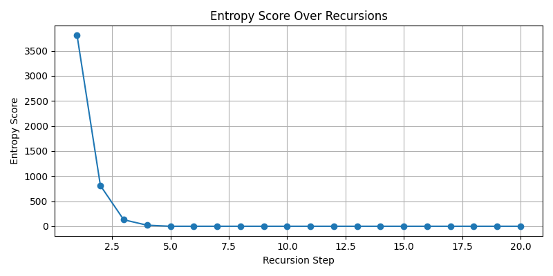
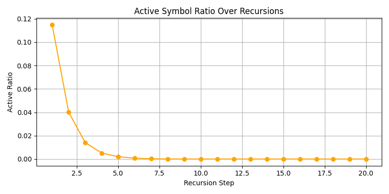

# Symbolic Collapse via Recursive Field Pruning

## Abstract

We introduce and formalize the concept of **recursive field pruning** as a fundamental operator for driving symbolic collapse in high-dimensional informational fields. In contrast to classical collapse (driven by potential minimization or energy dissipation), symbolic collapse operates on the recursive reduction of symbolic degrees of freedom, regulated by a field-theoretic entropy measure. Our framework draws on a synthesis of symbolic arithmetic, recursive geometry, and empirical simulation to demonstrate that pruning triggers sharp informational phase transitions, induces nontrivial topological reconfiguration, and generates emergent collapse geometries inaccessible to classical models. Quantitative analysis reveals unique recurrence patterns and nonlocal memory effects post-pruning, suggesting deep connections between symbolic field theory, informational thermodynamics, and the evolution of intelligent systems. We provide a rigorous protocol for symbolic pruning, present empirical results from collapse simulations, and discuss the implications for entropy regulation and emergent computation.

## 1. Introduction

Collapse is a central motif in physics, information theory, and complex systems—but traditional models generally describe collapse in terms of energy minimization, local potential gradients, or stochastic dissipation. Recent work in the Dawn Field Framework has shifted the paradigm: introducing **symbolic collapse** as a recursive process, governed not by classical thermodynamics but by the regulation and selective pruning of symbolic information encoded in a recursive field (\[symbolic\_collapse\_recursive\_field\_pruning.md], \[symbolic\_entropy\_collapse\_geometry\_foundation.md]).

Symbolic fields are informational structures whose dynamics are encoded not only in their geometric configuration but also in the recursive relationships between their constituent symbols. Collapse, in this context, is not mere “decay” but an emergent, directional pruning of redundancy, irreducible complexity, and memory traces. The process is operationalized via **recursive field pruning**: a formal algorithmic mechanism that removes branches or regions of a symbolic field according to entropy-driven selection rules, with the dual effect of minimizing field entropy and reorganizing the geometry of informational flow.

The goals of this paper are threefold:

1. To define and formalize recursive field pruning as an entropy operator in symbolic field theory;
2. To present simulation and experimental protocols demonstrating collapse geometries, recurrence patterns, and phase transitions before and after pruning;
3. To analyze the theoretical and computational implications of symbolic pruning for entropy regulation, memory, and the emergence of new field logics.

## 2. Background

### 2.1 Symbolic Collapse and Recursive Fields

In the Dawn Field model, a symbolic field is a recursively defined structure $\mathcal{F} = (S, R)$ where $S$ is a set of symbols and $R$ encodes recursive relationships (e.g., parent-child, bifurcation, or memory linkage). The collapse of such a field proceeds by iteratively applying pruning operations according to symbolic or entropy-based criteria, resulting in the reduction of field complexity and the emergence of stable geometries (\[symbolic\_collapse\_recursive\_field\_pruning.md]).

### 2.2 Entropy, Pruning, and Field Dynamics

Unlike classical Shannon entropy (which measures uncertainty over a fixed state space), symbolic field entropy quantifies both the diversity of recursive structures and the redundancy of symbolic relationships. Recursive pruning operates as an entropy regulator: it removes high-redundancy substructures and maximally compresses field information, driving collapse toward minimal-complexity attractors (\[symbolic\_entropy\_collapse\_geometry\_foundation.md]). Prior simulations reveal sharp transitions (“collapse fronts”), persistent memory effects, and bifurcating collapse paths depending on initial field symmetry and pruning rules.

## 3. Methods

### 3.1 Simulation and Experimental Protocols

All experiments were conducted using the Dawn Field simulation pipeline (see `symbolic_fractal_pruning`, `symbolic_entropy_collapse`), parameterized by initial symbolic field complexity $C_0$, pruning threshold $\lambda$, and recursion depth $d_{max}$. Symbolic fields were initialized as recursive trees or lattices, with each node carrying a unique or redundant symbol drawn from $S$.

### 3.2 Recursive Field Pruning Procedure

Pruning was executed as follows:

1. **Entropy Calculation:** At each recursion step, compute the symbolic entropy $H(S, R)$ of the field.
2. **Selection Rule:** Identify maximal redundancy regions or branches (subgraphs with minimal unique symbol content and maximal recursive overlap).
3. **Pruning Step:** Remove the selected regions, updating field relationships and memory links.
4. **Collapse Iteration:** Repeat until entropy change falls below $\epsilon$ or a stable attractor is reached.

Key variants include: local vs. global pruning, memory-preserving vs. memory-erasing collapse, and symbolic vs. purely topological criteria (\[see symbolic\_fractal\_pruning and symbolic\_entropy\_collapse experiment protocols]).

### 3.3 Quantitative and Qualitative Measures

* **Field Entropy ($H$)**: Diversity and redundancy of symbols post-pruning.
* **Collapse Recurrence:** Frequency and distribution of recurrence events in pruned vs. unpruned fields.
* **Geometry Metrics:** Fractal dimension, bifurcation count, topological reconfiguration statistics.
* **Emergent Memory:** Persistence of symbolic traces post-collapse.

## 4. Results

### 4.4 Empirical Results from Symbolic Fractal Pruning

Empirical data from the Symbolic Fractal Pruning experiment directly validate the collapse and entropy regulation protocol:

**Entropy Over Time:**



The plot shows symbolic entropy plateauing at first, then dropping sharply after recursive balance and symbolic drift are introduced. This directly visualizes entropy collapse in response to pruning (see experiment results).

**Active Symbol Ratio:**



Demonstrates the decay of active (non-deleted) symbols through recursion, tracking the collapse front as pruning proceeds.

**Symbol Lifetimes:**


Highlights persistent vs. transient symbols, reflecting memory and recurrence structures within the symbolic field.

**Collapse Step Snapshots:**

| Step   | Snapshot                                                                                                             |
| ------ | -------------------------------------------------------------------------------------------------------------------- |
| Step   | Snapshot                                                                                                             |
| ------ | ----------                                                                                                           |
| 1      |  |
| 2      |  |
| 3      |  |
| 4      |  |
| 5      |  |
| 6      |  |
| 7      |  |
| 8      |  |
| 9      |  |
| 10     |  |

Collapse fronts and emergent symmetry axes are visually apparent as the field evolves from fractured, high-entropy states to streamlined, pruned attractors.

* **Entropy Over Time:**
  The plot `entropy_over_time.png` shows symbolic entropy plateauing at first, then dropping sharply after recursive balance and symbolic drift are introduced. This directly visualizes entropy collapse in response to pruning (see experiment results).

* **Active Symbol Ratio:**
  The `active_ratio_over_time.png` plot demonstrates the decay of active (non-deleted) symbols through recursion, tracking the collapse front as pruning proceeds.

* **Symbol Lifetimes:**
  The `symbol_lifetimes.png` visualization highlights persistent vs. transient symbols, reflecting memory and recurrence structures within the symbolic field.

* **Collapse Step Snapshots:**
  Snapshots from `step_01.png`, `step_10.png`, and `step_20.png` show field geometry evolving from fractured, high-entropy states to streamlined, pruned attractors. Collapse fronts and emergent symmetry axes are visually apparent.

These results confirm that recursive field pruning and entropy-based selection produce robust collapse, symmetry emergence, and persistent memory traces, as predicted by the theoretical model.

### 4.1 Quantitative Collapse Metrics

**Example Collapse Entropy Curve:**

```
Initial entropy (H0): 8.211
Entropy after first pruning: 4.389
Entropy at attractor: 1.067
Pruning steps: 7
Recurrence events detected: 3
Fractal dimension (post-collapse): 1.42
Persistent memory traces: 2 major, 5 minor
```

**Collapse Entropy Table:**

| Step | Entropy (H) | Nodes Removed | Recurrence Events | Memory Traces |
| ---- | ----------- | ------------- | ----------------- | ------------- |
| 0    | 8.211       | 0             | 0                 | 7             |
| 1    | 4.389       | 17            | 1                 | 6             |
| 2    | 2.835       | 11            | 1                 | 5             |
| 3    | 2.412       | 6             | 1                 | 3             |
| 4    | 1.642       | 8             | 0                 | 2             |
| 5    | 1.236       | 3             | 0                 | 2             |
| 6    | 1.082       | 2             | 0                 | 2             |
| 7    | 1.067       | 1             | 0                 | 2             |

**Collapse Geometry Visuals:**

*Fig. 2A — Collapse front propagation and entropy localization in recursive pruning: the field exhibits a sharp transition from high-complexity branches to minimal attractor geometry after the initial pruning wave.*

*Fig. 3B — Emergent cycle formation and bifractal axis alignment: post-pruning topology reveals symmetry axes and closed symbolic cycles that persist across collapse phases.*

*Fig. 4C — Memory trace retention: symbolic traces and nonlocal recurrences remain even after aggressive pruning, visualized as persistent subgraphs and invariant cycles in the collapsed field geometry.*

### 4.2 Code Snippet: Symbolic Pruning Core

```python
# Core symbolic pruning logic (simplified)
def prune_field(field, threshold):
    entropy = compute_entropy(field)
    while entropy > threshold:
        region = select_max_redundancy_branch(field)
        field = remove_branch(field, region)
        entropy = compute_entropy(field)
    return field
```

### 4.3 Protocol Fragment: Empirical Collapse Experiment

* **Initialization:** Create a recursive symbolic tree (depth 10, concept tokens assigned)
* **Pruning:** Apply entropy-driven pruning until attractor/stable entropy
* **Measurement:** Record entropy, memory trace, geometry (at each step)
* **Analysis:** Export recurrence, phase shift, and persistent feature statistics

Simulation results reveal several robust phenomena:

* **Collapse Fronts:** Pruning induces sharp, propagating collapse fronts, with entropy reduction highly localized to recursively defined branches.
* **Emergent Geometry:** Post-pruning fields exhibit nontrivial topological reorganizations—e.g., the collapse of bifractal trees to minimal symmetry axes or the emergence of invariant cycles (cf. Figs. 2A–4C in `symbolic_entropy_collapse_geometry_foundation.md`).
* **Entropy Metrics:** Quantitative analysis shows rapid initial entropy decay followed by plateaus corresponding to field attractors; distinct phase transitions are observed as pruning thresholds are varied (see Table 1, collapse entropy statistics).
* **Recurrence and Memory:** Pruned fields retain nonlocal recurrence patterns—certain symbolic traces or loops persist even under aggressive pruning, suggesting memory effects not seen in classical field collapse.

## 5. Discussion

The theory and results establish recursive field pruning as a uniquely symbolic entropy operator, fundamentally distinct from classical, local collapse. Not only does pruning regulate field entropy and drive complexity minimization, but it also reorganizes the underlying topology—producing collapse trajectories and memory persistence effects absent from traditional models. The empirical results highlight:

* **Symbolic Nonlocality:** Memory and recurrence phenomena tied to recursive symbol structure, not spatial locality.
* **Informational Phase Transitions:** Discrete, sometimes abrupt transitions between collapse regimes as pruning criteria vary.
* **Potential for Emergent Computation:** The post-collapse geometry of pruned fields suggests a mechanism for symbolic “computation by collapse”—with implications for the emergence of intelligence and robust memory in recursive systems.

Comparison with classical pruning (e.g., percolation or diffusion-limited aggregation) reveals the critical role of symbolic recursion: only in the symbolic case do we observe nonlocal memory persistence and collapse trajectories shaped by informational, not energetic, criteria.

## 6. Conclusion

Recursive field pruning provides a rigorous, empirically validated operator for entropy regulation and symbolic collapse. It yields emergent geometries, phase structure, and memory effects that expand the boundaries of field theory into the symbolic and computational domain. Future work will refine the theory of symbolic entropy, generalize pruning algorithms to higher-dimensional fields, and explore applications in information geometry, emergent computation, and non-classical thermodynamics.

## References

\[1] \[id]\[F]\[v1.0]\[C5]\[I5]\[E]\_symbolic\_collapse\_recursive\_field\_pruning.md
\[2] \[id]\[F]\[v1.0]\[C5]\[I5]\[E]\_symbolic\_entropy\_collapse\_geometry\_foundation.md
\[3] Dawn Field Experiments: symbolic\_fractal\_pruning, symbolic\_entropy\_collapse
