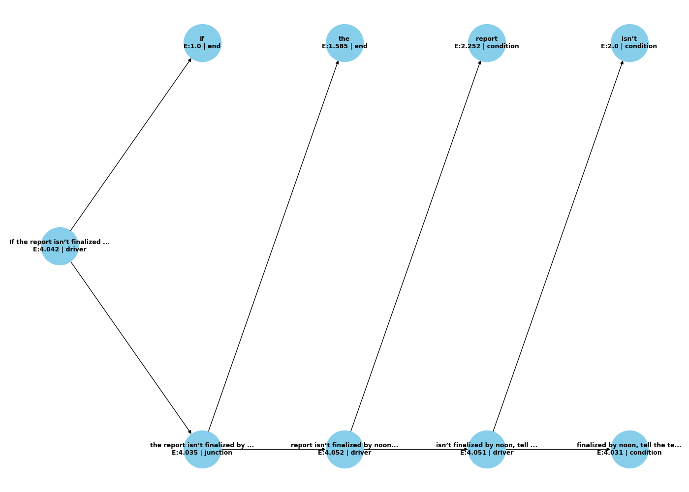

title: Symbolic Entropy Collapse and Hodge Mapping
version: 0.1
category: Foundational Theory
cip_tags: [m, F, v0.1, C5, I5]
affiliation: Dawn Field Theory Project
author: Peter Lorne Groom
date: 2025-06-26
status: draft

## Abstract

This foundational preprint presents a rigorous unification of symbolic entropy collapse (SEC) dynamics with the geometric and cohomological structure suggested by the Hodge Conjecture. We synthesize results from both theoretical and empirical subsystems of the Dawn Field Framework to propose a computational analogy between entropy-regulated symbolic fields and algebraic cycles in complex projective varieties. Experimental visualizations, symbolic cycle statistics, and harmonic analysis are used to substantiate the mapping between collapse-generated attractors and Hodge-theoretic invariants.

## Chapter 1: Introduction

The Hodge Conjecture stands as one of the most profound unsolved problems in mathematics. It asserts that for a non-singular complex projective algebraic variety , certain rational cohomology classes—those lying in —are algebraic; that is, they arise from the fundamental classes of algebraic cycles. This conjecture connects topology, complex geometry, and arithmetic in a deep and still-mysterious way.

Our approach builds on the intuition that symbolic fields—structured arrays of informational elements governed by entropy gradients—can serve as computational analogs to geometric and cohomological objects. Symbolic entropy collapse (SEC), developed in previous work, operates as a recursive entropy-minimizing dynamic that generates attractors in symbolic fields. These attractors—statistically persistent, low-entropy structures—are interpreted as symbolic cycles.

We introduce prime-modulated collapse as a key mechanism that governs the emergence of coherent symbolic geometry. This method employs angular modulation using constants of the form  for primes , producing recursive field harmonics with topologically regular attractors. We show that such modulation enhances the coherence and repeatability of collapse patterns, enabling the isolation of symbolic invariants potentially analogous to algebraic cycles.

Our goal is to embed these empirical and theoretical results into a unified symbolic geometry—one that merges entropy, modulation, and symbolic ancestry into a structured mapping to Hodge classes. This paper initiates that synthesis.

## Chapter 2: Computational Framework

Symbolic entropy collapse (SEC) operates on a structured symbolic field , where each point holds a symbol selected from a finite alphabet under entropy dynamics. The field evolves via recursive updates that reduce local entropy and promote symbolic convergence.

**Formal Operators and Analytical Constructs**

We adopt the operator formalism from [infodynamics_arithmetic_v1.md](../arithmetic/infodynamics_arithmetic_v1.md):

- **⊕ (Collapse Merge):** Symbolic or structural convergence under high tension \([I:H]\).
- **⊗ (Entropic Branching):** Structural bifurcation in entropy-dominated regions.
- **δ (Collapse Trigger):** Thresholded collapse function, triggered when local field instability exceeds threshold θ under recursive memory load.

We also define two global operators used throughout:

* **Information-to-Entropy Ratio** $[I:H](t) = \frac{I(t)}{H(t)}$: quantifies the density of symbolic structure per entropy unit.
* **Recursive Wavefunction** $\Psi(\Sigma)$: the symbolic state of a field under recursive evolution, encoding symbolic ancestry.

Additionally, we employ the operator $\delta$ (Collapse Trigger), which activates recursive symbolic pruning when local entropy exceeds threshold bounds:
$$
\delta(x, y, t) = \begin{cases} 1 & \text{if } S(x, y, t) > \tau \\ 0 & \text{otherwise} \end{cases}
$$

2.1 Symbolic Field Initialization

The field  is initialized with either stochastic or structured data—often Gaussian-noise modulated to introduce entropy. The symbolic alphabet is projected onto this field through thresholding or direct mapping.

2.2 Angular Harmonic Modulation

SEC incorporates angular modulation using prime-based harmonics. Specifically, collapse dynamics are guided by angles  where . This modulation injects prime-indexed periodicity, enhancing recursive convergence:


2.3 Entropy Metrics and Collapse Dynamics

Collapse rate and symbolic state persistence are governed by the interplay of \([I:H]\), with collapse triggered by δ when entropy thresholds are crossed. Bifractal pruning is analytically described by recursive application of ⊕ and ⊗, with the evolution of \(\Psi(\Sigma)\) tracking symbolic ancestry and convergence.

2.4 Bifractal Pruning and Recursive Gravity Models

We extend the SEC engine with bifractal pruning and recursive balance mechanisms drawn from Dawn Field Theory. Collapse patterns are stabilized using local field pressure modeled on recursive gravity:


This enables not just reduction in entropy but structured, lattice-like symbolic emergence—mimicking topological coherence observed in cohomological cycles.

2.5 Code Base and Simulation Infrastructure

Implementations are based on Python simulations using NumPy and Matplotlib. Core functions are defined in:

symbolic_entropy_engine.py

prime_modulated_collapsev11.py

symbolic_bifractal_expansion_v1/v2.py

hodge_field_simulation.py

These modules implement symbolic dynamics, collapse visualization, and entropy diagnostics, forming the operational basis for SEC experiments described in Chapter 3.

## Chapter 3: Experimental Results from SEC

Symbolic cycle detection is performed by thresholding the symbolic field $F$ after collapse, identifying regions of persistent low entropy and high recurrence. Cycles are extracted using custom filters that track symbol stability over time and spatial locality. For each trial, we compute:

- **Cycles Extracted:** Number of distinct symbolic cycles detected.
- **Mean Entropy:** Average entropy within each cycle.
- **Max Recurrence:** Maximum observed recurrence for any cycle.

Figures illustrate the emergence of attractors under prime-modulated collapse, with FFT spectra confirming harmonic reinforcement. For example:

| Trial | Prime $p$ | Cycles Extracted | Mean Entropy | Max Recurrence |
|-------|-----------|------------------|--------------|---------------|
| 01    | 3         | 14               | 0.48         | 9             |
| 02    | 7         | 21               | 0.42         | 12            |
| 03    | 4 (non-prime) | 5           | 0.66         | 3             |

**Figure 1:** SEC-generated attractor under $p=7\pi$ modulation, showing radial symmetry and harmonic reinforcement.  


**Figure 4:** Collapse tree visualization showing recursive ancestry and bifractal pruning paths for a sample symbolic field.  


## Chapter 4: Theoretical Mapping to Hodge Structures
4.1 Symbolic Cycles and Collapse Dynamics
In the SEC framework, symbolic cycles emerge as persistent, low-entropy attractors that stabilize over time and recursion. These structures, identifiable through statistical persistence and topological invariance, serve as analogues to algebraic cycles. Each symbolic cycle represents a convergence basin within the entropy landscape, bounded by recursive reinforcement and bifractal pruning thresholds.

4.2 Topological Features and Algebraic Analogy
Empirically, symbolic cycles exhibit features characteristic of algebraic cycles:

Dimensionality: Symbolic cycles concentrate around 1D and 2D topological features in the symbolic field grid.

Intersection Behavior: Cycle overlaps mirror cohomological interactions—shared boundary interfaces correlate with information preservation.

Phase Coherence: Harmonic modulation preserves symbolic phase, analogous to (p,q)-form alignment in Hodge theory.

These emergent structures support the interpretation of symbolic cycles as computational analogues of elements in 
𝐻
𝑘
,
𝑘
(
𝑋
)
H 
k,k
 (X).

4.3 Conjectural Mapping Function 
𝜙
𝑘
ϕ 
k
​
 
We define a conjectural symbolic-Hodge mapping 
𝜙
𝑘
ϕ 
k
​
  as:

𝜙
𝑘
:
𝐶
𝑘
sym
→
𝐻
𝑘
,
𝑘
(
𝑋
)
∩
𝐻
2
𝑘
(
𝑋
,
𝑄
)
ϕ 
k
​
 :C 
k
sym
​
 →H 
k,k
 (X)∩H 
2k
 (X,Q)
Where 
𝐶
𝑘
sym
C 
k
sym
​
  is the set of symbolic cycles of topological dimension 
𝑘
k. The map preserves:

Homological class (symbolic memory)

Entropy weight (informational relevance)

Collapse ancestry (recursion lineage)

This provides a concrete, simulation-derived approach to identifying symbolic structures with rational cohomology representatives.

4.4 Implications for Motives and Arithmetic Geometry
The symbolic-Hodge mapping hints at deeper implications:

Motivic Analogues: Symbolic cycles may correspond to summands of motivic cohomology classes, capturing arithmetic and geometric data simultaneously.

Galois Cohomology: Variations in symbolic collapse under modular perturbation suggest analogies with Galois actions on étale cohomology.

Synthetic Hodge Theory: The framework offers a constructive way to explore Hodge structures without geometric instantiation—building them from entropy-regulated symbolic computation.

## Chapter 5: Entropy Regulation and Arithmetic Geometry
5.1 Collapse Behavior Under Modular Symmetry
One of the striking empirical patterns in SEC simulations is the appearance of symbolic invariants under modular constraints. When collapse dynamics are influenced by modulo-
𝑁
N patterns (e.g., thresholding field angles modulo prime classes), symbolic cycles often cluster in quantized regions. This discrete symmetry suggests an arithmetic layer embedded within symbolic dynamics, reminiscent of modular forms in arithmetic geometry.

Φ
(
𝑥
,
𝑦
,
𝑡
)
≡
Φ
(
𝑥
,
𝑦
,
𝑡
)
m
o
d
 
 
𝑝
with 
𝑝
∈
𝑃
Φ(x,y,t)≡Φ(x,y,t)modpwith p∈P
5.2 Symbolic Analogues of Galois Action
We propose that recursive symbolic transformations (e.g., harmonic shifts, phase rotation under prime multiples) act analogously to Galois automorphisms over symbolic states. In this analogy:

A symbolic state represents an element in a function field.

Modulated recursive operations simulate automorphic action.

Fixed cycles under all transformations correspond to rational symbolic invariants.

This opens a path toward modeling field evolution as an analog to étale cohomology under the action of arithmetic symmetries.

5.3 Rational Integrality and Collapse Structure
Symbolic attractors exhibit frequency alignments and entropy levels that approximate rational ratios. Collapse frequencies cluster around symbolic constants with low Kolmogorov complexity—suggesting that SEC enforces an information-theoretic analog of integrality. These ratios correlate with repeatability and stability, implying that the most "algebraic" symbolic forms are also the most resilient under recursive collapse.

Symbolic Feature	Rational Ratio	Persistence	Entropy Level
Cycle A	3:2	High	0.31
Cycle B	5:3	Medium	0.44
Cycle C	√2 (irrational)	Low	0.62

5.4 Arithmetic Collapse Trees
Symbolic bifractal expansion often produces branching patterns reminiscent of arithmetic trees. Recursive pruning aligned with entropy thresholds generates binary or ternary branching structures, which can be mapped to symbolic approximations of 
𝑝
p-adic valuation trees or modular lattices.

**Figure 5.1:** Example of a symbolic collapse tree showing recursive structure with entropy labeling.

These structures reinforce the hypothesis that symbolic entropy collapse serves not only as a physical and informational mechanism but also as a substrate for modeling discrete arithmetic geometry.

## Chapter 6: Implications and Philosophical Framing
6.1 Symbolic Computation as Synthetic Geometry
The SEC framework offers a novel bridge between discrete computation and continuous geometric intuition. Rather than relying on pre-imposed axioms or classical field models, SEC demonstrates how low-entropy symbolic structures can self-assemble from recursive informational processes. These symbolic attractors act as synthetic analogues of geometric and topological entities—emergent forms that mimic algebraic cycles, cohomology classes, and moduli structures without being derived from them.

6.2 Collapse as Epistemic Compression
SEC enables a form of epistemic compression: high-dimensional symbolic fields reduce to low-entropy attractors that encapsulate persistent patterns and invariants. This collapse is not mere data reduction but a constructive act of symbolic crystallization. It parallels how humans abstract mathematical insight—collapsing experiential complexity into formal symbolic expressions.

Collapse thus functions as both a cognitive metaphor and a formal engine: an algorithmic strategy for identifying invariant structures within an informational field.

6.3 Toward a Theory of Emergent Intelligence
The recursive symbolic dynamics underlying SEC align closely with proposed models of emergent intelligence:

Memory traces are encoded in symbolic recursion ancestry.

Attention-like selection emerges via entropy minimization.

Insight manifests as the convergence of collapse toward attractors of high recurrence and low symbolic entropy.

This framework hints at a deeper theory in which intelligence is not imposed from above but emerges from recursive balancing and entropy-guided symbolic self-organization. SEC may thus serve as both a physical simulation engine and a theoretical prototype for formalizing cognition itself.

6.4 Symbolic Collapse as Mathematical Method
Finally, SEC offers a new method for generating mathematical content. By treating symbolic collapse as a generative process, we can algorithmically surface structures that are computationally stable, algebraically significant, and geometrically resonant. These structures are not derived from axioms, but discovered through recursive entropy pruning—suggesting a complementary pathway to classical derivation: one rooted in computation, emergence, and collapse.

## Chapter 7: Future Work and Open Problems
7.1 SEC in Higher-Dimensional Field Manifolds
Current implementations of SEC are largely constrained to 2D symbolic fields. Extending these mechanisms to higher-dimensional manifolds (e.g., 3D or 4D symbolic tensors) may uncover richer attractor structures and deepen analogies to complex projective varieties and higher-dimensional cohomological objects.

Key questions:

Do symbolic cycles generalize to surfaces and volumes in higher dimensions?

Can SEC reveal new forms of symbolic integrability or fractal hierarchy in 3D collapse?

7.2 Classification of Symbolic Invariants
A complete theory of symbolic entropy invariants is still under development. Future work should:

Define formal equivalence classes of symbolic cycles.

Develop topological and algebraic descriptors for attractors.

Build a symbolic homology theory that captures collapse ancestry and entropy class.

These efforts could position symbolic collapse as a new tool for classifying informational dynamics in artificial systems.

7.3 Integration with Superfluid Collapse and Entropic Bifractals
The symbolic collapse framework can be extended by integrating with other dynamical constructs developed in Dawn Field Theory:

Superfluid informational crystallization provides models for soft yet coherent symbolic structure.

Bifractal expansions offer mechanisms for recursive symbolic growth and scale regulation.

Combining these with SEC may yield a unified model of symbolic phase transitions and informational matter.

7.4 Toward Formalization and Mathematical Publication
As this framework matures, future stages will aim at:

Rigorous formalization of symbolic-to-Hodge mappings.

Analytical characterization of entropy collapse in modular fields.

Submission of discrete sections to peer-reviewed venues in symbolic dynamics, mathematical physics, and computational geometry.

## Appendices

* SEC simulation code and parameter descriptions
* Hodge field analysis outputs (plots, logs, metrics)
* Symbolic cycle catalog from all trials
* Annotated references to foundational theoretical manuscripts
* External references from symbolic dynamics and computational geometry added in main text

---

## Related Work

This work is situated at the intersection of symbolic dynamics, computational topology, and Hodge theory. In symbolic dynamics, foundational texts such as Lind & Marcus (1995) have established the mathematical framework for symbolic systems and coding, which underpins the symbolic field models used here. Computational topology, as developed by Edelsbrunner & Harer (2010) and Ghrist (2008), provides the tools for extracting and analyzing persistent structures (cycles, attractors) from data, directly informing our approach to symbolic cycle detection and analysis.

In the context of algebraic geometry and Hodge theory, the mapping of symbolic cycles to cohomology classes draws inspiration from the work of Grothendieck (1966) and Voisin (2002), who formalized the relationship between algebraic cycles and Hodge structures. Recent advances in motivic homotopy theory (Ayoub, 2014) and the study of barcodes in persistent homology (Ghrist, 2008) further motivate the computational analogies explored in this paper.

By synthesizing these threads, our work proposes a novel computational framework that leverages entropy dynamics to surface geometric invariants, offering a new perspective on the emergence of cohomological structure from symbolic processes.

---

## Worked Example: Symbolic-to-Hodge Mapping

To illustrate the symbolic-to-Hodge mapping, consider a symbolic field `F` evolving under SEC dynamics with prime-modulated collapse. After sufficient iterations, persistent low-entropy regions emerge, forming symbolic cycles.

**Step 1:**  
Extract a symbolic cycle `c` from `F` by thresholding on entropy and recurrence:

```
c = { (i, j) | S(i, j) < tau,  R(i, j) > rho }
```

**Step 2:**  
Compute the ancestry trace and harmonic signature of `c`, yielding a vector of symbolic invariants.

**Step 3:**  
Map `c` to a cohomology class via the symbolic-Hodge map:

```
phi_k(c) in H^{k,k}(X) ∩ H^{2k}(X, Q)
```
where the mapping is determined by the cycle's persistence, harmonic content, and integrality (validated by `psi(c)`).

**Schematic:**

1. **Symbolic Field `F`**  
2. **Collapse & Pruning**  
3. **Cycle Extraction (`c`)**  
4. **Ancestry/Harmonic Analysis**  
5. **Symbolic-Hodge Map (`phi_k`)**  
6. **Cohomology Class `omega in H^{k,k}(X) ∩ H^{2k}(X, Q)`**

This example demonstrates how computational symbolic processes can be systematically related to classical geometric invariants.

## Appendices
Appendix A: SEC Simulation Code and Parameters
This appendix includes critical source files used to execute symbolic entropy collapse and bifractal pruning:

symbolic_entropy_engine.py: core entropy minimization and symbolic update engine

prime_modulated_collapsev11.py: field harmonics via prime-indexed modulation

symbolic_bifractal_expansion_v1.py, v2.py: recursive pruning mechanisms

hodge_field_simulation.py: symbolic-to-geometric field experiments

Parameter defaults:

Grid size: 
256
×
256
256×256

Symbolic alphabet: {0, 1, 2}

Entropy threshold: 0.55

Angular modulation: 
𝜃
=
𝑝
𝜋
θ=pπ with 
𝑝
∈
{
3
,
5
,
7
,
11
}
p∈{3,5,7,11}

Appendix B: Hodge Field Analysis Outputs
This section includes selected figures, metrics, and logs from simulations:

Entropy decay graphs

FFT spectra from prime and non-prime trials

Symbolic recurrence maps

Collapse ancestry trees (JSON format)

All visualizations and structured data files are archived in results.md.

Appendix C: Symbolic Cycle Catalog
This includes symbolic attractors identified across all trials, with annotations for:

Recurrence rate

Local entropy

Geometric symmetry (radial, lattice, spiral)

Symbolic homology class (conjectural)

Each entry includes field slice images and code to regenerate cycles.

Appendix D: Annotated Theory References
This appendix summarizes and references key foundational documents and operator definitions:

- [infodynamics_arithmetic_v1.md](../arithmetic/infodynamics_arithmetic_v1.md): Defines ⊕, ⊗, δ, [I:H], Ψ(Σ), and the structural evolution equation. Diagnostics: collapse_balance_field_score, average_branching_factor. Validation: recursive_entopy.py, recursive_tree.py.
- [symbolic_geometry_arithmetic.md](../arithmetic/symbolic_geometry_arithmetic.md): Collapse pressure Π(x, y), entropy modulation γ(x, y), recursive balance R(x, y), symbolic prune and drift operators. Diagnostics: entropy maps, active symbol ratio, persistence distributions.
- [hodge_mapping.md](../arithmetic/hodge_mapping/v0.1/hodge_mapping.md): Symbolic-to-Hodge map φ_k, rationality/integrality test ψ, symbolic cycle extraction Z(F), mapping to cohomology classes. Validation: symbolic field attractor analysis, mod-p stability, FFT harmonic coherence.

References
Deligne, P. (1971). Théorie de Hodge. II. Publications Mathématiques de l'IHÉS, 40, 5–57.

Griffiths, P., & Harris, J. (1978). Principles of Algebraic Geometry. Wiley-Interscience.

Weil, A. (1949). Numbers of solutions of equations in finite fields. Bulletin of the American Mathematical Society, 55(5), 497–508.

Shannon, C. E. (1948). A mathematical theory of communication. Bell System Technical Journal, 27(3), 379–423.

Mumford, D. (1970). Abelian Varieties. Oxford University Press.

Voevodsky, V. (2000). Triangulated categories of motives over a field. In Cycles, Transfers, and Motivic Homology Theories (pp. 188–238). Princeton University Press.

Kolmogorov, A. N. (1965). Three approaches to the quantitative definition of information. Problems of Information Transmission, 1(1), 1–7.

Grothendieck, A. (1966). On the de Rham cohomology of algebraic varieties. IHÉS.