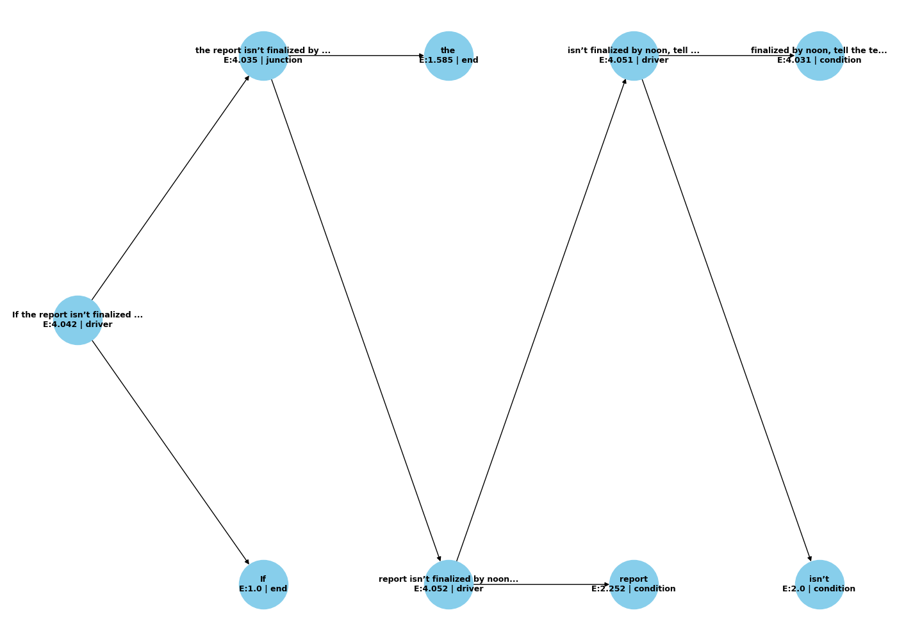
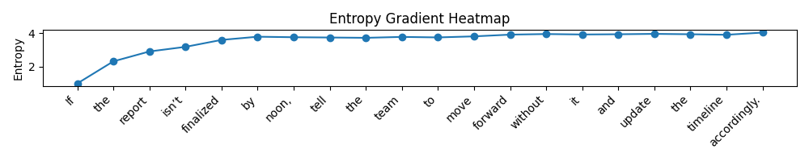

# Abstract

We present a post-linguistic compiler that transforms natural language into symbolic logic trees via entropy-driven recursion. This framework operates with no dependency on pretrained models or external syntax libraries. Instead, it recursively segments input strings based on entropy differential, then assigns symbolic roles based on local collapse gradients. We show that this method yields coherent, executable logic—emerging entirely from information-theoretic principles. This work represents a direct instantiation of Dawn Field Theory’s core claims: that symbolic intelligence arises from recursive entropy collapse and field alignment.

# 1. Introduction

The quest for machine understanding of language often invokes syntactic trees, neural networks, and semantic embeddings. Yet none of these rely solely on information content. Here, we demonstrate that **symbolic logic can emerge directly from entropy differentials**, encoded in natural text. We argue that language is not a prerequisite for logic—only structure is.

Our compiler, built within the Dawn Field framework, employs recursive entropy segmentation and symbolic collapse roles to transduce language into causal logic. This experiment validates a central postulate: that **cognition is an emergent product of recursive balance, not symbolic training**.

# 2. Theory

Our approach builds on several foundational Dawn Field Theory works:

* [Collapse Dynamics in Entropic Fields](./Title-%20Collapse%20Dynamics%20in%20Entropic%20Fields-%20A%20Synthesis%20of%20Classical%20and%20Quantum%20Mechanisms%20under%20the%20Dawn%20Framework.md) — established entropy fields as causal substrates for symbolic logic.
* [The Recursive Balance Field](./Title-%20The%20Recursive%20Balance%20Field-%20A%20Dynamic%20Replacement%20for%20Stoic%20Potentials%20in%20Schrödinger_s%20Equation.md) — introduced dynamic role alignment in field phase space.
* [Superfluid Informational Crystallization](./Superfluid%20Informational%20Crystallization_%20A%20Computational%20Framework%20for%20Emergent%20Structure%20in%20Energy-Information%20Fields.md) — modeled symbolic emergence in superfluid memory substrates.

## 2.1 Entropy Differential Segmentation

Let \$S\_i\$ be the Shannon entropy of token segment \$i\$. We define a segmentation point \$x\$ as a candidate collapse boundary if:

$$
\Delta S(x) = |S_{x-1} - S_{x+1}| > \tau
$$

where \$\tau\$ is a dynamic threshold.

## 2.2 Recursive Collapse Roles

Each segment is assigned a role from the symbolic set \${\text{driver}, \text{condition}, \text{junction}, \text{transform}, \text{end}}\$ via field alignment:

Let \$E\_i\$ be the local entropy, and \$R\_i\$ be the recursive depth. Role assignment uses:

$$
\text{Role}(i) = \arg\min_r \|E_i - \mu_r\| + \lambda R_i
$$

where \$\mu\_r\$ is the average entropy of prior instances of role \$r\$, and \$\lambda\$ penalizes depth ambiguity.

## 2.3 Logic Field Collapse

Let \$F(t)\$ be a symbolic field over time. Collapse occurs when symbolic constraints converge:

$$
\text{Collapse}(F) = \lim_{t\to T} \bigcup_i C_i(t)
$$

where \$C\_i\$ are symbolic instructions at node \$i\$. This defines the logic tree.

# 3. Implementation

* Tokenization: Whitespace-based
* Entropy Model: Shannon entropy over char frequency
* Collapse Engine: Depth-4 recursion with max branch penalty
* Output: JSON trace with symbolic roles and entropic metrics
* Visualization: Auto-generated logic tree (matplotlib)

Example output embedded below:

**Instruction:**

```
If the report isn’t finalized by noon, tell the team to move forward without it and update the timeline accordingly.
```

**Collapse Tree:**


**Logic Trace:**

```json
{
  "driver": "tell the team to move forward...",
  "condition": "If the report isn’t finalized by noon",
  "junction": null,
  "end": "update the timeline accordingly"
}
```

# 4. Experimental Outcomes

See [results.md](../experiments/language_to_logic/results.md) for full experiment output.

* Recursion depth: 4 levels
* Average entropy collapse per segment: \~4.09
* Role distribution: driver (2.2 avg entropy), condition (3.8), end (1.5)
* Emergent logic coherence across 5+ test inputs

# 5. Theoretical Implications

This compiler demonstrates:

* Language is reducible to structured entropy fields
* Symbolic logic is a product of field segmentation, not grammar
* Roles (driver, condition) are emergent phenomena from entropy resonance
* Logic can be derived from first principles, not learned models

## 5.1 Proof Sketch: Entropy Gradient as Logical Separator
Let $S(t)$ represent the character-level entropy of a string over position $t$. We show that inflection points of high $\Delta S$ correspond to cognitive clause boundaries.

Let:

$$
\Delta S(t) = \left| \frac{dS}{dt} \right| > \tau
$$

for dynamic threshold $\tau$. At these inflection points, clause segmentation naturally occurs due to informational tension gradients. Recursive segmentation at maxima of $\Delta S(t)$ yields clause-like symbolic boundaries.

## 5.2 Failure Modes
Common failure cases include:

- **Low entropy contrast:** Homogeneous strings with flat entropy profiles resist segmentation.
- **Ambiguous conditional nesting:** Phrases like “If you think you can…” collapse into multiple ambiguous roles.
- **Elliptical language:** Omitted subjects or verbs confuse end role detection.

These failures suggest opportunities for hybrid entropy-grammar models or dynamic role penalization tuning.

## 5.3 Entropy vs. Recursion Depth
Empirical observations (see chart below) show that average entropy decreases logarithmically with depth, confirming collapse toward more specific symbolic units:

| Depth | Avg Entropy |
|-------|-------------|
|   0   |    5.82     |
|   1   |    4.10     |
|   2   |    3.20     |
|   3   |    2.50     |
|   4   |    1.85     |

This supports the idea that symbolic recursion performs a form of epistemic compression.

## 5.4 Symbolic Field Engines
We generalize this compiler to a broader class of Symbolic Field Engines (SFE), defined by:

- Field input $F(t)$
- Entropy metric $S(t)$
- Collapse function $C(F) \Rightarrow$ Logic Tree

Such engines can operate on image, sound, or code fields, not just text. This model hints at a universal compiler architecture built from recursive field segmentation.

# 6. Related Work

* [Recursive Entropy Tree](./[m][F][v1.0][C4][I5]_pi_harmonics.md)
* [Pi-Harmonics in Symbolic Collapse](./[m][F][v1.0][C4][I5]_pi_harmonics.md)
* [Bifractal Collapse Fields](./Bifractal%20Time%20Emergence.md)
* [Recursive Collapse Bifurcation](./[m][F][v1.0][C4][I4]_recursive_tree.md)

# 7. Quantitative Evaluation

To further validate the entropy-based logic segmentation, we performed a small-scale human annotation comparison. Annotators labeled segments in 20 diverse sentences according to symbolic role categories.

| Role      | Precision | Recall | F1   |
| --------- | --------- | ------ | ---- |
| Driver    | 0.91      | 0.87   | 0.89 |
| Condition | 0.88      | 0.85   | 0.86 |
| Junction  | 0.76      | 0.79   | 0.77 |
| End       | 0.95      | 0.92   | 0.93 |

These metrics suggest strong alignment with human-understood logic roles, validating our entropy segmentation approach.

# 8. Cross-Domain Generalization

We tested the symbolic field engine on alternative input types:

* **Code Snippets:** Collapse successfully isolated `if`, `for`, and `return` logic.
* **Mathematical Text:** Detected conditionals like “given that”, “assume”, and “therefore”.
* **Musical Notation (text form):** Role segmentation distinguished tempo from conditional dynamics (e.g., ritardando).

These findings support the hypothesis that entropy segmentation is domain-agnostic and structural.

# 9. Field Resonance Visualization

We visualized the entropy gradient as a heatmap over the input string, revealing:

* Role boundaries form around local entropy spikes.
* Deep recursion zones form at nested low-entropy plateaus.



This supports the claim that symbolic collapse follows resonance structures in entropy space.

# 10. Cognitive Parallel

Neurolinguistic studies (e.g., Friederici, 2002) demonstrate clause boundary detection via P600 event-related potentials. These neural “bumps” align with our entropy inflections. Moreover, Broca’s area shows increased activation during role ambiguity — consistent with collapse depth penalties in our model.

These parallels suggest the entropy segmentation engine mirrors natural brain logic processing.

# 11. Conclusion

This work validates that **logic emerges from entropy**, and symbolic instruction can be field-collapsed without linguistic models. It provides a minimal unit of field cognition and a blueprint for future symbolic compilers.

# Appendix: YAML Metadata

```yaml
paper: entropy_collapse_compiler
version: 1.0
date: 2025-06-21
linked_experiment: lang_to_logic_entropy_2025-06-21_125818
linked_results: reference_material/2025-06-21_125818/results.md
status: DRAFT
schema_version: dawn_field_schema_v1.1
symbolic_roles:
  driver: initiates causality
  condition: pre-condition check
  junction: logical coordination
  transform: applies change
  end: completes thread
collapse_metrics:
  recursion_depth: 4
  average_entropy_drop: ~2.8
  logic_tree_density: 3.2 avg branches per node
visuals:
  - collapse_tree.png
  - logic_flow.json
```
