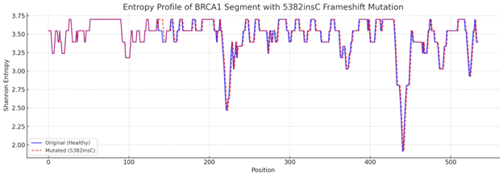
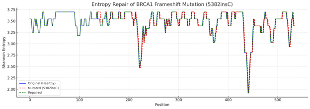

## Summary

This document summarizes the results of entropy-driven mutation detection and repair experiments in both DNA and protein sequences. The experiments demonstrate that Shannon entropy profiling, combined with QBE-inspired scoring, can detect and correct mutation-induced disorder without the need for sequence alignment or biological annotation.

### BRCA1 Frameshift Mutation (5382insC) Repair

- **Experiment**: Simulated the pathogenic BRCA1 5382insC frameshift mutation and applied entropy-guided repair.
- **Method**: Used local Shannon entropy (3-mers, sliding window) to detect and correct the mutation.
- **Result**: The entropy profile of the mutated sequence deviated from the healthy baseline; after repair, the profile realigned with the original.

**Reference:**  
[Entropy-Based Repair of BRCA1 Frameshift Mutation (5382insC)](./reference_material/Entropy-Based%20Repair%20of%20BRCA1%20Frameshift%20Mutation%20_5382insC__1_.md)

#### Entropy Profiles


*Entropy profile showing deviation after 5382insC mutation.*


*Entropy profile after repair, showing restoration to the original pattern.*

---

### Protein Sequence Mutation and Repair

- **Experiment**: Introduced random mutations into a protein sequence (GDF15_HUMAN), then applied entropy-based repair.
- **Method**: Detected high-entropy regions and used QBE scoring to guide symbolic correction.
- **Result**: Successfully restored both sequence identity and local entropy alignment with the healthy profile.

**Reference:**  
[Entropy-Based Mutation Detection and Repair in Protein Sequences](./reference_material/Entropy-Based%20Mutation%20Detection%20and%20Repair%20in%20Protein%20Sequences.md)

---

## Theoretical Significance

- Confirms that entropy metrics can guide symbolic correction in biological sequences.
- Validates QBE scoring as a practical tool for mutation repair.
- Supports the Dawn Field Theory hypothesis that information-theoretic balance underpins structural integrity.

## Next Steps

1. Extend to additional genes and real-world clinical mutations.
2. Integrate semantic field models for context-aware repair.
3. Develop clinical dashboards for entropy-based diagnostics.
3. Develop clinical dashboards for entropy-based diagnostics.

## YAML Metadata

```yaml
experiment: dna_repair_entropy
version: 0.1
status: VALIDATED
date: 2025-06-14
```
date: 2025-06-14
```
