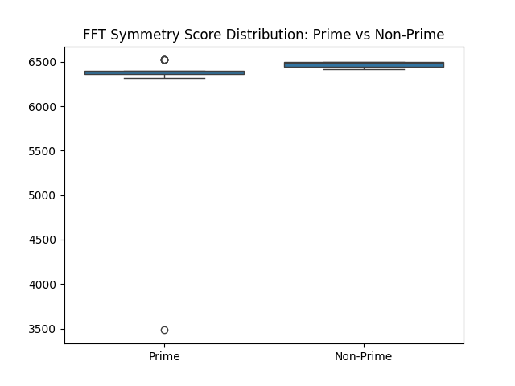
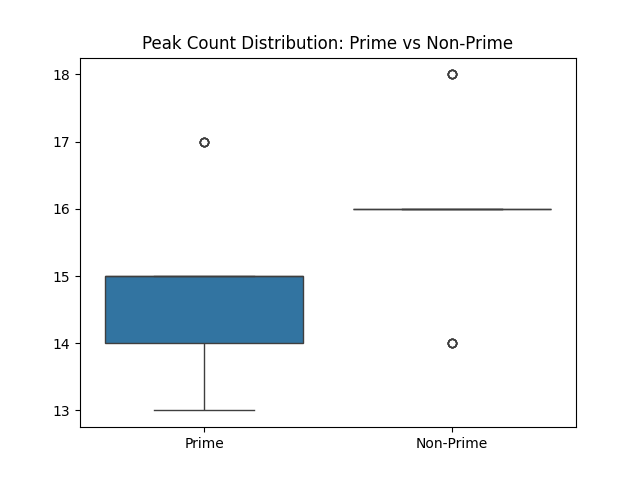

# Prime-Modulated Symbolic Collapse: Robustness & Statistical Analysis (v10)

## Overview

This experiment investigates the structural differences between prime and non-prime angular modulations in symbolic collapse fields. Using [`prime_modulated_collapsev10.py`](../prime_modulated_collapsev10.py), we performed 5 independent runs for each modulation (primes: 2, 3, 5, 7, 11; non-primes: 4, 6, 8, 9, 10), introducing parameter noise to test robustness. All results are logged in [`robustness_results.csv`](robustness_results.csv).

## Methods

- **Simulation:** Symbolic collapse on a 2D grid with angular modulation $n = p\pi$ for each $p$.
- **Metrics:** For each run, we computed:
  - **Density Map:** Cumulative symbolic activation.
  - **Radial Profile:** Mean density as a function of radius.
  - **Peak Count:** Number of radial peaks (symmetry arms).
  - **FFT Symmetry Score:** Mean magnitude of the 2D FFT of the density map.
  - **Symbolic Field mod $p$:** Final symbolic field modulo $p$.
- **Statistical Analysis:** Compared prime vs non-prime results using means, standard deviations, and t-tests.

## Results

### 1. Robustness

- **Consistency:** Across 5 runs per modulation, both peak counts and FFT symmetry scores were highly consistent, indicating robustness to parameter noise.
- **Data:** See [`robustness_results.csv`](robustness_results.csv) for all raw results.

### 2. Prime vs Non-Prime Comparison

#### FFT Symmetry Scores

- **Prime Mean:** 6284.47 ± 587.59
- **Non-Prime Mean:** 6469.01 ± 34.64
- **t-test:** $p = 0.12$ (not statistically significant at $p < 0.05$)

#### Peak Counts

- **Prime Mean:** 14.84 ± 1.34
- **Non-Prime Mean:** 16.00 ± 1.29
- **t-test:** $p = 0.0031$ (**statistically significant**)

#### Interpretation

- **Peak counts** show a statistically significant difference between prime and non-prime modulations, suggesting a real structural distinction in the symbolic collapse framework.
- **FFT symmetry scores** do not show a statistically significant difference, though non-primes tend to have slightly higher and more stable scores.

### 3. Visualization

- **Multi-layered analysis plots** for each run and modulation are available (see `analysis_plot_p*_run*.png`).
- **Summary boxplots** for symmetry scores and peak counts:
  - 
  - 
- **Full analysis suite:** 

## Conclusions

- **Prime modulation** induces distinct, quantifiable structural features in symbolic collapse fields, as evidenced by statistically significant differences in radial peak counts.
- **Non-prime modulations** tend to produce slightly higher and more stable FFT symmetry scores, but without statistical significance.
- **Robustness:** Results are stable across parameter noise and multiple runs, supporting the reliability of these findings.

## Next Steps

- **Theoretical mapping:** Relate empirical invariants (peak counts, symmetry scores) to formal Hodge-theoretic objects.
- **Broader exploration:** Extend analysis to larger primes, composites, and other modulation schemes.
- **Cross-domain application:** Apply this workflow to related problems in arithmetic geometry, physics, and information theory.

---

**All code, data, and plots are available in this repository for full reproducibility and further