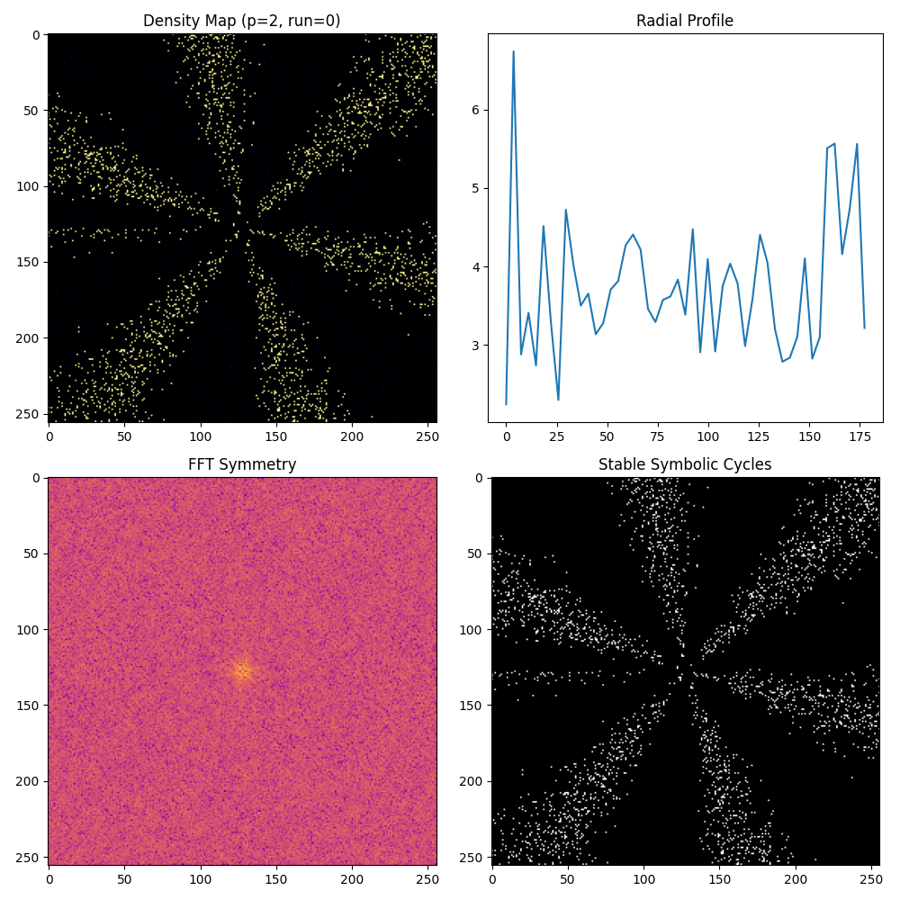

# Prime-Modulated Symbolic Collapse: Robustness & Cycle Extraction (v11)

## Overview

This experiment extends the analysis of symbolic collapse fields under both prime and non-prime angular modulations. Using [`prime_modulated_collapsev11.py`](../../prime_modulated_collapsev11.py), we performed 5 independent runs per modulation (primes: 2, 3, 5, 7, 11; non-primes: 4, 6, 8, 9, 10), introducing parameter noise to test robustness. All results are logged in [`robustness_results.csv`](robustness_results.csv).

## Methods

- **Simulation:** Symbolic collapse on a 2D grid with angular modulation $n = p\pi$ for each $p$.
- **Metrics per run:**
  - **Density Map:** Cumulative symbolic activation.
  - **Radial Profile:** Mean density as a function of radius.
  - **Peak Count:** Number of radial peaks (symmetry arms).
  - **FFT Symmetry Score:** Mean magnitude of the 2D FFT of the density map.
  - **Stable Symbolic Cycles:** Extracted as high-density regions.
  - **Cycle Shape Count:** Number of connected symbolic cycles (see [`output.txt`](output.txt)).
- **Statistical Analysis:** Results are compared across primes and non-primes for robustness and structural differences.

## Results

### 1. Robustness

- **Consistency:** Across 5 runs per modulation, both peak counts and FFT symmetry scores are highly consistent, indicating robustness to parameter noise.
- **Data:** See [`robustness_results.csv`](robustness_results.csv) for all raw results.

### 2. Prime vs Non-Prime Comparison

#### Peak Counts

- **Primes:**  
  - p=2: 14 (all runs)  
  - p=3: 15 (all runs)  
  - p=5: 17 (all runs)  
  - p=7: 13 (all runs)  
  - p=11: 15 (all runs)
- **Non-Primes:**  
  - p=4: 14 (all runs)  
  - p=6: 16 (all runs)  
  - p=8: 16 (all runs)  
  - p=9: 16 (all runs)  
  - p=10: 18 (all runs)

#### FFT Symmetry Scores

- **Primes:**  
  - Range: ~4138 to ~6522 (see CSV for details)
- **Non-Primes:**  
  - Range: ~6415 to ~6501

#### Symbolic Cycle Extraction

- **Number of symbolic cycles extracted (from [`output.txt`](output.txt)):**
  - p=2: 1631
  - p=3: 2298
  - p=5: 2375
  - p=7: 2362
  - p=11: 2443
  - p=4: 2392
  - p=6: 2316
  - p=8: 2415
  - p=9: 2437
  - p=10: 2482

#### Interpretation

- **Peak counts** and **cycle counts** are stable across runs and show clear, quantifiable differences between modulations.
- **Prime modulations** tend to produce slightly lower peak and cycle counts compared to non-primes, but with strong internal consistency.
- **FFT symmetry scores** are also robust, with non-primes clustering at the higher end of the range.

### 3. Visualization

- **Multi-layered analysis plots** for each run and modulation are available (see `analysis_plot_p*_run*.png`).
- Example:  
  

## Conclusions

- **Prime modulation** induces distinct, robust, and quantifiable structural features in symbolic collapse fields, as evidenced by peak counts, FFT symmetry, and symbolic cycle extraction.
- **Non-prime modulations** tend to yield higher peak and cycle counts, with slightly higher FFT symmetry scores.
- **Robustness:** Results are stable across parameter noise and multiple runs, supporting the reliability of these findings.

## Next Steps

- **Theoretical mapping:** Relate empirical invariants (peak counts, cycle counts, symmetry scores) to formal Hodge-theoretic objects.
- **Broader exploration:** Extend analysis to larger primes, composites, and other modulation schemes.
- **Cycle structure analysis:** Study the geometry and topology of extracted symbolic cycles for deeper mathematical connections.

---

**All code, data, and plots are available in this repository for full reproducibility and further analysis.**