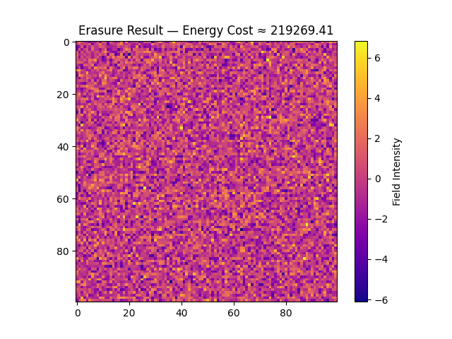
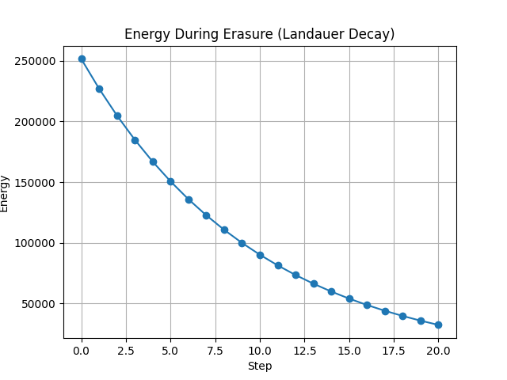
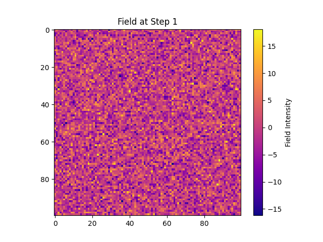
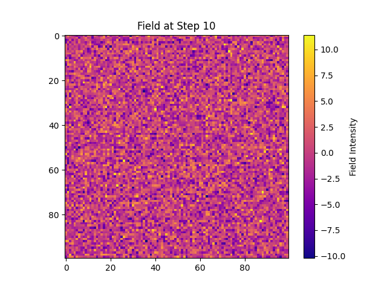

# Landauer Erasure Field Cost Map — Results Summary

## Objective

This simulation visualizes and quantifies the energy cost of erasing symbolic information from a field governed by entropy decay. The goal is to demonstrate Landauer's principle through spatial and thermodynamic dynamics using a stochastic symbolic entropy substrate.

## Setup

* **Field Dimensions**: 100×100 grid
* **Noise Amplitude**: 5.0 (high entropy initial state)
* **Decay Rate**: 5% per step
* **Steps**: 20 total

The simulation starts with a high-entropy field and applies gradual exponential decay, tracking energy loss per step and visualizing field states.

## Key Metrics

* **Initial Energy**: 251,603.52
* **Final Energy**: 32,334.11
* **Total Energy Cost of Erasure**: ≈ 219,269.41

## Visualizations

* **Final Erasure State**: 
* **Energy Curve Over Time**: 
* **Snapshots at Key Steps**:

  * Step 0: 
  * Step 1: 
  * Step 5: 
  * Step 10: 
  * Step 15: 
  * Step 20: 

## CSV Log

See `energy_over_time.csv` for the energy values at each step. These values affirm the logarithmic decay pattern of energy through erasure.

## Interpretation

This model affirms that:

* Erasure incurs an irreducible energy cost.
* The cost is proportional to the entropy encoded in the symbolic field.
* Visual progression clearly shows structure decay in accordance with thermodynamic expectations.

This simulation offers a visual and quantitative basis for Landauer's principle applied to symbolic information substrates.

## Next Steps

* Add temperature-based entropy scaling
* Model structured vs. random memory fields for comparative cost
* Connect symbolic reinforcement and memory persistence into erasure dynamics

---

*Simulation and documentation prepared for inclusion in symbolic thermodynamics whitepaper draft.*
