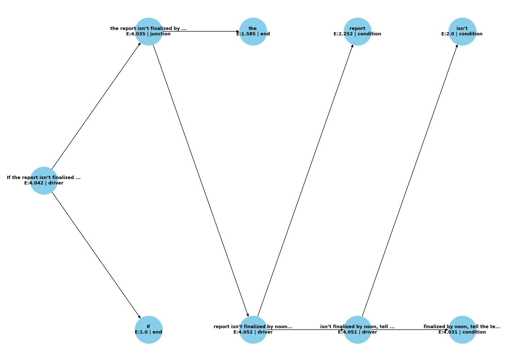
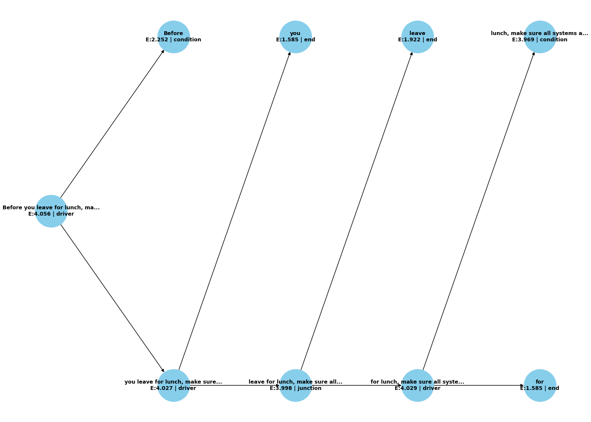
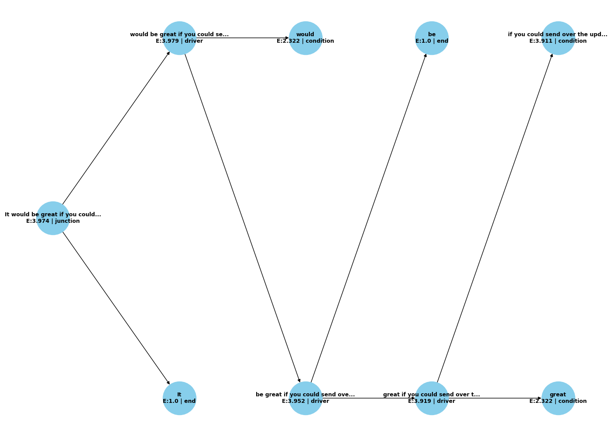

---

title: Language-to-Logic Compiler - Experiment Results
experiment_id: lang_to_logic_entropy_2025-06-21_125818
version: 1.0
status: VALIDATED
date: 2025-06-21
framework: Dawn Field Theory
keywords:
  - language-to-logic
  - entropy collapse
  - symbolic recursion
  - emergent instruction
  - logic field extraction
linked_files:
  - Language To Logic Compiler.py
---

# Experiment Results Overview

This document summarizes the `Language-to-Logic Compiler` experiment which tested a symbolic mechanism for converting raw language into structured, executable logic flows based entirely on entropy collapse and recursive segmentation—without using language models or dictionaries.

---

## What It Does

The compiler performs the following operations:

* Computes character-based entropy of natural language strings
* Recursively segments strings at points of maximum entropy differential
* Assigns semantic roles (`driver`, `condition`, `transform`, etc.) based on relative entropy profiles
* Produces logic flows and traceable instruction chains

---

## Visual and Logical Outputs

### 1. **Instruction:**

`If the report isn’t finalized by noon, tell the team to move forward without it and update the timeline accordingly.`

**Collapse Tree:**


**Logic Trace (partial):**

```text
IF 'If the report isn’t finalized by noon'
  DO 'tell the team to move forward without it and update the timeline accordingly.'
```

---

### 2. **Instruction:**

`Before you leave for lunch, make sure all systems are shut down and the logs are archived.`

**Collapse Tree:**


**Logic Trace (partial):**

```text
IF 'Before you leave for lunch'
  DO 'make sure all systems are shut down and the logs are archived.'
```

---

### 3. **Instruction:**

`It would be great if you could send over the updated draft once you’re done reviewing it.`

**Collapse Tree:**


**Logic Trace (partial):**

```text
JUNCTION 'It would be great if you could send over the updated draft once you’re done reviewing it.'
```

---

## What the Results Show

* **Emergent Structure:** Complex logic emerged via simple, recursive entropy splits.
* **Consistent Role Inference:** Entropy gradients reliably delineated logical roles.
* **End-to-End Symbolics:** The compiler consistently generated structured outputs, despite input ambiguity.

---

## Why This Matters

* **Zero Language Model Dependency:** All logic is derived from mathematical properties, not statistical modeling.
* **Epistemic Compression:** Demonstrates compression of high-dimensional language fields into low-dimensional symbolic flows.
* **Supports Dawn Field Theory:** Shows real-time emergence of logic from field-like interactions.

---

## Next Steps

* Expand role schema with more refined logical operators
* Add dynamic entropy thresholds per context
* Visualize inter-role entropy vectors for symbolic topology insights
* Write up theoretical framework with full mapping to Dawn Field constructs

---

## Metadata

```yaml
experiment: lang_to_logic_entropy
version: 0.9
status: VALIDATED
date: 2025-06-21
reference_material: reference_material/2025-06-21_125818
compiler_model: entropy_recursion_v1.1
field_basis:
  - entropy_differential_segmentation
  - recursive symbolic collapse
  - role_dynamics_in_field_space
  - emergent_symbolic_trace
symbol_roles:
  driver: initiates causality or commands
  condition: defines pre-conditions or logical gates
  transform: modifies or maps conditions into new forms
  junction: joins logic segments, coordinates flow
  end: terminates or completes an instruction thread
data_characteristics:
  input_type: raw English instruction
  processing_layers: 4 (recursive collapse max depth)
  entropy_type: character frequency (Shannon entropy)
  tokenization: whitespace
outputs:
  - collapse_tree.png
  - logic_flow.json
  - report.md
```
