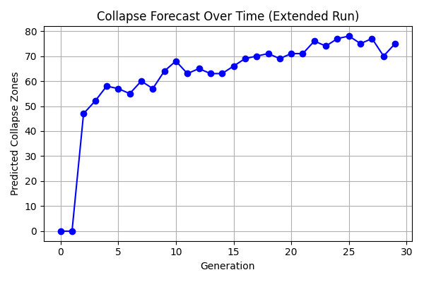
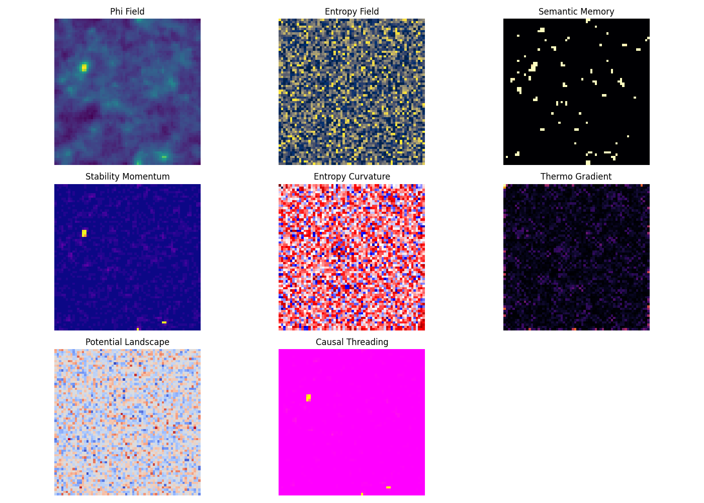

---
CIP-METADATA:
  experiment: Collapse Forecast
  author: Peter Lorne Groom
  date: 2025-06-30
  version: 1.0
  location: foundational/experiments/predictive_collapse/results.md
  description: |
    This simulation explores the emergence and propagation of collapse zones within a symbolic-thermodynamic framework. It introduces high-fidelity fields (symbolic potential, entropy, memory, thermodynamics, and causality) evolving under coupled dynamics, forecasting collapse zones over time based on entropy curvature and momentum.
---
# Collapse Forecast Results

## Experiment Metadata

* **Grid Size:** 64
* **Generations:** 30
* **Symbolic Reinforcement (alpha):** 0.1
* **Semantic Memory Rate (beta):** 0.05
* **Entropy Decay Rate (eta):** 0.05
* **Crystallization Threshold (theta):** 0.25
* **Collapse Curvature Threshold (kappa):** 0.12
* **Stability Threshold:** 0.25

## Objective

This simulation aimed to explore the emergence and propagation of collapse zones within a symbolic-thermodynamic framework. It introduces high-fidelity fields (symbolic potential, entropy, memory, thermodynamics, and causality) evolving under coupled dynamics. The model forecasts collapse zones over time based on entropy curvature and momentum.

## Forecast Plot

The system exhibits a delayed but sharp increase in predicted collapse zones around generation 2, peaking above 70 by generation 29. The steady rise and late plateau reflect increasing structural tension and stabilization in symbolic-momentum space.

## Snapshot of Fields (Final Generation)

This composite image showcases nine evolving fields:

* **Phi Field:** Represents symbolic concentration and phase dynamics
* **Entropy Field:** Shows local uncertainty and decay
* **Semantic Memory:** Cumulative reinforcement of symbolic patterns
* **Stability Momentum:** Persistence of symbolic crystallization
* **Entropy Curvature:** Predictive curvature of informational dynamics
* **Thermo Gradient:** Thermodynamic cost and fluxes
* **Potential Landscape:** Underlying energetic scaffolding
* **Causal Threading:** Accumulated causal potential over time

## Collapse Zone CSV Output

Captured in `forecasted_collapse_data.csv`, it logs predicted collapse counts per generation.

## Log File Metadata

Key parameters and per-generation collapse events are stored in `simulation_log.txt`, ensuring reproducibility and inspection.

## Interpretation

* Collapse dynamics follow stabilization of symbolic fields, requiring momentum and semantic support.
* The interaction between entropy curvature and stability predicts phase-transition-like behavior.
* Causal threading appears to integrate late-stage stabilization effects, pointing to emergent coordination mechanisms.

## Next Steps

* Introduce variable entropy and symbolic decay rates across spatial zones
* Explore multi-resolution temporal threading and latent encoding
* Compare collapse timing to entropy inflection for possible predictive bounds
* Transition to a multi-agent generative symbolic system for inter-field causality

---

This simulation will support a broader preprint on predictive actualization and collapse topology in symbolic thermodynamic space. Results are archived in `reference_material/<timestamp>/` for citation and further study.

---
CIP-METADATA-END
