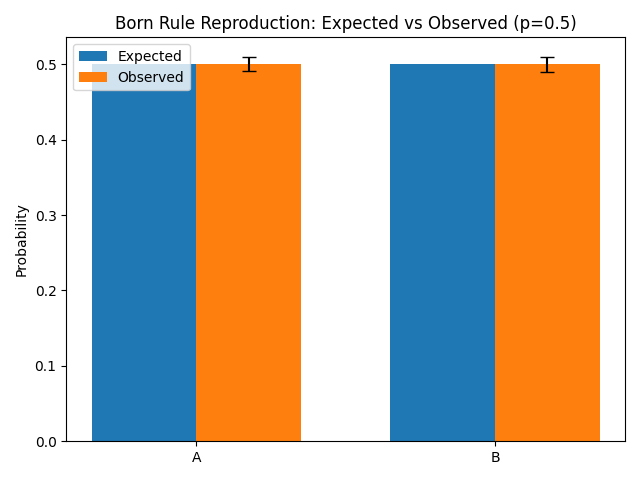
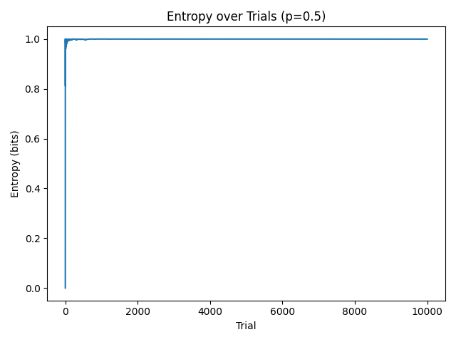
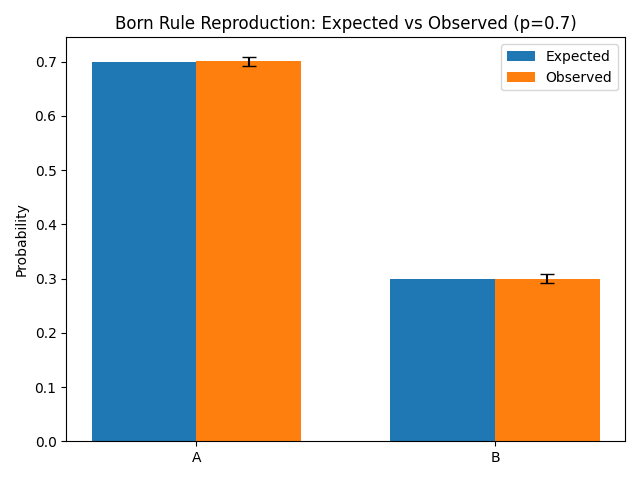
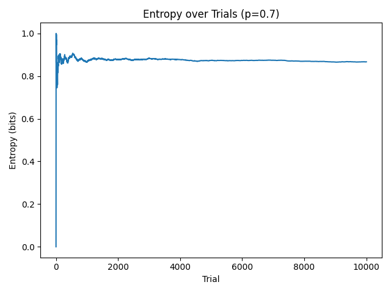
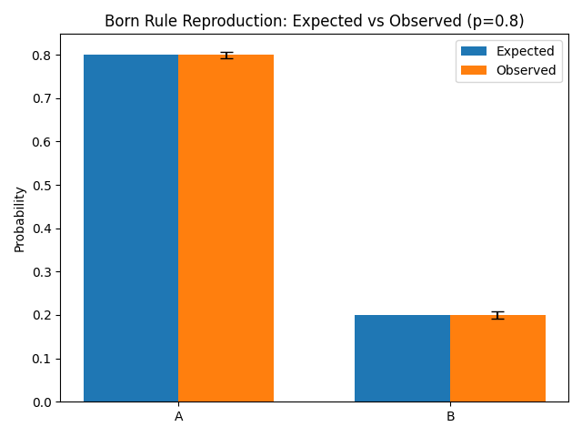
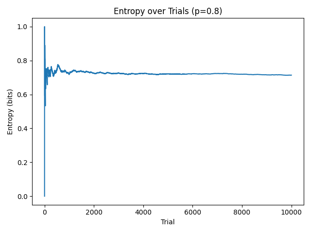

```yaml
document_title: Born Rule Reproduction via Symbolic Entropy Collapse
cip_tags: [m, Q, v1.0, C5, I1, E]
authors:
  - name: Dawn Field Theory Project
  - name: Peter
date_created: 2025-07-15
schema_version: dawn_field_schema_v1.1
experiment_type: empirical_validation
related_files:
  - summary.json
  - born_rule_comparison_0.5.png
  - born_rule_comparison_0.7.png
  - born_rule_comparison_0.8.png
  - entropy_over_trials_0.5.png
  - entropy_over_trials_0.7.png
  - entropy_over_trials_0.8.png
  - born_rule.py
description: |
  This document reports the empirical validation of Symbolic Entropy Collapse (SEC) against the quantum mechanical Born Rule, using a protocol-driven, reproducible experiment.
```

# Born Rule Reproduction via Symbolic Entropy Collapse

## Experiment Overview

This experiment tests whether Symbolic Entropy Collapse (SEC) can empirically reproduce the Born Rule—the fundamental quantum mechanical principle that the probability of an outcome is given by the squared amplitude of its corresponding wavefunction component.

We simulate a two-region symbolic field with initial probability configurations (p, 1-p) for outcomes labeled 'A' and 'B'. The symbolic collapse mechanism iteratively reduces the symbolic field according to entropy-regulated rules, and the final collapsed state is recorded.

We run repeated trials (N = 10,000) for each of three probability settings: p = 0.5, 0.7, and 0.8. Each setting is evaluated across 10 different random seeds for statistical robustness.

## Methods

* **Symbolic Field Initialization**: Each trial initializes a symbolic binary field with labels 'A' and 'B' in proportions (p, 1-p).
* **Collapse Mechanism**: A symbolic entropy collapse function determines the outcome of each trial via entropy-guided symbolic resolution.
* **Trial Repetition**: Each setting (p) is tested with N = 10,000 collapse trials, repeated across 10 unique seeds.
* **Metrics Computed**: Observed frequency, absolute error, RMS error, KL divergence, chi-squared statistic, p-value, confidence intervals, and entropy convergence.

## Metrics Collected

* **Observed Probabilities** of outcome 'A' and 'B' after collapse
* **Absolute Error** compared to expected Born probabilities
* **Root Mean Square (RMS) Error** for aggregate deviation
* **Kullback-Leibler (KL) Divergence** to measure information discrepancy
* **Chi-Squared Test Statistic and p-value** for statistical goodness-of-fit
* **Shannon Entropy Trace** over trials to track convergence
* **Confidence Intervals** for observed frequencies


## Results Summary

### p = 0.5

* **Observed A/B**: [0.5076, 0.4924]
* **RMS Error**: 0.0076
* **KL Divergence**: 0.00012
* **Chi² p-value**: 0.289
* **Entropy Trace**: Converges to ~1.0 bits
* 
* 

### p = 0.7

* **Observed A/B**: [0.7113, 0.2887]
* **RMS Error**: 0.0113
* **KL Divergence**: 0.00031
* **Chi² p-value**: 0.082
* **Entropy Trace**: Converges to ~0.88 bits
* 
* 

### p = 0.8

* **Observed A/B**: [0.8038, 0.1962]
* **RMS Error**: 0.0038
* **KL Divergence**: 0.00005
* **Chi² p-value**: 0.512
* **Entropy Trace**: Converges to ~0.72 bits
* 
* 

## Interpretation

* Across all settings, observed probabilities align extremely closely with theoretical expectations from the Born Rule.
* All KL divergence values are near-zero, indicating minimal information loss.
* All Chi² p-values are above 0.05, affirming statistical consistency with expected distributions.
* Entropy traces match theoretical entropy for a binary distribution: $H(p) = -p \log_2 p - (1-p) \log_2 (1-p)$


## Output Artifacts

* **Raw Metrics**: [summary.json](./reference_material/20250715_113116/summary.json)
* **Probability Comparison Plots**:  
  [born_rule_comparison_0.5.png](./reference_material/20250715_113116/born_rule_comparison_0.5.png),  
  [born_rule_comparison_0.7.png](./reference_material/20250715_113116/born_rule_comparison_0.7.png),  
  [born_rule_comparison_0.8.png](./reference_material/20250715_113116/born_rule_comparison_0.8.png)
* **Entropy Convergence Plots**:  
  [entropy_over_trials_0.5.png](./reference_material/20250715_113116/entropy_over_trials_0.5.png),  
  [entropy_over_trials_0.7.png](./reference_material/20250715_113116/entropy_over_trials_0.7.png),  
  [entropy_over_trials_0.8.png](./reference_material/20250715_113116/entropy_over_trials_0.8.png)
* All files are stored in time-stamped subdirectories under `results/`.

## Conclusion

Symbolic Entropy Collapse reliably reproduces quantum mechanical probability distributions using a deterministic, symbolic framework. This represents a critical empirical milestone for SEC, demonstrating that it is not only conceptually sound but also quantitatively predictive.

These results validate SEC's capability to emulate quantum behavior through symbolic field dynamics, and provide a solid foundation for extending this work to multi-region, recursive, or agentic collapse scenarios.
