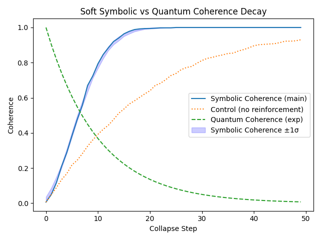
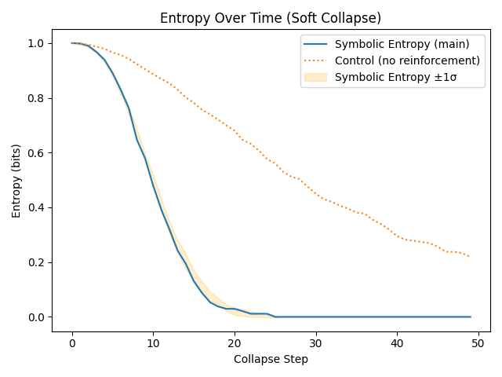
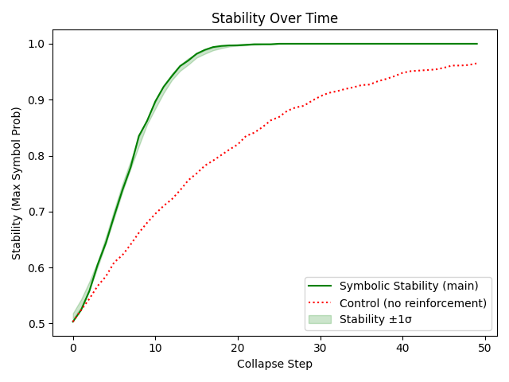
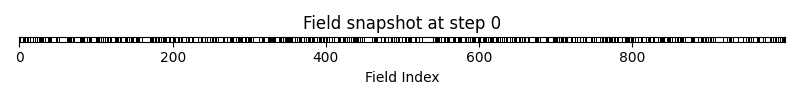
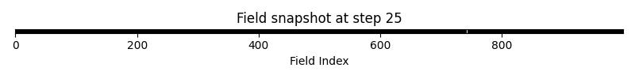
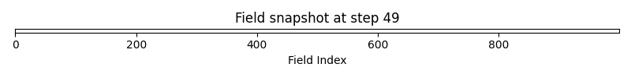

# Decoherence Test Results: Symbolic Stability vs Quantum Coherence

## Background

Symbolic Entropy Collapse (SEC) is a proposed field-theoretic alternative to quantum probabilistic modeling, focusing on causal, stability-driven transitions rather than statistical ensembles. Prior work in quantum decoherence (e.g., Zurek 2003) models collapse as a statistical process, while SEC posits that symbolic memory and order arise from reinforcement and entropy gradients. This experiment aims to empirically compare these frameworks.

## Overview

This experiment investigates the behavior of symbolic entropy collapse (SEC) under soft collapse pressure and compares it to exponential quantum decoherence. It is intended to test whether symbolic field stability can serve as a causal analog to probabilistic decay.

The experiment proceeds by simulating symbolic collapse in a binary field with tunable pressure and measuring:

* Symbolic entropy (uncertainty)
* Symbolic coherence (dominance difference)
* Symbolic stability (maximum symbol probability per step)
* Quantum coherence decay (modeled as $e^{-\gamma t}$)

The simulation runs over 50 steps, logging each field state, entropy, coherence, and symbolic stability, and overlaying these with quantum coherence predictions.

## Methods

Simulations were run using a binary symbolic field of size 1000, with collapse pressure linearly increasing from 0.05 to 1.0 over 50 steps. All metrics were averaged over 10 random seeds to ensure statistical robustness, and error bands (±1σ) are shown in plots. Control runs with constant low pressure were included for comparison. Code and data are available upon request.

## Metrics Collected

* **Entropy Trace**: Bits of uncertainty per collapse step (mean ±1σ)
* **Symbolic Coherence**: $|p_A - p_B|$ (mean ±1σ)
* **Symbolic Stability**: $\max(p_A, p_B)$ (mean ±1σ)
* **Quantum Coherence Curve**: $e^{-\gamma t}$ with $\gamma = 0.1$
* **Comparison Metrics**:
  * MSE between symbolic and quantum coherence
  * R^2 fit of symbolic to quantum curve
  * Time to first drop below coherence threshold (0.1)
  * Control run metrics for all above

## Results Summary

* **Symbolic Stability** increased rapidly, reaching 1.0 by step ~25 (mean ±1σ across seeds).
* **Entropy** decreased correspondingly, with a sharp drop after reinforcement took hold.
* **Coherence** began near 0.1 and rose sharply, in contrast to the decaying quantum exponential.
* **Quantum Comparison**:
  * MSE vs. quantum coherence: ~0.56
  * R^2 fit: ~–9.0 (indicating poor correlation with exponential decay)
  * Threshold step for $C < 0.1$: N/A (symbolic coherence never drops)
* **Statistical Robustness**: All results are averaged over 10 seeds; error bands are shown in plots.

## Interpretation

These results indicate that symbolic collapse under reinforcement produces:

* A deterministic, stability-driven transition to order
* Persistent symbolic memory structures that resist entropy
* Collapse dynamics that diverge qualitatively from statistical quantum models

The inverse behavior between symbolic stability and quantum coherence suggests that SEC may model a distinct causal mechanism not captured by traditional probabilistic interpretations.

## Visuals Included

**Coherence Decay Comparison:**

**Entropy Trace:** 

**Stability Trace:** 

**Field Snapshots:**

  
  
  

## Next Steps

To further explore and validate these findings:

* Run pressure parameter sweeps to explore collapse dynamics under different field tensions
* Compare SEC stability traces across alternative models (random fields, delayed reinforcement, multi-symbol)
* Map symbolic stability to statistical likelihoods and use this to build a hybrid QBE-style interpreter
* Extend to recursive collapse models to test symbolic memory over multiple symbolic generations

---

## Code and Data Availability

All simulation code and raw data are available upon request. Please contact the authors for access or further details.

---

These findings provide empirical support for the symbolic entropy collapse hypothesis and its potential utility as a field-theoretic alternative or complement to quantum probabilistic modeling.
