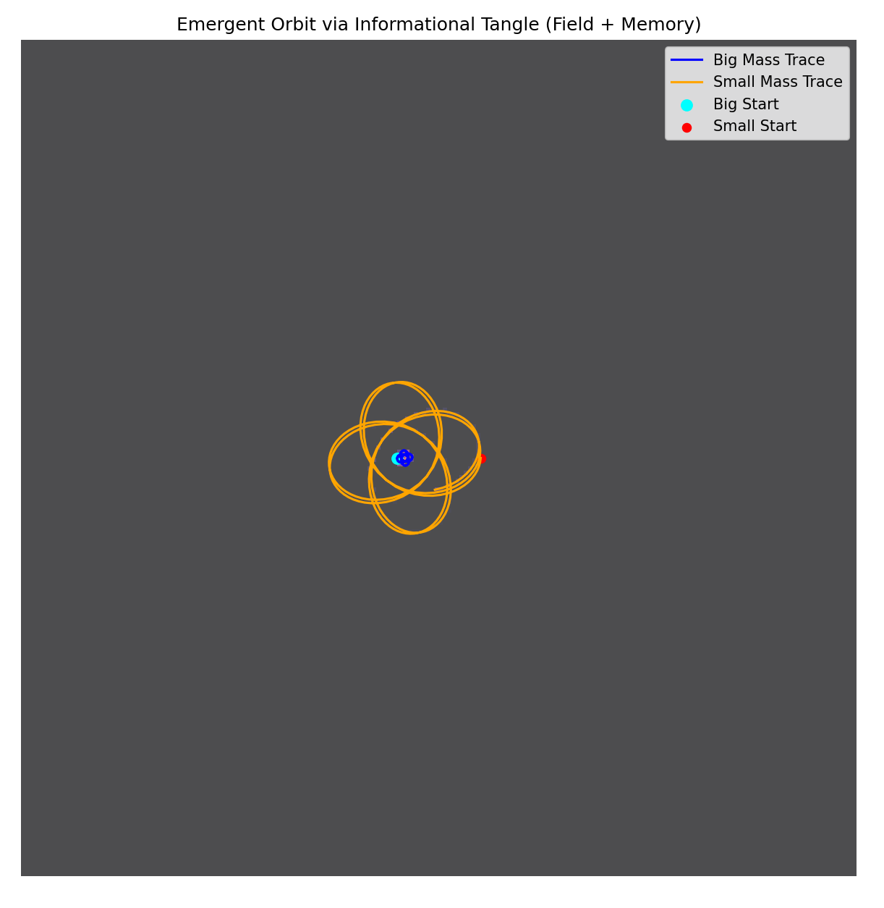
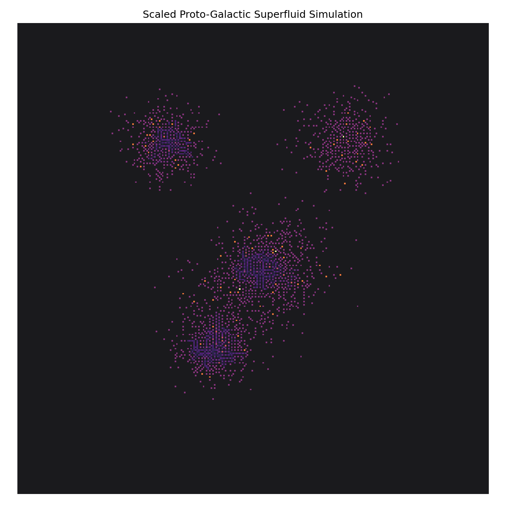
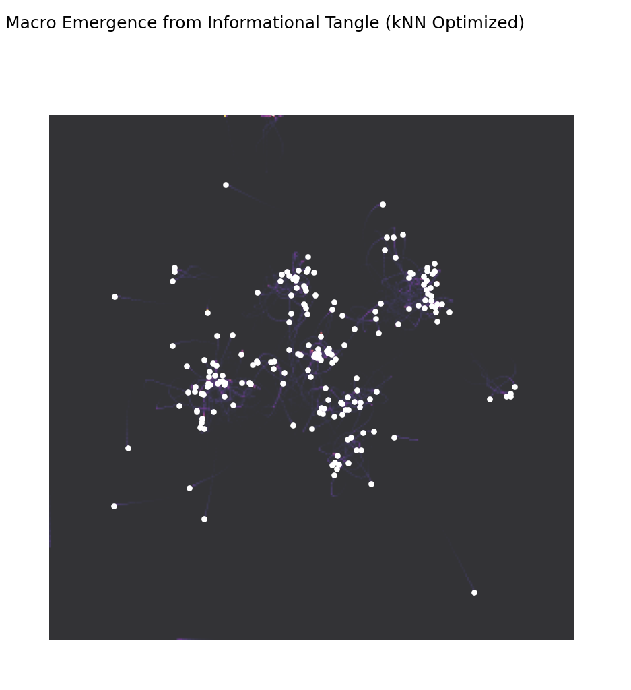

# Experiment Results Overview

This document summarizes the main experiments in this folder, focusing on what each script does, what the results look like, and why they matter for Dawn Field Theory. Each experiment explores how complex, ordered structures can emerge from simple, recursive field rules—without relying on traditional gravitational equations.

---

## 1. `recursive_gravity.py`: Emergent Orbit via Informational Tangle

**What it does:**  
Simulates two "masses" interacting through recursive informational feedback and entropy field overlays—no Newtonian gravity. The feedback is based on distance and recursive memory, not force laws.

**What you see:**  
- Two traces: one for a "big" and one for a "small" mass.
- An entropy field overlay showing where recursive memory accumulates.
- Orbits and feedback loops emerge naturally.

**Why it matters:**  
Shows that orbit-like motion and field memory can arise from informational recursion alone. Supports the idea that gravity might be an emergent, memory-based field effect.



---

## 2. `proto_galactic_superfluid.py`: Proto-Galactic Superfluid Emergence

**What it does:**  
Initializes several clusters of particles and lets them evolve under entropy field gradients and recursive memory. No gravity or central force is coded in.

**What you see:**  
- Macro-scale, spiral, and filamentary structures emerge from random clusters.
- Entropy field overlays reveal coherent, galaxy-like patterns.

**Why it matters:**  
Demonstrates that galactic-scale order and rotation can self-organize from field feedback and memory, not from mass or force. Suggests a new way to think about cosmological structure formation.



---

## 3. `macro_emergence_knn.py`: Macro Emergence from Informational Tangle (kNN)

**What it does:**  
Simulates many particles interacting via local neighbor (kNN) informational tangling, with recursive memory and entropy field overlays. Each particle's motion is influenced by its neighbors' positions and masses.

**What you see:**  
- Dense, emergent macrostructures and clustering.
- Entropy field highlights regions of high recursive interaction.
- Final positions show non-random, coherent patterns.

**Why it matters:**  
Validates that large-scale order and clustering can arise from local, memory-driven field rules. Reinforces the Dawn Field Theory claim that complexity and "gravity-like" effects can emerge from informational recursion.



---

## Significance

- **No Gravity Needed:** All experiments show that orbit, clustering, and macrostructure can arise from recursive informational fields and memory, not from Newtonian or relativistic gravity.
- **Field Cognition:** The results support the idea that memory, feedback, and entropy gradients can drive the emergence of order and structure—key to Dawn Field Theory.
- **Reproducibility:** All scripts are deterministic given the same seeds and parameters, making results easy to verify and extend.

---

## Next Steps

- Analyze the entropy and memory traces for deeper patterns.
- Extend to 3D and add symbolic payloads for semantic field experiments.
- Compare with traditional N-body and GR simulations for quantitative benchmarks.

---

## Metadata

```yaml
experiments:
  - recursive_gravity
  - proto_galactic_superfluid
  - macro_emergence_knn
version: 1.2
status: VALIDATED
date: 2025-06-14
```
