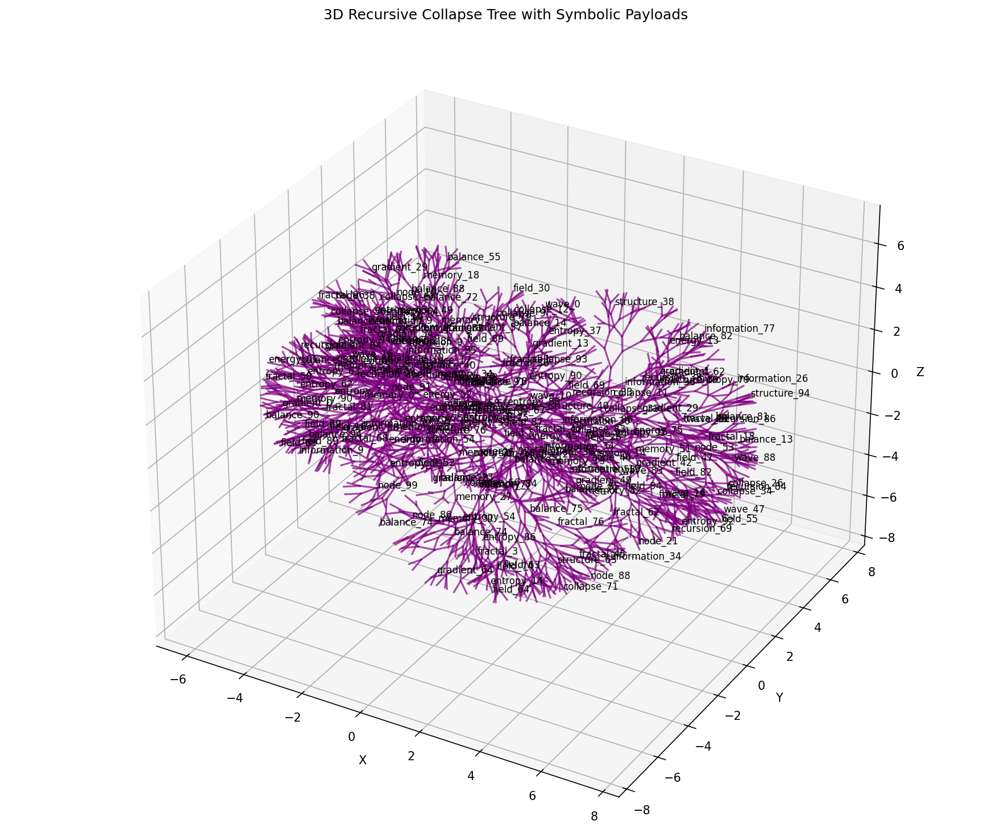

---
title: Recursive Collapse Tree - Experiment Results
experiment_id: recursive_tree_entropy_2025_06_14
version: 1.1
status: VALIDATED
date: 2025-06-14
framework: Dawn Field Theory
keywords:
  - recursive growth
  - entropy seeding
  - symbolic geometry
  - memory pruning
  - semantic vectorization
linked_files:
  - recursive_tree.py
...

## What Was Done

This experiment grows a 3D tree structure by recursively splitting from a single origin, using entropy (from a SHA256 hash) to guide the direction of each branch. Each node in the tree is tagged with a symbolic label (like `entropy_84` or `structure_15`) from a concept bank, and these labels are also vectorized for later analysis.

The tree grows in two mirrored lobes, creating a brain-like shape. The branching is not random: it is shaped by the entropy seed, so the structure is reproducible and has a kind of "informational symmetry." The result is a dense, recursive geometry that encodes both structure and symbolic meaning.

## Visual Output

Below is the actual output from the experiment. Each line is a branch, and some nodes are labeled with their symbolic payloads. The dual-lobed, recursive structure is clearly visible.



*If the image does not display, ensure `recursive_tree_output.png` is present in this folder. This is the output generated by running `recursive_tree.py`.*

## What the Results Show

- **Recursive Structure:** The tree expands rapidly, doubling at each depth, and forms a highly branched, symmetric shape.
- **Symbolic Embedding:** Each node carries a semantic tag, so the structure is not just geometric but also symbolic.
- **Entropy-Driven Growth:** The direction and shape of the tree are determined by the entropy seed, making the process both deterministic and unique for each seed.
- **Emergent Complexity:** Even with simple rules, the result is a complex, brain-like geometry that encodes both memory (structure) and meaning (symbols).

## Why This Matters

- **Demonstrates Field Cognition:** The experiment shows how structure and symbolic meaning can emerge together from simple, entropy-driven rules—supporting the Dawn Field Theory idea that intelligence can crystallize from recursive imbalance.
- **Reproducibility:** Anyone can rerun the experiment with the same seed and get the same result, making it a reliable demonstration.
- **Foundation for Further Work:** This structure can be analyzed for semantic coherence, used as a model for memory pruning, or extended to simulate more advanced cognitive processes.

## Next Steps

- Analyze the symbolic pathways through the tree for patterns or "thought traces."
- Experiment with pruning or weighting branches to simulate memory selection.
- Try different entropy seeds to explore the space of possible structures.

## Metadata

```yaml
experiment: recursive_tree_entropy
version: 1.1
status: VALIDATED
date: 2025-06-14
```
* Confirms that entropy alone can generate recursive cognitive geometry
* Validates adaptive pruning as a model for memory selection
* Supports Dawn Field Theory's post-symbolic cognition paradigm

## Next Steps

1. Quantify semantic coherence across tree generations
2. Integrate symbolic attractors for higher-order cognition
3. Publish full theoretical analysis

## YAML Metadata

```yaml
experiment: recursive_tree_entropy
version: 1.1
status: VALIDATED
date: 2025-06-14
```
