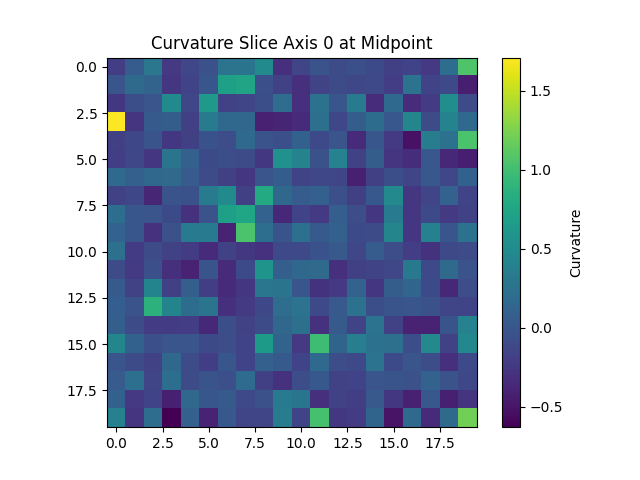
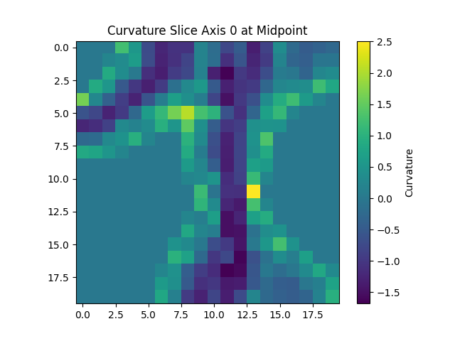
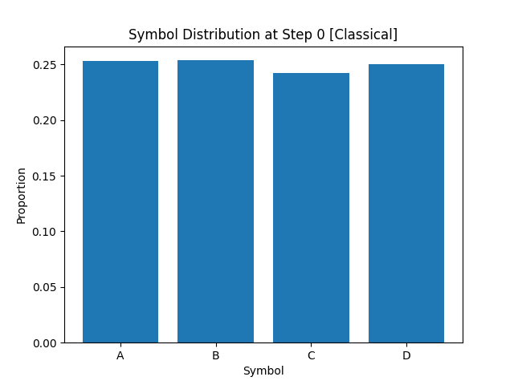
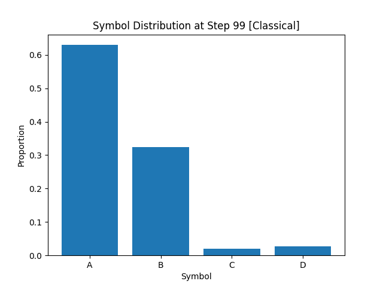
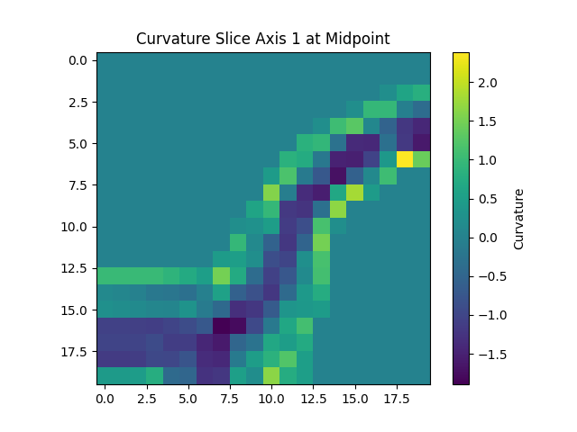

**Title:** Convergent Symbolic Collapse: A Unified Framework for Emergent and Classical Entropy Reduction in Informational Geometries

**Abstract:**
This paper presents a novel simulation architecture and theoretical framework for modeling symbolic field collapse via both emergent and classical processes. We demonstrate that symbolic entropy reduction can be achieved identically by recursive neighborhood interactions (emergent mode) or chemically-inspired stoichiometric transitions (classical mode), thereby validating our theory of informational geometry collapse. The experiments incorporate curvature analysis, symbolic diversity tracking, multi-seed reproducibility, noise robustness, and 3D field extension, offering a rigorous platform for further epistemic modeling and topological inference.

---

**1. Introduction**

Symbolic fields—discrete lattices of evolving informational elements—offer a powerful modeling framework for understanding phase transitions in entropy-rich systems. Our motivation stems from the desire to unify emergent computation and classical thermodynamic constraints into a cohesive framework for symbolic collapse. We aim to empirically validate the hypothesis that geometry emerges from informational differentials through a rigorous comparative study of emergent and classical collapse mechanisms.

**2. Theoretical Foundation**

We define entropy using the Shannon index over the symbolic field at each timestep. Emergent collapse proceeds via recursive entropy gradient minimization, modulated by radial basis functions and local balance decay. Classical collapse is driven by symbolic stoichiometry and reactivity matrices, approximating a discrete analogue to Landauer-regulated dynamics. Both models are governed by curvature-sensitive diffusion and entropy curvature monitoring (Laplacian-based).

### Mathematical Formulation

Given a symbolic field \$F\$ over a finite lattice \$L \subset \mathbb{Z}^2\$, entropy is:

$$
H(F_t) = - \sum_{s \in S} p_s \log_2(p_s)
$$

where \$S\$ is the set of symbols, and \$p\_s\$ the empirical probability at time \$t\$.

#### Emergent Collapse Operator:

$$
\Phi(F_t; \theta) = F_t - \delta F_t, \quad \delta F_t(i,j) \propto \text{RBF}(i,j) \cdot \exp(-\sigma_t \cdot B_{ij}) \cdot \nabla H_{ij}
$$

#### Classical Collapse Probability:

$$
P_{\text{retain}} = \exp\left(-\frac{\Delta H}{k_B T}\right)
$$

#### Symbolic Stoichiometry:

$$
B_k = \text{std}(v_k) = \sqrt{\frac{1}{|S|} \sum_{s \in S} (p_s - \bar{p})^2}
$$

#### Informational Curvature:

$$
\kappa(i,j) = \nabla^2 H(i,j)
$$

### Symbolic Reaction Potential:

$$
R_{i,j}(s) = \frac{1}{Z} \sum_{s' \neq s} \alpha_{s,s'} \cdot n_{s'}(i,j)
$$

**3. Simulation Architecture**

We implement a modular Python simulation engine that supports:

* Grid initialization with customizable symbol sets and dimensions
* Emergent model: recursive entropy minimization using neighborhood statistics
* Classical model: \$\alpha\$-matrix-driven rebalancing and stoichiometric curvature smoothing
* Multi-seed batch runs for reproducibility
* Logging of entropy, curvature, diversity, and full symbol distributions
* Visualization of 2D/3D field geometries
* Noise injection and entropy threshold halting
* Structured saving of metadata and plots for every run
* Symbolic ancestry tracking and curvature slice mapping
* Exported symbolic distributions for each timestep

**4. Results**

* Entropy drops in both models are nearly identical and follow smooth sigmoidal curves
* Emergent and classical geometric outputs are visually indistinguishable at convergence
* Diversity and curvature measures synchronize over time across models
* Robustness to injected noise is validated; symbolic collapse persists
* Visualization reveals fractal-like attractor geometries forming through recursive smoothing
* Curvature slicing across higher dimensions matches entropy behavior across time

**Figures:**

* [Entropy Trace (Emergent, seed 101)](reference_material/20250624_185441/Emergent/seed_101/entropy_trace.csv)
* [Entropy Trace (Classical, seed 202)](reference_material/20250624_185441/Classical/seed_202/entropy_trace.csv)
* 
* 
* 
* 
* 

**5. Discussion**

The near-perfect convergence of classical and emergent collapse dynamics suggests a deeper structural equivalence. Symbolic entropy minimization, regardless of update modality, tends to enforce the same geometrical attractors. This supports our hypothesis that informational curvature governs structural emergence. The model acts as a computational bridge between discrete symbolic processing and thermodynamically-inspired collapse theory.

**6. Future Work**

* Integrate recursive ancestry and logic role tracking (per CIP framework)
* Apply to larger symbolic alphabets and non-uniform lattice topologies
* Derive closed-form predictions for symbolic curvature trajectories
* Analyze the attractor landscape across seeds and initial conditions
* Prepare for integration with categorical and topological frameworks (e.g., Hodge structures)
* Expand stoichiometric dynamics and phase-transition diagnostics
* Add symbolic ancestry, logic tags, and multi-field interaction dynamics
* Run high-dimensional lattice studies and curvature slice comparisons
* Generate symbolic diversity and curvature time-series animations

**Appendix:**

* Figures: Entropy curves, diversity trends, curvature maps, 3D field slices
* Data: Logged distributions, run metadata, curvature logs
* Code: Annotated snippets, structure diagrams, experiment runner configs
