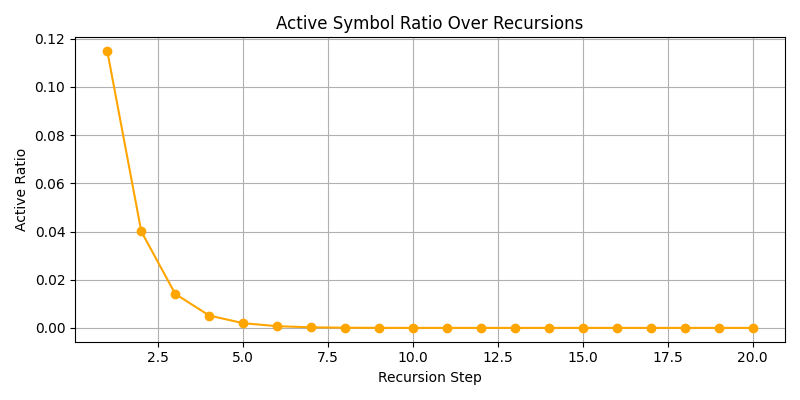
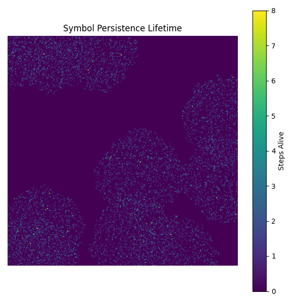
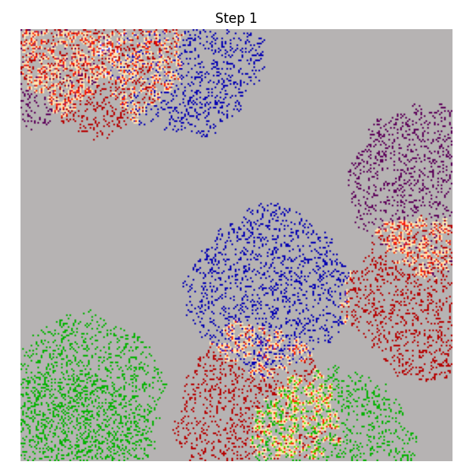
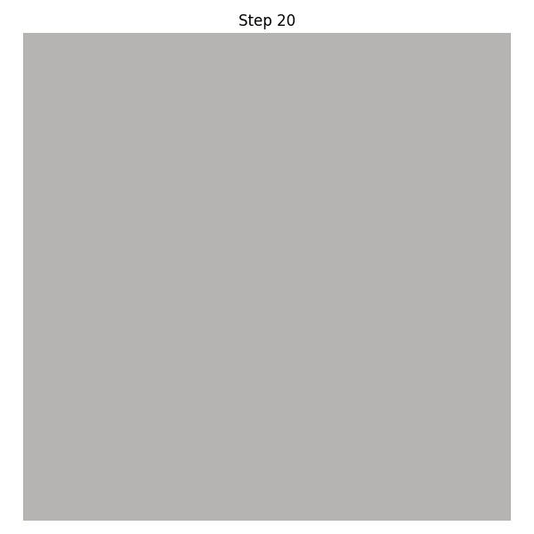

# Symbolic Fractal Pruning Experiment – Results Summary

## Objective

This experiment investigates whether recursive calculus operations (Laplacian, gradient) can prune a complex symbolic field seeded with fractured, non-uniform geometry. The aim is to explore the symbolic analogs of field collapse, entropy regulation, and symbolic morphogenesis — inspired by principles of recursion, balance, and information dynamics.

## Methodology

* **Symbol Initialization**: A 256×256 field was populated with symbols ('A', 'B', 'C', 'D') distributed via a fractured growth algorithm.
* **Calculus Application**: Laplacian and gradient magnitudes were recursively computed and combined to determine pruning masks.
* **Entropy-Based Regulation**:

  * **Shannon entropy** was used to track symbolic diversity per neighborhood.
  * Recursive balance was enforced through RBF-weighted entropy penalty fields.
  * Landauer-inspired symbolic resistance limited deletion in high-entropy or stable zones.
* **Morphogenetic Flow**: Symbol drift was introduced, enabling symbols to stochastically migrate, mimicking symbolic fluidity.

## Key Visuals






Example Collapse Steps:






* `entropy_over_time.png`: Tracks total symbolic entropy across 20 recursions.
* `active_ratio_over_time.png`: Shows the percentage of remaining active (non-deleted) symbols.
* `symbol_lifetimes.png`: Visualizes how long each symbol persisted through the recursion.
* `step_01.png` → `step_20.png`: Snapshots of the symbolic field evolution.

## Observations

* Entropy initially plateaued due to overly stable or uniform dynamics.
* After recursive balance integration and drift, entropy began to fluctuate and drop organically.
* Active symbol ratio showed coherent decay, confirming effective symbolic pruning.
* Visual inspection shows symbolic collapse zones, balance emergence, and drift patterns.

## Interpretations

* The recursive calculus model successfully prunes symbolic fields while respecting complexity.
* Recursive entropy regulation and symbolic drift were essential to avoid stagnation.
* This framework simulates symbolic superfluid collapse and may represent a novel computational geometry primitive for symbolic intelligence.

## Next Steps

* Extend to symbolic generative fields (not just pruning)
* Compare pruning outcomes across geometric seeds and symbol rules
* Integrate curvature, divergence, and higher-order field operators
* Publish experimental setup and results alongside entropy modulation theory

## Archive Path

Output saved to:

```
reference_material/pruning_YYYYMMDD_HHMMSS/
```

Includes all visuals and `pruning_stats.json` for analysis and citation.
