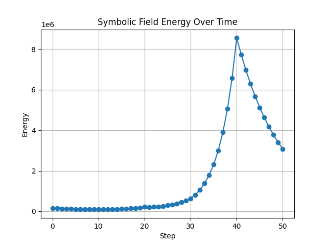
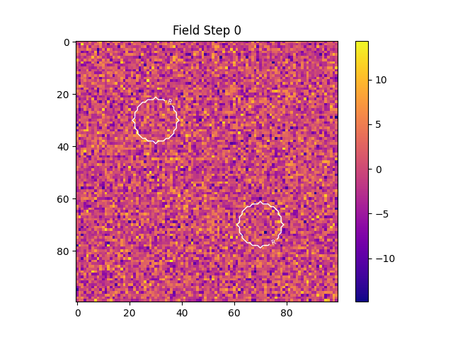
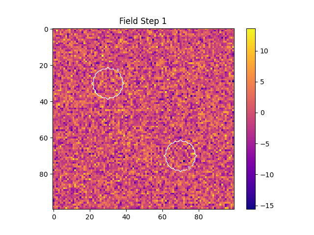
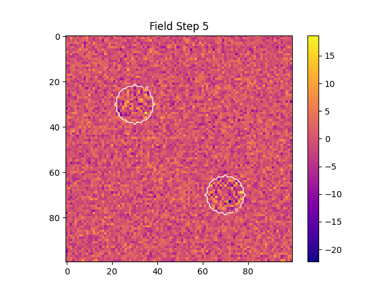
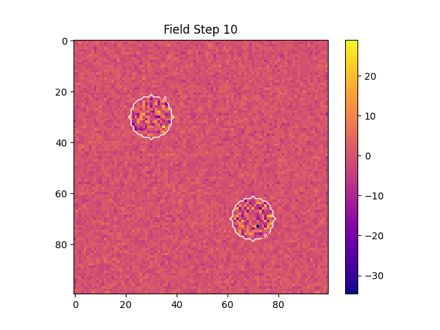
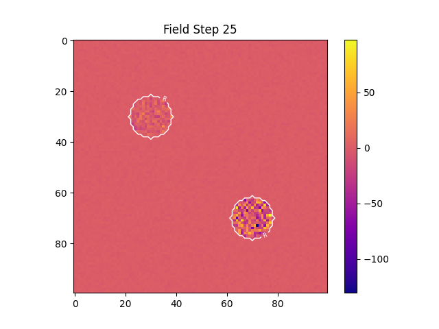
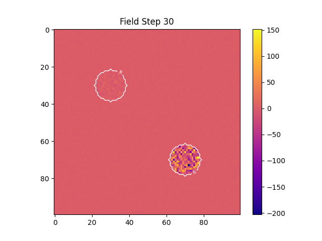
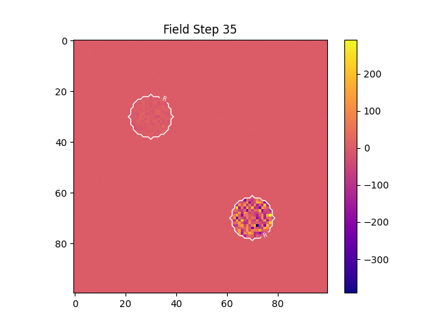
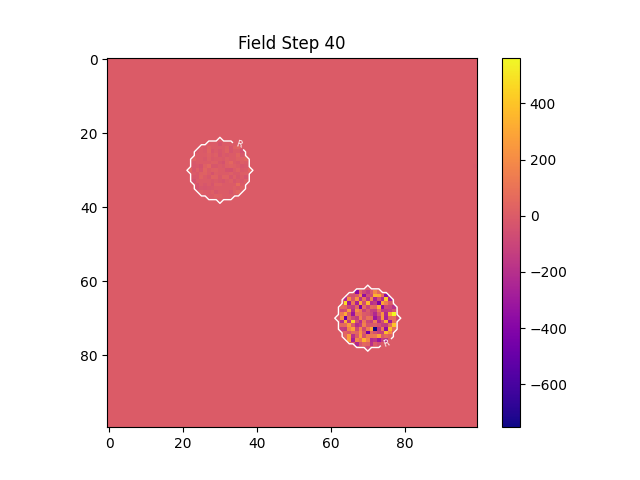
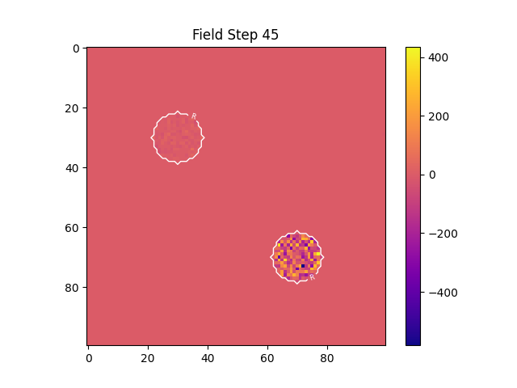

---
CIP-METADATA:
  experiment: Symbolic Memory Reinforcement + Decay Test (Agentic Dynamics)
  author: Peter Lorne Groom
  date: 2025-06-30
  version: 1.0
  location: foundational/experiments/symbolic_memory_agentic_decay_test/results.md
  description: |
    This experiment explores the interplay between symbolic memory reinforcement and thermodynamic decay in a spatial field, simulating agentic dynamics. Two reinforcement zones represent “memories” or loci of symbolic attention, while the rest of the field decays over time. An optional control mode allows pure decay comparison.
---
# Symbolic Memory Reinforcement + Decay Test (Agentic Dynamics) — Results

## Overview

This experiment explores the interplay between symbolic memory reinforcement and thermodynamic decay in a spatial field, simulating agentic dynamics. Two reinforcement zones represent “memories” or loci of symbolic attention, while the rest of the field decays over time. An optional control mode allows pure decay comparison.

**Key Parameters:**

* Field shape: 100 × 100
* Decay rate: 0.05
* Steps: 50
* Reinforcement strength: 0.15
* Radius: 8
* Feedback boost (phase 2): 0.2
* Interaction field (phase 3): weak sinusoidal pattern

---

## Results

### 1. Energy Curve

* **Interpretation:**

  * Energy initially drops due to decay, but then sharply rises as reinforcement dominates the reinforced zones.
  * After reinforcement phases, energy plateaus or drops (especially with secondary agent interaction), showing both persistence and eventual dissipation.

---

### 2. Field Snapshots

**Reinforced regions** (white contours labeled ‘R’) are visible as persistent high-intensity zones, while the rest of the field decays.
Below are representative steps:

| Step | Field Snapshot                |
| ---- | ----------------------------- |
| 0    |    |
| 1    |    |
| 5    |    |
| 10   |  |
| 15   |  |
| 20   |  |
| 25   |  |
| 30   |  |
| 35   |  |
| 40   |  |
| 45   |  |
| 50   |  |

*Reinforced zones persist and amplify, while surrounding field regions fade, especially after step 20 when agentic feedback and interactions occur.*

---

### 3. Controls & Exploration

* **Reinforcement overlays** highlight persistent symbolic regions; future runs may explore different reinforcement strengths, radii, or patterns.
* **Control mode:** Pure decay (no reinforcement) shows rapid energy loss and homogeneous field decay—demonstrating the distinct effect of symbolic reinforcement.
* **Parameter sweeps:** Can reveal critical transitions between memory persistence and forgetting.

---

## Conclusions

* **Agentic reinforcement** sustains and amplifies symbolic regions, resisting natural decay—mimicking memory retention and learning.
* **Decay-only controls** confirm the necessity of reinforcement for persistent symbolic structure.
* **Overlay visualization** makes reinforced memory regions and their evolution clearly visible.
* **Future work:**

  * Systematic exploration of reinforcement/decay balance
  * Complex agent dynamics (multiple or mobile regions)
  * Direct symbolic encoding/decoding
  * Linking field energy to information-theoretic memory cost

---
CIP-METADATA-END
