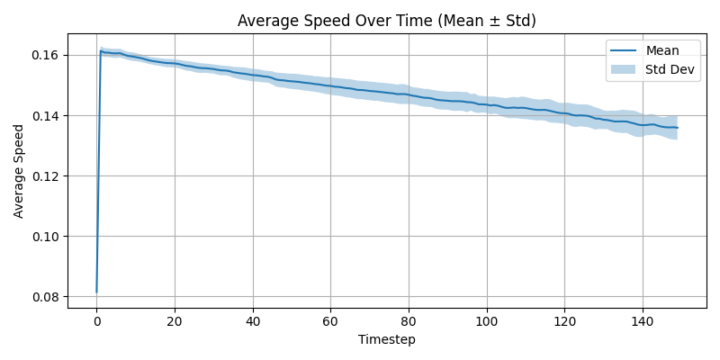

---
CIP-METADATA:
  experiment: Symbolic Superfluid Collapse
  author: Peter Lorne Groom
  date: 2025-06-30
  version: 1.0
  location: foundational/experiments/symbolic_superfluid_collapse_pi/results.md
  description: |
    This experiment investigates the emergent behavior of symbolic particles within a synthetic superfluid-like field governed by pi-harmonic angular modulation and radial attractor geometry. The aim is to simulate how symbolic logic structures, entropy, and spatial dynamics converge in a shared system, toward a self-organizing, rest-state geometry.
---
# Symbolic Superfluid Collapse — Experiment Overview

## Purpose

This experiment investigates the emergent behavior of symbolic particles within a synthetic superfluid-like field governed by pi-harmonic angular modulation and radial attractor geometry. The aim is to simulate how symbolic logic structures, entropy, and spatial dynamics converge in a shared system, toward a self-organizing, rest-state geometry.

## Method

Particles labeled with symbolic states (A, B, C, D) were simulated across 5 trials, each comprising 150 timesteps, within a 200x200 grid. Forces include:

* **Radial attraction** to a center
* **Pi-harmonic angular bias** (sin(πθ))
* **Entropy memory** that decays and accumulates

Symbolic rules (e.g., `A + B -> C`) govern local interactions. We track:

* Field entropy changes
* Particle convergence
* Symbolic entropy (symbol diversity per cell)
* Particle velocity (avg speed)

## Results

### Entropy Change


### Symbolic Entropy


### Particle Convergence


### Average Speed



### Transition Rules Observed

```json
{
  "D+A": 309,
  "C+D": 302,
  "B+C": 275,
  "A+B": 271
}
```

## Analysis

* Convergence to radial center is consistent across trials
* Symbolic entropy diminishes, indicating harmonization
* Transition rules show repeat patterns, suggesting underlying symbolic logic cycles
* Average speed declines, supporting collapse and stasis

## Next Steps

* Symbolic field arithmetic formalization
* Comparison to analytic solutions (Laplacian, Navier-Stokes analogs)
* Link to real superfluid topologies (e.g. helium vortices)

## Artifacts

* [Simulation Script](../symbolic_superfluid_collapse_pi/symbolic_superfluid_collapse_pi.py)
* [Raw Logs](reference_material/latest_batch/symbolic_transitions.json)
* [RESULTS.md](reference_material/latest_batch/RESULTS.md)
---
CIP-METADATA-END
